# Amiga TestBook example-4567

TABLE OF CONTENTS

Paragraph Number — Title — Page Number

**Section 1**
**Overview**

1.1 MC68000 ................................ 1-1
1.2 MC68008 ................................ 1-2
1.3 MC68010 ................................ 1-2
1.4 MC68HC000 .............................. 1-2
1.5 MC68HC001 .............................. 1-3
1.6 MC68EC000 .............................. 1-3

**Section 2**
**Introduction**

2.1 Programmer's Model ................................ 2-1
2.1.1 User's Programmer's Model ........................ 2-1
2.1.2 Supervisor Programmer's Model .................... 2-2
2.1.3 Status Register ................................. 2-3
2.2 Data Types and Addressing Modes ................... 2-3
2.3 Data Organization In Registers .................... 2-5
2.3.1 Data Registers .................................. 2-5
2.3.2 Address Registers ............................... 2-6
2.4 Data Organization In Memory ....................... 2-6
2.5 Instruction Set Summary ........................... 2-8

**Section 3**
**Signal Description**

3.1 Address Bus ....................................... 3-3
3.2 Data Bus .......................................... 3-4
3.3 Asynchronous Bus Control .......................... 3-4
3.4 Bus Arbitration Control ........................... 3-5
3.5 Interrupt Control ................................. 3-6
3.6 System Control .................................... 3-7
3.7 M6800 Peripheral Control .......................... 3-8
3.8 Processor Function Codes .......................... 3-8
3.9 Clock ............................................. 3-9
3.10 Power Supply ..................................... 3-9
3.11 Signal Summary ................................... 3-10

TABLE OF CONTENTS (Continued)

Paragraph Number — Title — Page Number

**Section 4**
**8-Bit Bus Operations**

4.1 Data Transfer Operations ................................ 4-1
4.1.1 Read Operations ................................ 4-1
4.1.2 Write Cycle ................................ 4-3
4.1.3 Read-Modify-Write Cycle ................................ 4-5
4.2 Other Bus Operations ................................ 4-8

**Section 5**
**16-Bit Bus Operations**

5.1 Data Transfer Operations ................................ 5-1
5.1.1 Read Operations ................................ 5-1
5.1.2 Write Cycle ................................ 5-4
5.1.3 Read-Modify-Write Cycle ................................ 5-7
5.1.4 CPU Space Cycle ................................ 5-9
5.2 Bus Arbitration ................................ 5-11
5.2.1 Requesting The Bus ................................ 5-14
5.2.2 Receiving The Bus Grant ................................ 5-15
5.2.3 Acknowledgment of Mastership (3-Wire Arbitration Only) ................................ 5-15
5.3 Bus Arbitration Control ................................ 5-15
5.4 Bus Error and Halt Operation ................................ 5-23
5.4.1 Bus Error Operation ................................ 5-24
5.4.2 Retrying The Bus Cycle ................................ 5-26
5.4.3 Halt Operation ................................ 5-27
5.4.4 Double Bus Fault ................................ 5-28
5.5 Reset Operation ................................ 5-29
5.6 The Relationship of $\overline{\mathrm{DTACK}}$, $\overline{\mathrm{BERR}}$, and $\overline{\mathrm{HALT}}$ ................................ 5-30
5.7 Asynchronous Operation ................................ 5-32
5.8 Synchronous Operation ................................ 5-35

**Section 6**
**Exception Processing**

6.1 Privilege Modes ................................ 6-1
6.1.1 Supervisor Mode ................................ 6-2
6.1.2 User Mode ................................ 6-2
6.1.3 Privilege Mode Changes ................................ 6-2
6.1.4 Reference Classification ................................ 6-3
6.2 Exception Processing ................................ 6-4
6.2.1 Exception Vectors ................................ 6-4
6.2.2 Kinds Of Exceptions ................................ 6-5
6.2.3 Multiple Exceptions ................................ 6-8

# TABLE OF CONTENTS (Continued)

Paragraph Number | Title | Page Number

**Section 10**
**Electrical and Thermal Characteristics**

10.9 MC68008 AC Electrical Specifications—Clock Timing ........ 10-9
10.10 AC Electrical Specifications—Read and Write Cycles ........ 10-10
10.11 AC Electrical Specifications—MC68000 To M6800 Peripheral ........ 10-15
10.12 AC Electrical Specifications—Bus Arbitration ........ 10-17
10.13 MC68EC000 DC Electrical Specifications ........ 10-23
10.14 MC68EC000 AC Electrical Specifications—Read and Write ........ 10-24
10.15 MC68EC000 AC Electrical Specifications—Bus Arbitration ........ 10-28

**Section 11**
**Ordering Information and Mechanical Data**

11.1 Pin Assignments ........ 11-1
11.2 Package Dimensions ........ 11-7

**Appendix A**
**MC68010 Loop Mode Operation**

**Appendix B**
**M6800 Peripheral Interface**

B.1 Data Transfer Operation ........ B-1
B.2 Interrupt Interface Operation ........ B-4

1

SECTION 1
OVERVIEW

This manual includes hardware details and programming information for the MC68000, the MC68HC000, the MC68HC001, the MC68008, the MC68010, and the MC68EC000. For ease of reading, the name M68000 MPUs will be used when referring to all processors. Refer to M68000PM/AD, *M68000 Programmer's Reference Manual*, for detailed information on the MC68000 instruction set.

The six microprocessors are very similar. They all contain the following features

- 16 32-Bit Data and Address Registers
- 16-Mbyte Direct Addressing Range
- Program Counter
- 6 Powerful Instruction Types
- Operations on Five Main Data Types
- Memory-Mapped Input/Output (I/O)
- 14 Addressing Modes

The following processors contain additional features:

- MC68010
  - Virtual Memory/Machine Support
  - High-Performance Looping Instructions
- MC68HC001/MC68EC000
  - Statically Selectable 8- or 16-Bit Data Bus
- MC68HC000/MC68EC000/MC68HC001
  - Low-Power

All the processors are basically the same with the exception of the MC68008. The MC68008 differs from the others in that the data bus size is eight bits, and the address range is smaller. The MC68010 has a few additional instructions and instructions that operate differently than the corresponding instructions of the other devices.

1.1 MC68000

The MC68000 is the first implementation of the M68000 16/-32 bit microprocessor architecture. The MC68000 has a 16-bit data bus and 24-bit address bus while the full architecture provides for 32-bit address and data buses. It is completely code-compatible with the MC68008 8-bit data bus implementation of the M68000 and is upward code compatible with the MC68010 virtual extensions and the MC68020 32-bit implementation of the architecture. Any user-mode programs using the MC68000 instruction set will run unchanged on the MC68008, MC68010, MC68020, MC68030, and MC68040. This is possible because the user programming model is identical for all processors and the instruction sets are proper subsets of the complete architecture.

1

1.2 MC68008

The MC68008 is a member of the M68000 family of advanced microprocessors. This device allows the design of cost-effective systems using 8-bit data buses while providing the benefits of a 32-bit microprocessor architecture. The performance of the MC68008 is greater than any 8-bit microprocessor and superior to several 16-bit microprocessors.

The MC68008 is available as a 48-pin dual-in-line package (plastic or ceramic) and 52-pin plastic leaded chip carrier. The additional four pins of the 52-pin package allow for additional signals: A20, A21, $\overline{\mathrm{BGACK}}$, and $\overline{\mathrm{IPL2}}$. The 48-pin version supports a 20-bit address that provides a 1-Mbyte address space; the 52-pin version supports a 22-bit address that extends the address space to 4 Mbytes. The 48-pin MC68008 contains a simple two-wire arbitration circuit; the 52-pin MC68008 contains a full three-wire MC68000 bus arbitration control. Both versions are designed to work with daisy-chained networks, priority encoded networks, or a combination of these techniques.

A system implementation based on an 8-bit data bus reduces system cost in comparison to 16-bit systems due to a more effective use of components and byte-wide memories and peripherals. In addition, the nonmultiplexed address and data buses eliminate the need for external demultiplexers, further simplifying the system.

The large nonsegmented linear address space of the MC68008 allows large modular programs to be developed and executed efficiently. A large linear address space allows program segment sizes to be determined by the application rather than forcing the designer to adopt an arbitrary segment size without regard to the application's individual requirements.

1.3 MC68010

The MC68010 utilizies VLSI technology and is a fully implemented 16-bit microprocessor with 32-bit registers, a rich basic instruction set, and versatile addressing modes. The vector base register (VBR) allows the vector table to be dynamically relocated

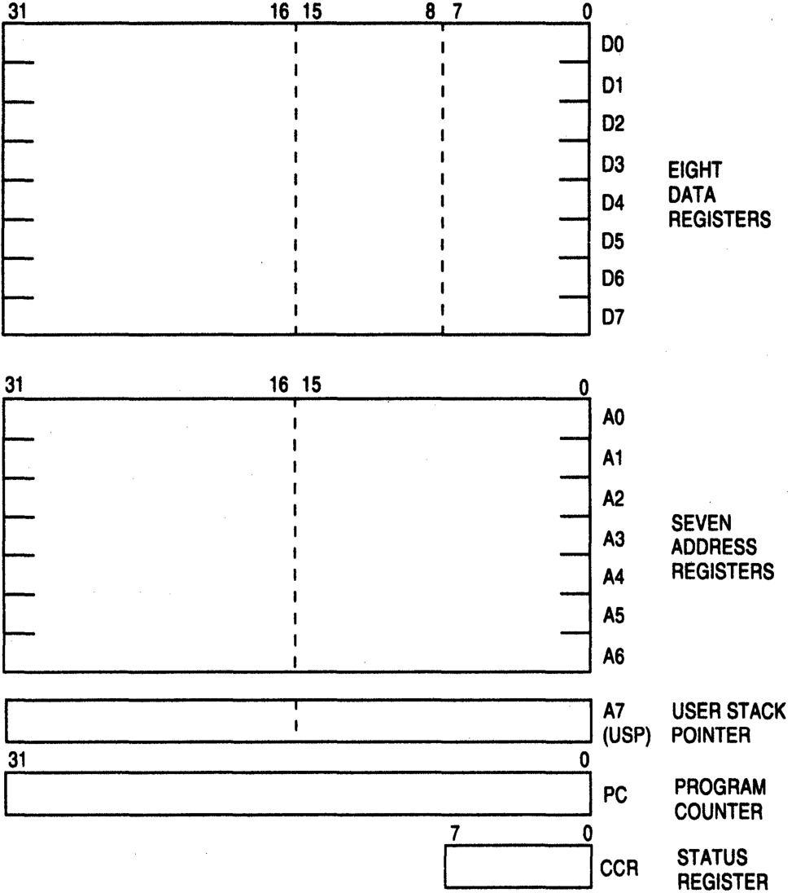

2

Figure 2-1. User Programmer's Model
(MC68000/MC68HC000/MC68008/MC68010)

2.1.2 Supervisor Programmer's Model

The supervisor programmer's model consists of supplementary registers used in the supervisor mode. The M68000 MPUs contain identical supervisor mode register resources, which are shown in Figure 2-2, including the status register (high-order byte) and the supervisor stack pointer (SSP/A7').

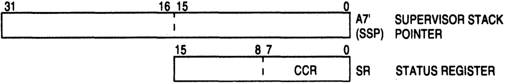

Figure 2-2. Supervisor Programmer's Model Supplement

The supervisor programmer's model supplement of the MC68010 is shown in Figure 2-3. In addition to the supervisor stack pointer and status register, it includes the vector base register (VRB) and the alternate function code registers (AFC).The VBR is used to determine the location of the exception vector table in memory to support multiple vector

tables. The SFC nad DFC registers allow the supervisor to access user data space or emulate CPU space cycles.

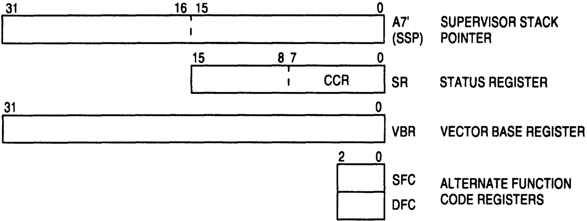

2

Figure 2-3. Supervisor Programmer's Model Supplement
(MC68010)

2.1.3 Status Register

The status register (SR),contains the interrupt mask (eight levels available) and the following condition codes: overflow (V), zero (Z), negative (N), carry (C), and extend (X). Additional status bits indicate that the processor is in the trace (T) mode and/or in the supervisor (S) state (see Figure 2-4). Bits 5, 6, 7, 11, 12, and 14 are undefined and reserved for future expansion

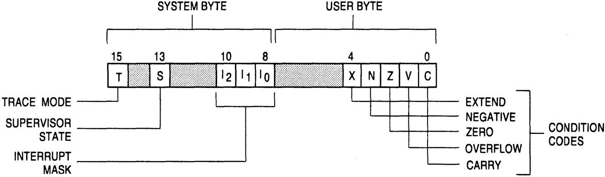

Figure 2-4. Status Register

2.2 DATA TYPES AND ADDRESSING MODES

The five basic data types supported are as follows:

1. Bits
2. Binary-Coded-Decimal (BCD) Digits (4 Bits)
3. Bytes (8 Bits)
4. Words (16 Bits)
5. Long Words (32 Bits)

Table 2-1. Data Addressing Modes

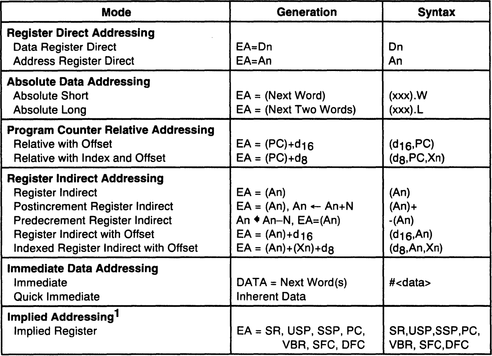

2

NOTES: 1. The VBR, SFC, and DFC apply to the MC68010 only

EA = Effective Address

Dn = Data Register

An = Address Register

( ) = Contents of

PC = Program Counter

d₈ = 8-Bit Offset (Displacement)

d₁₆ = 16-Bit Offset (Displacement)

N = 1 for byte, 2 for word, and 4 for long word. If An is the stack pointer and the operand size is byte, N = 2 to keep the stack pointer on a word boundary.

← = Replaces

Xn = Address or Data Register used as Index Register

SR = Status Register

USP = User Stack Pointer

SSP = Supervisor Stack Pointer

CP = Program Counter

VBR = Vector Base Register

2.3 DATA ORGANIZATION IN REGISTERS

The eight data registers support data operands of 1, 8, 16, or 32 bits. The seven address registers and the active stack pointer support address operands of 32 bits.

2.3.1 Data Registers

Each data register is 32 bits wide. Byte operands occupy the low-order 8 bits, word operands the low-order 16 bits, and long-word operands, the entire 32 bits. The least significant bit is addressed as bit zero; the most significant bit is addressed as bit 31.

When a data register is used as either a source or a destination operand, only the appropriate low-order portion is changed; the remaining high-order portion is neither used nor changed.

2.3.2 Address Registers

2

Each address register (and the stack pointer) is 32 bits wide and holds a full, 32-bit address. Address registers do not support byte-sized operands. Therefore, when an address register is used as a source operand, either the low-order word or the entire long-word operand is used, depending upon the operation size. When an address register is used as the destination operand, the entire register is affected, regardless of the operation size. If the operation size is word, operands are sign-extended to 32 bits before the operation is performed.

2.4 DATA ORGANIZATION IN MEMORY

Bytes are individually addressable. As shown in Figure 2-5, the high-order byte of a word has the same address as the word. The low-order byte has an odd address, one count higher. Instructions and multibyte data are accessed only on word (even byte) boundaries. If a long-word operand is located at address n (n even), then the second word of that operand is located at address n+2.

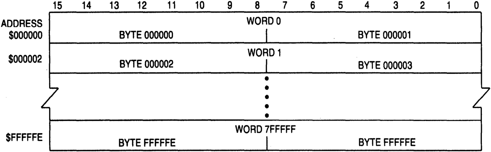

Figure 2-5. Word Organization in Memory

The data types supported by the M68000 MPUs are bit data, integer data of 8, 16, and 32 bits, 32-bit addresses, and binary-coded-decimal data. Each data type is stored in memory as shown in Figure 2-6. The numbers indicate the order of accessing the data from the processor. For the MC68008 with its 8-bit bus, the appearance of data in memory is identical to the all the M68000 MPUs. The organization of data in the memory of the MC68008 is shown in Figure 2-7.

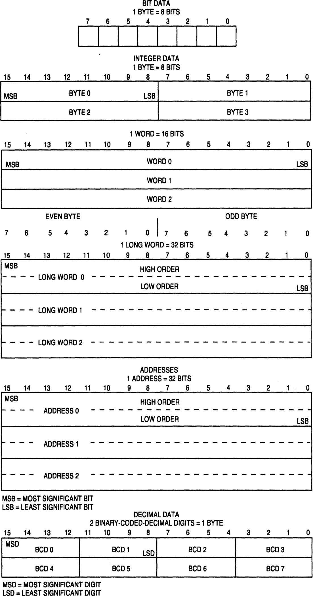

2

Figure 2-6. Data Organization in Memory

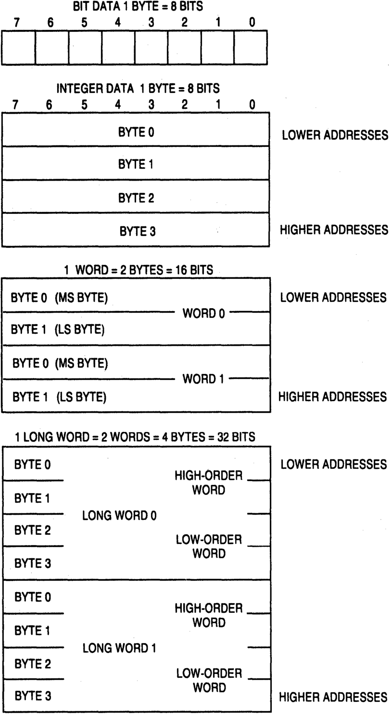

2

Figure 2-7. Memory Data Organization of the MC68008

2.5 INSTRUCTION SET SUMMARY

Table 2-2 provides an alphabetized listing of the M68000 instruction set listed by opcode, operation, and syntax. In the syntax descriptions, the left operand is the source operand, and the right operand is the destination operand. The following list contains the notations used in Table 2-2.

Table 2-2. Instruction Set Summary (Sheet 1 of 4)

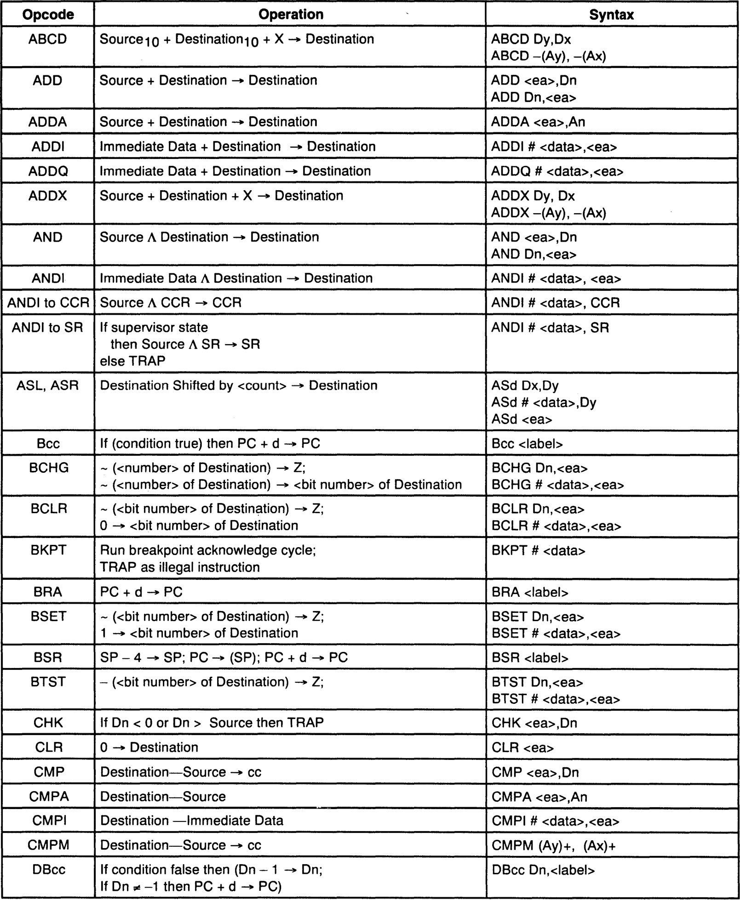

2

Table 2-2. Instruction Set Summary (Sheet 2 of 4)

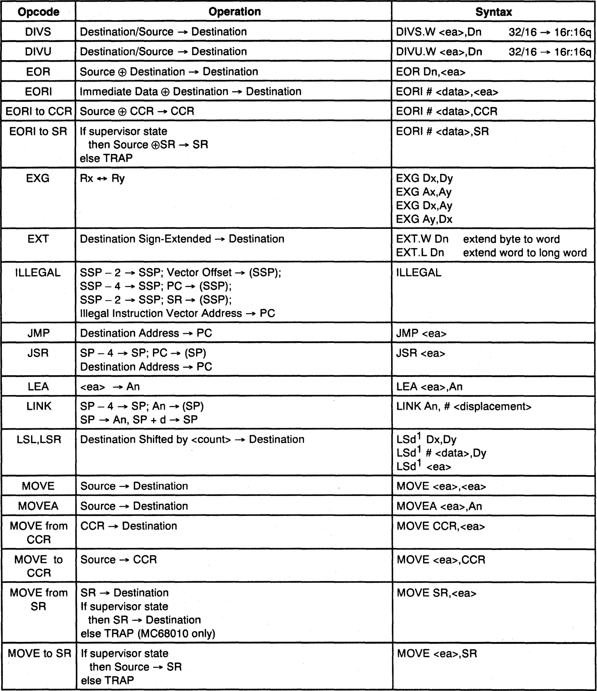

2

Table 2-2. Instruction Set Summary (Sheet 4 of 4)

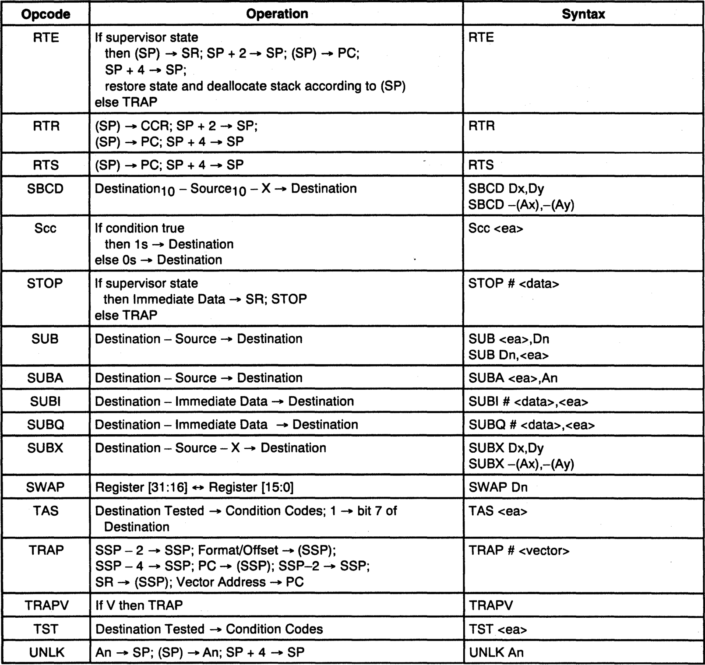

2

NOTE: d is direction, L or R.

SECTION 3
SIGNAL DESCRIPTION

This section contains descriptions of the input and output signals. The input and output signals can be functionally organized into the groups shown in Figure 3-1 (for the MC68000, the MC68HC000 and the MC68010), Figure 3-2 (for the MC68HC001), Figure 3-3 (for the MC68EC000), Figure 3-4 (for the MC68008, 48-pin version), and Figure 3-5 (for the MC68008, 52-pin version). The following paragraphs provide brief descriptions of the signals and references (where applicable) to other paragraphs that contain more information about the signals.

3

NOTE

The terms **assertion** and **negation** are used extensively in this manual to avoid confusion when describing a mixture of "active-low" and "active-high" signals. The term assert or assertion is used to indicate that a signal is active or true, independently of whether that level is represented by a high or low voltage. The term negate or negation is used to indicate that a signal is inactive or false.

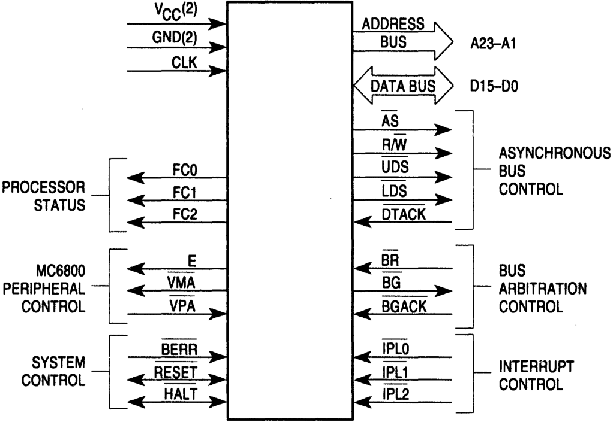

Figure 3-1. Input and Output Signals
(MC68000, MC68HC000 and MC68010)

Address Bus (A23–A0)

This 24-bit, unidirectional, three-state bus is capable of addressing 16 Mbytes of data. This bus provides the address for bus operation during all cycles except interrupt acknowledge cycles and breakpoint cycles. During interrupt acknowledge cycles, address lines A1, A2, and A3 provide the level number of the interrupt being acknowledged, and address lines A23–A4 and A0 are driven to logic high. In 16-Bit mode, A0 is always driven high.

MC68008 Address Bus

The unidirectional, three-state buses in the two versions of the MC68008 differ from each other and from the other processor bus only in the number of address lines and the addressing range. The 20-bit address (A19–A0) of the 48-pin version provides a 1-Mbyte address space; the 52-pin version supports a 22-bit address (A21–A0), extending the address space to 4 Mbytes. During an interrupt acknowledge cycle, the interrupt level number is placed on lines A1, A2, and A3. Lines A0 and A4 through the most significant address line are driven to logic high.

3

3.2 DATA BUS (D15–D0; MC68008: D7–D0)

This bidirectional, three-state bus is the general-purpose data path. It is 16 bits wide in the all the processors except the MC68008 which is 8 bits wide. The bus can transfer and accept data of either word or byte length. During an interrupt acknowledge cycle, the external device supplies the vector number on data lines D7–D0. The MC68EC000 and MC68HC001 use D7–D0 in 8-bit mode, and D15–D8 are undefined.

3.3 ASYNCHRONOUS BUS CONTROL

Asynchronous data transfers are controlled by the following signals: address strobe, read/write, upper and lower data strobes, and data transfer acknowledge. These signals are described in the following paragraphs.

Address Strobe ($\overline{\mathrm{AS}}$).

This three-state signal indicates that the information on the address bus is a valid address.

Read/Write ($\mathrm{R}/\overline{\mathrm{W}}$).

This three-state signal defines the data bus transfer as a read or write cycle. The $\mathrm{R}/\overline{\mathrm{W}}$ signal relates to the data strobe signals described in the following paragraphs.

Upper And Lower Data Strobes ($\overline{\mathrm{UDS}}$, $\overline{\mathrm{LDS}}$).

These three-state signals and $\mathrm{R}/\overline{\mathrm{W}}$ control the flow of data on the data bus. Table 3-1 lists the combinations of these signals and the corresponding data on the bus. When the $\mathrm{R}/\overline{\mathrm{W}}$ line is high, the processor reads from the data bus. When the $\mathrm{R}/\overline{\mathrm{W}}$ line is low, the processor drives the data bus. In 8-bit mode, $\overline{\mathrm{UDS}}$ is always forced high and the $\overline{\mathrm{LDS}}$ signal is used.

Bus Request ($\overline{\mathrm{BR}}$).

This input can be wire-ORed with bus request signals from all other devices that could be bus masters. This signal indicates to the processor that some other device needs to become the bus master. Bus requests can be issued at any time during a cycle or between cycles.

Bus Grant ($\overline{\mathrm{BG}}$).

This output signal indicates to all other potential bus master devices that the processor will relinquish bus control at the end of the current bus cycle.

3

Bus Grant Acknowledge ($\overline{\mathrm{BGACK}}$).

This input indicates that some other device has become the bus master. This signal should not be asserted until the following conditions are met:

1. A bus grant has been received.
2. Address strobe is inactive, which indicates that the microprocessor is not using the bus.
3. Data transfer acknowledge is inactive, which indicates that neither memory nor peripherals are using the bus.
4. Bus grant acknowledge is inactive, which indicates that no other device is still claiming bus mastership.

The 48-pin version of the **MC68008** has no pin available for the bus grant acknowledge signal and uses a two-wire bus arbitration scheme instead. If another device in a system supplies a bus grant acknowledge signal, the bus request input signal to the processor should be asserted when either the bus request or the bus grant acknowledge from that device is asserted.

3.5 INTERRUPT CONTROL ($\overline{\mathrm{IPL0}}$, $\overline{\mathrm{IPL1}}$, $\overline{\mathrm{IPL2}}$)

These input signals indicate the encoded priority level of the device requesting an interrupt. Level seven, which cannot be masked, has the highest priority; level zero indicates that no interrupts are requested. $\overline{\mathrm{IPL0}}$ is the least significant bit of the encoded level, and $\overline{\mathrm{IPL2}}$ is the most significant bit. For each interrupt request, these signals must remain asserted until the processor signals interrupt acknowledge (FC2–FC0 and A19–A16 high) for that request to ensure that the interrupt is recognized.

NOTE

The 48-pin version of the **MC68008** has only two interrupt control signals: $\overline{\mathrm{IPL0}}/\overline{\mathrm{IPL2}}$ and $\overline{\mathrm{IPL1}}$. $\overline{\mathrm{IPL0}}/\overline{\mathrm{IPL2}}$ is internally connected to both $\overline{\mathrm{IPL0}}$ and $\overline{\mathrm{IPL2}}$, which provides four interrupt priority levels: levels 0, 2, 5, and 7. In all other respects, the interrupt priority levels in this version of the **MC68008** are identical to those levels in the other microprocessors described in this manual.

Table 3-3. Function Code Outputs

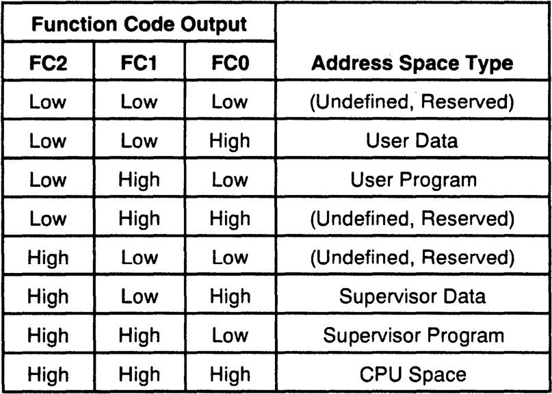

3

3.9 CLOCK (CLK)

The clock input is a TTL-compatible signal that is internally buffered for development of the internal clocks needed by the processor. This clock signal is a constant frequency square wave that requires no stretching or shaping. The clock input should not be gated off at any time, and the clock signal must conform to minimum and maximum pulse-width times listed in **Section 10 Electrical Characteristics**.

3.10 POWER SUPPLY (Vcc and GND)

Power is supplied to the processor using these connections. The positive output of the power supply is connected to the V<sub>CC</sub> pins and ground is connected to the GND pins.

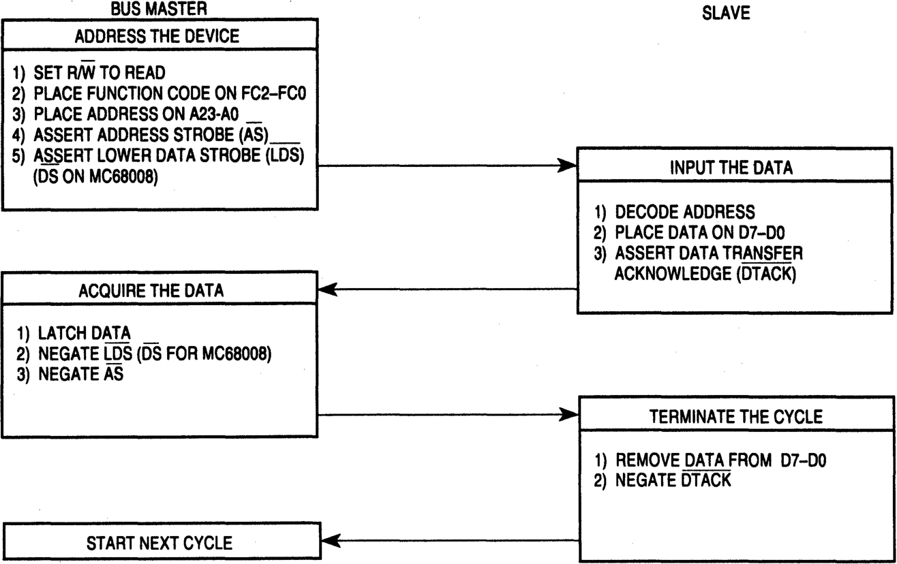

4

Figure 4-1. Byte Read-Cycle Flowchart

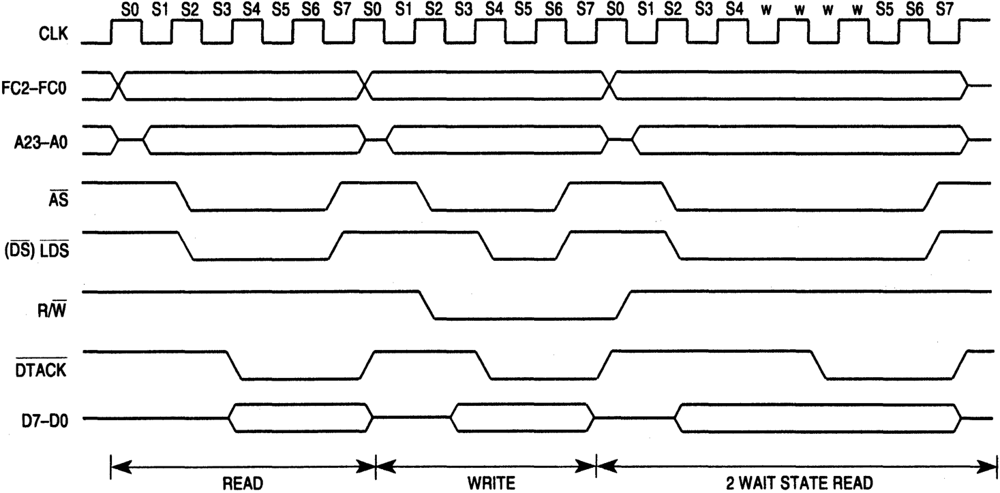

Figure 4-2. Read and Write-Cycle Timing Diagram

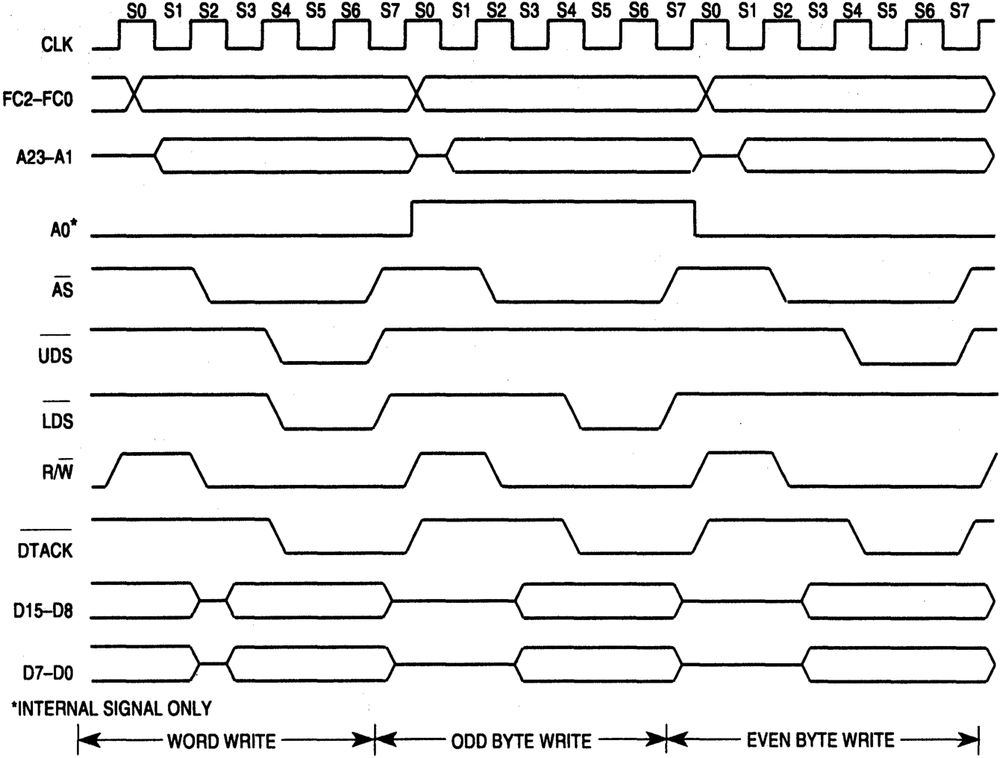

5

Figure 5-7. Word and Byte Write-Cycle Timing Diagram

The descriptions of the eight states of a write cycle are as follows:

STATE 0 The write cycle starts in S0. The processor places valid function codes on FC2–FC0 and drives $R/\overline{W}$ high (if a preceding write cycle has left $R/\overline{W}$ low).

STATE 1 Entering S1, the processor drives a valid address on the address bus.

STATE 2 On the rising edge of S2, the processor asserts $\overline{AS}$ and drives $R/\overline{W}$ low.

STATE 3 During S3, the data bus is driven out of the high-impedance state as the data to be written is placed on the bus.

STATE 4 At the rising edge of S4, the processor asserts $\overline{UDS}$, or $\overline{LDS}$. The processor waits for a cycle termination signal ($\overline{DTACK}$ or $\overline{BERR}$) or $\overline{VPA}$, an M6800 peripheral signal. When $\overline{VPA}$ is asserted during S4, the cycle becomes a peripheral cycle (refer to **Appendix B M6800 Peripheral Interface**. If neither termination signal is asserted before the falling edge at the end of S4, the processor inserts wait states (full clock cycles) until either $\overline{DTACK}$ or $\overline{BERR}$ is asserted.

STATE 5 During S5, no bus signals are altered.

STATE 6 During S6, no bus signals are altered.

STATE 12 The write portion of the cycle starts in S12. The valid function codes on FC2–FC0, the address bus lines, $\overline{\mathrm{AS}}$, and $\mathrm{R}/\overline{\mathrm{W}}$ remain unaltered.

STATE 13 During S13, no bus signals are altered.

STATE 14 On the rising edge of S14, the processor drives $\mathrm{R}/\overline{\mathrm{W}}$ low.

STATE 15 During S15, the data bus is driven out of the high-impedance state as the data to be written are placed on the bus.

STATE 16 At the rising edge of S16, the processor asserts $\overline{\mathrm{UDS}}$ or $\overline{\mathrm{LDS}}$. The processor waits for $\overline{\mathrm{DTACK}}$ or $\overline{\mathrm{BERR}}$ or $\overline{\mathrm{VPA}}$, an M6800 peripheral signal. When $\overline{\mathrm{VPA}}$ is asserted during S16, the cycle becomes a peripheral cycle (refer to **Appendix B M6800 Peripheral Interface**). If neither termination signal is asserted before the falling edge at the close of S16, the processor inserts wait states (full clock cycles) until either $\overline{\mathrm{DTACK}}$ or $\overline{\mathrm{BERR}}$ is asserted.

5

STATE 17 During S17, no bus signals are altered.

STATE 18 During S18, no bus signals are altered.

STATE 19 On the falling edge of the clock entering S19, the processor negates $\overline{\mathrm{AS}}$, $\overline{\mathrm{UDS}}$, and $\overline{\mathrm{LDS}}$. As the clock rises at the end of S19, the processor places the address and data buses in the high-impedance state, and drives $\mathrm{R}/\overline{\mathrm{W}}$ high. The device negates $\overline{\mathrm{DTACK}}$ or $\overline{\mathrm{BERR}}$ at this time.

5.1.4 CPU Space Cycle

A CPU space cycle, indicated when the function codes are all high, is a special processor cycle. Bits A16–A19 of the address bus identify eight types of CPU space cycles. Only the interrupt acknowledge cycle, in which A16–A19 are high, applies to all the microprocessors described in this manual. The MC68010 defines an additional type of CPU space cycle, the breakpoint acknowledge cycle, in which A16–A19 are all low. Other configurations of A16–A19 are reserved by Motorola to define other types of CPU cycles used in other M68000 Family microprocessors. Figure 5-10 shows the encoding of CPU space addresses.

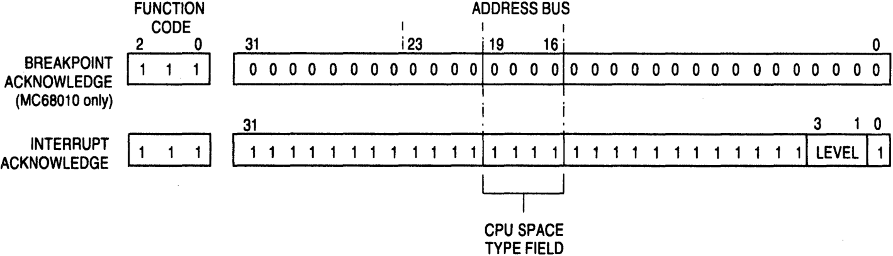

Figure 5-10. CPU Space Address Encoding

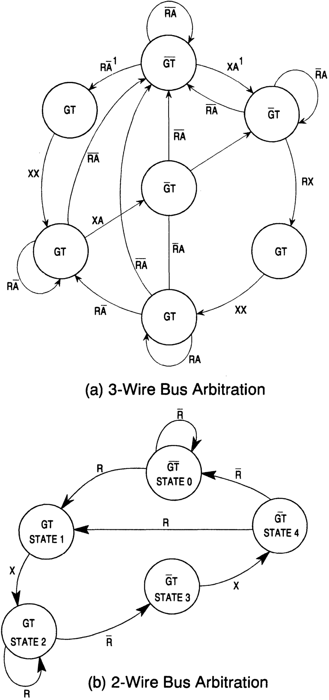

5

**Notes:**
1. State machine will not change if the bus is S0 or S1. Refer to BUS ARBITRATION CONTROL. 5.2.3.
2. The address bus will be placed in the high-impedance state if T is asserted and $\overline{\mathrm{AS}}$ is negated.

```text
R = Bus Request Internal
A = Bus Grant Acknowledge Internal
G = Bus Grant
T = Three-state Control to Bus Control Logic
X = Don't Care
```

Figure 5-18. Bus Arbitration Unit State Diagrams

Figures 5-19, 5-20, and 5-21 applies to all processors using 3-wire bus arbitration. Figures 5-22, 5-23, and 5-24 applies to all processors using 2-wire bus arbitration.

supervisor mode. Therefore, when instruction execution resumes at the address specified to process the exception, the processor is in the supervisor privilege mode.

NOTE

The transition from supervisor to user mode can be accomplished by any of four instructions: return from exception (RTE) (MC68010 only), move to status register (MOVE to SR), AND immediate to status register (ANDI to SR), and exclusive OR immediate to status register (EORI to SR). The RTE instruction in the MC68010 fetches the new status register and program counter from the supervisor stack and loads each into its respective register. Next, it begins the instruction fetch at the new program counter address in the privilege mode determined by the S bit of the new contents of the status register.

The MOVE to SR, ANDI to SR, and EORI to SR instructions fetch all operands in the supervisor mode, perform the appropriate update to the status register, and then fetch the next instruction at the next sequential program counter address in the privilege mode determined by the new S bit.

6

6.1.4 Reference Classification

When the processor makes a reference, it classifies the reference according to the encoding of the three function code output lines. This classification allows external translation of addresses, control of access, and differentiation of special processor states, such as CPU space (used by interrupt acknowledge cycles). Table 6-1 lists the classification of references.

Table 6-1. Reference Classification

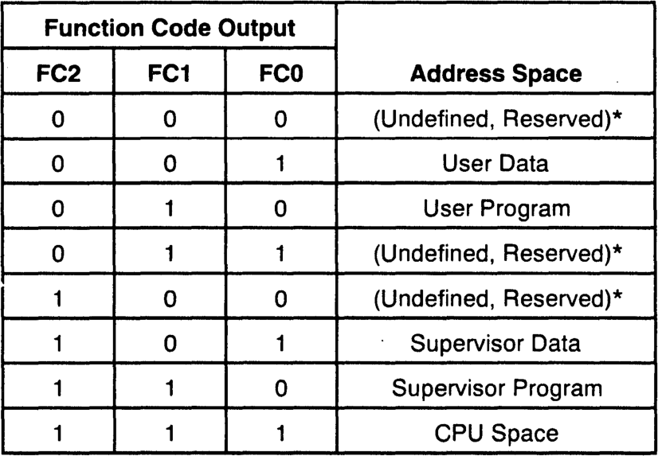

*Address space 3 is reserved for user definition, while 0 and 4 are reserved for future use by Motorola.

shown in Figure 6-9. If the bus cycle is a read, the data at the fault address should be written to the images of the data input buffer, instruction input buffer, or both according to the data fetch (DF) and instruction fetch (IF) bits.* In addition, for read-modify-write cycles, the status register image must be properly set to reflect the read data if the fault occurred during the read portion of the cycle and the write operation (i.e., setting the most significant bit of the memory location) must also be performed. These operations are required because the entire read-modify-write cycle is assumed to have been completed by software. Once the cycle has been completed by software, the rerun (RR) bit in the special status word is set to indicate to the processor that it should not rerun the cycle when the RTE instruction is executed. If the RR bit is set when an RTE instruction executes, the MC68010 reads all the information from the stack, as usual.

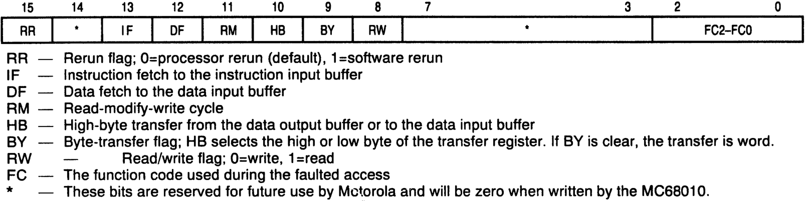

6

Figure 6-9. Special Status Word Format

6.3.10 Address Error

An address error exception occurs when the processor attempts to access a word or long-word operand or an instruction at an odd address. An address error is similar to an internally generated bus error. The bus cycle is aborted, and the processor ceases current processing and begins exception processing. The exception processing sequence is the same as that for a bus error, including the information to be stacked, except that the vector number refers to the address error vector. Likewise, if an address error occurs during the exception processing for a bus error, address error, or reset, the processor is halted.

On the MC68010, the address error exception stacks the same information stacked by a bus error exception. Therefore, the RTE instruction can be used to continue execution of the suspended instruction. However, if the RR flag is not set, the fault address is used when the cycle is retried, and another address error exception occurs. Therefore, the user must be certain that the proper corrections have been made to the stack image and user registers before attempting to continue the instruction. With proper software handling, the address error exception handler could emulate word or long-word accesses to odd addresses if desired.

*If the faulted access was a byte operation, the data should be moved from or to the least significant byte of the data output or input buffer images, unless the high-byte transfer (HB) bit is set. This condition occurs if a MOVEP instruction caused the fault during transfer of bits 8–15 of a word or long word or bits 24–31 of a long word.

Table 7-1. Effective Address Calculation Times

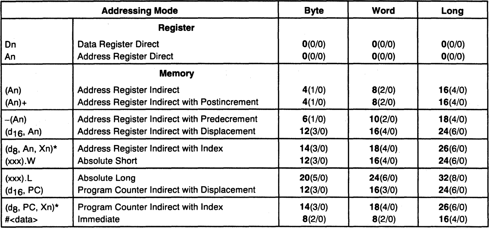

\*The size of the index register (Xn) does not affect execution time.

7.2 MOVE INSTRUCTION EXECUTION TIMES

7

Tables 7-2, 7-3, and 7-4 list the numbers of clock periods for the move instructions. The totals include instruction fetch, operand reads, and operand writes. The total number of clock periods, the number of read cycles, and the number of write cycles are shown in the previously described format.

Table 7-2. Move Byte Instruction Execution Times

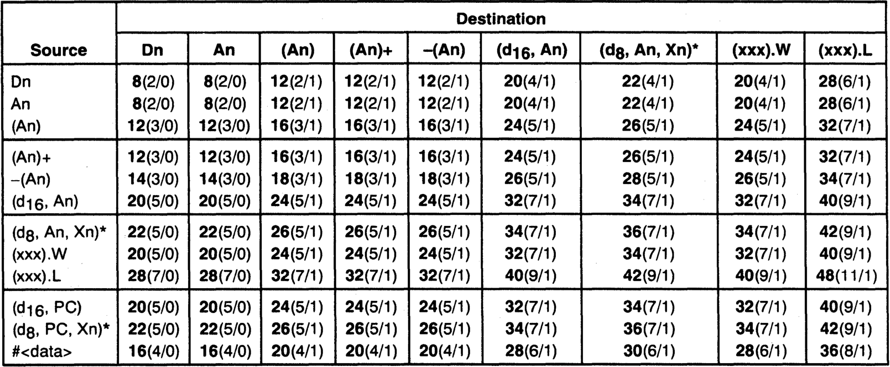

\*The size of the index register (Xn) does not affect execution time.

1.1 INTEGER UNIT USER PROGRAMMING MODEL

Figure 1-1 illustrates the integer portion of the user programming model. It consists of the following registers:

- 16 General-Purpose 32-Bit Registers (D7 – D0, A7 – A0)
- 32-Bit Program Counter (PC)
- 8-Bit Condition Code Register (CCR)

.

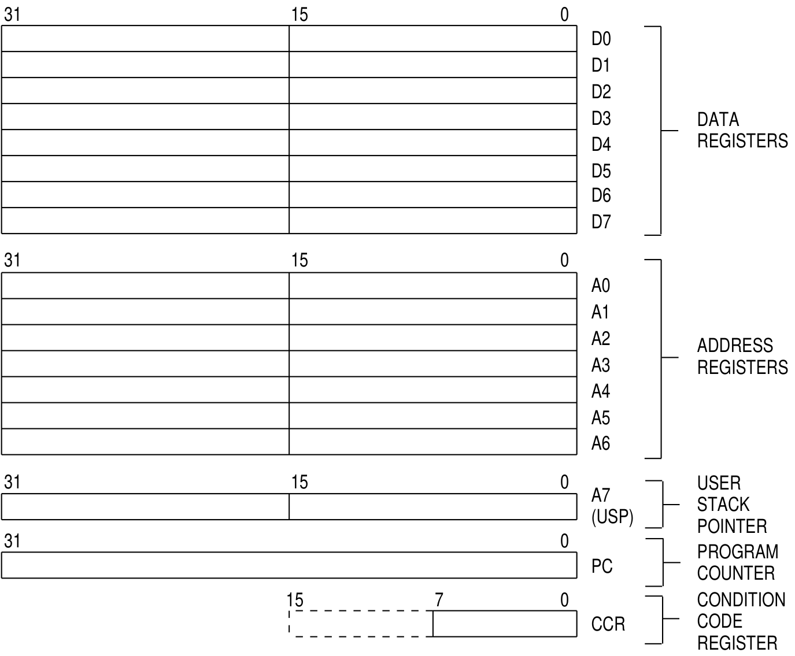

Figure 1-1. M68000 Family User Programming Model

1.1.1 Data Registers (D7 – D0)

These registers are for bit and bit field (1 – 32 bits), byte (8 bits), word (16 bits), long-word (32 bits), and quad-word (64 bits) operations. They also can be used as index registers.

1.1.2 Address Registers (A7 – A0)

These registers can be used as software stack pointers, index registers, or base address registers. The base address registers can be used for word and long-word operations. Register A7 is used as a hardware stack pointer during stacking for subroutine calls and exception handling. In the user programming model, A7 refers to the user stack pointer (USP).

1.2.2 Floating-Point Control Register (FPCR)

The FPCR (see Figure 1-3) contains an exception enable (ENABLE) byte and a mode control (MODE) byte. The user can read or write to the FPCR. Motorola reserves bits 31 – 16 for future definition; these bits are always read as zero and are ignored during write operations. The reset function or a restore operation of the null state clears the FPCR. When cleared, this register provides the IEEE 754 Standard for Binary Floating-Point Arithmetic defaults.

**1.2.2.1 EXCEPTION ENABLE BYTE.** Each bit of the ENABLE byte (see Figure 1-3) corresponds to a floating-point exception class. The user can separately enable traps for each class of floating-point exceptions.

**1.2.2.2 MODE CONTROL BYTE.** MODE (see Figure 1-3) controls the user- selectable rounding modes and precisions. Zeros in this byte select the IEEE 754 standard defaults. The rounding mode (RND) field specifies how inexact results are rounded, and the rounding precision (PREC) field selects the boundary for rounding the mantissa. Refer to Table 3-21 for encoding information. .

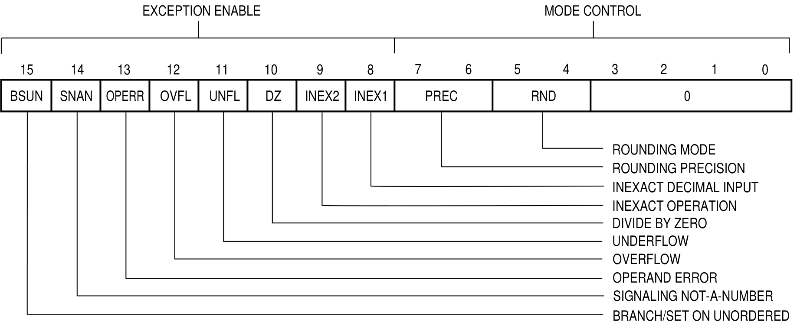

Figure 1-3. Floating-Point Control Register

1.2.3 Floating-Point Status Register (FPSR)

The FPSR (see Figure 1-2) contains a floating-point condition code (FPCC) byte, a floating-point exception status (EXC) byte, a quotient byte, and a floating-point accrued exception (AEXC) byte. The user can read or write to all the bits in the FPSR. Execution of most floating-point instructions modifies this register. The reset function or a restore operation of the null state clears the FPSR.

**1.2.3.1 FLOATING-POINT CONDITION CODE BYTE.** The FPCC byte, illustrated in Figure 1-4, contains four condition code bits that set after completion of all arithmetic instructions involving the floating-point data registers. The move floating-point data register

supported, where T0 is always zero, and only one system stack where the M-bit is always zero. I2, I1, and I0 define the interrupt mask level.

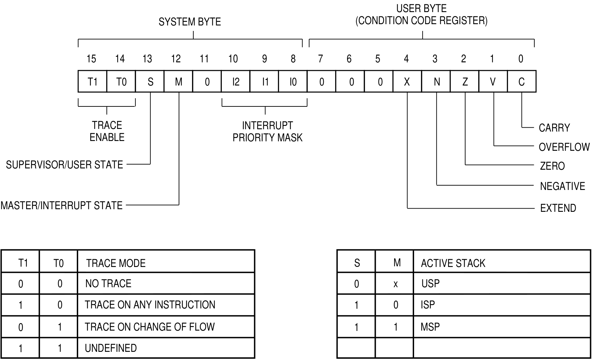

Figure 1-8. Status Register

1.3.3 Vector Base Register (VBR)

The VBR contains the base address of the exception vector table in memory. The displacement of an exception vector adds to the value in this register, which accesses the vector table.

1.3.4 Alternate Function Code Registers (SFC and DFC)

The alternate function code registers contain 3-bit function codes. Function codes can be considered extensions of the 32-bit logical address that optionally provides as many as eight 4-Gbyte address spaces. The processor automatically generates function codes to select address spaces for data and programs at the user and supervisor modes. Certain instructions use SFC and DFC to specify the function codes for operations.

1.3.5 Acu Status Register (MC68EC030 only)

The access control unit status register (ACUSR) is a 16-bit register containing the status information returned by execution of the PTEST instruction. The PTEST instruction searches the access control (AC) registers to determine a match for a specified address. A match in either or both of the AC registers sets bit 6 in the ACUSR. All other bits in the ACUSR are undefined and must not be used.

1.3.6 Transparent Translation/access Control Registers

Transparent translation is actually a misnomer since the whole address space transparently translates in an embedded control environment with no on-chip MMU present as well as in processors that have built-in MMUs. For processors that have built-in MMUs, such as the MC68030, MC68040, and MC68LC040, the transparent translation (TT) registers define blocks of logical addresses that are transparently translated to corresponding physical addresses. These registers are independent of the on-chip MMU. For embedded controllers, such as the MC68EC030 and MC68EC040, the access control registers (AC) are similar in function to the TT registers but just named differently. The AC registers, main function are to define blocks of address space that control address space properties such as cachability. The following paragraphs describe these registers.

NOTE

For the paged MMU related supervisor registers, please refer to the appropriate user’s manual for specific programming detail.

**1.3.6.1 TRANSPARENT TRANSLATION/ACCESS CONTROL REGISTER FIELDS FOR THE M68030.** Figure 1-9 illustrates the MC68030 transparent translation/MC68EC030 access control register format.

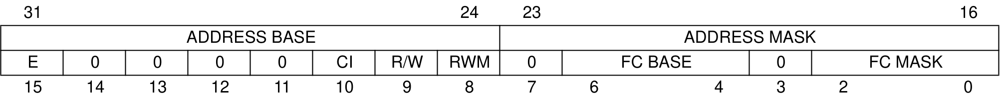

Figure 1-9. MC68030 Transparent Translation/MC68EC030 Access Control Register Format

Address Base

This 8-bit field is compared with address bits A31 – A24. Addresses that match in this comparison (and are otherwise eligible) are transparently translated/access controlled.

Address Mask

This 8-bit field contains a mask for the address base field. Setting a bit in this field causes the corresponding bit of the address base field to be ignored. Blocks of memory larger than 16 Mbytes can be transparently translated/accessed controlled by setting some logical address mask bits to ones. The low-order bits of this field normally are set to define contiguous blocks larger than 16 Mbytes, although this is not required.

1.6.1 Normalized Numbers

Normalized numbers encompass all numbers with exponents laying between the maximum and minimum values. Normalized numbers can be positive or negative. For normalized numbers in single and double precision the implied integer bit is one. In extended precision, the mantissa’s MSB, the explicit integer bit, can only be a one (see Figure 1-13); and the exponent can be zero.

.

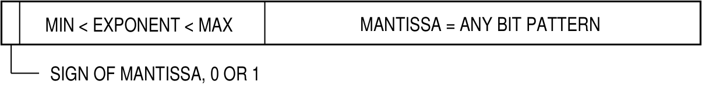

Figure 1-13. Normalized Number Format

1.6.2 Denormalized Numbers

Denormalized numbers represent real values near the underflow threshold. The detection of the underflow for a given data format and operation occurs when the result’s exponent is less than or equal to the minimum exponent value. Denormalized numbers can be positive or negative. For denormalized numbers in single and double precision the implied integer bit is a zero. In extended precision, the mantissa’s MSB, the explicit integer bit, can only be a zero (see Figure 1-14).

.

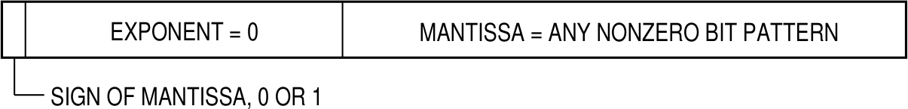

Figure 1-14. Denormalized Number Format

Traditionally, the detection of underflow causes floating-point number systems to perform a "flush-to-zero". This leaves a large gap in the number line between the smallest magnitude normalized number and zero. The IEEE 754 standard implements gradual underflows: the result mantissa is shifted right (denormalized) while the result exponent is incremented until reaching the minimum value. If all the mantissa bits of the result are shifted off to the right during this denormalization, the result becomes zero. Usually a gradual underflow limits the potential underflow damage to no more than a round-off error. This underflow and denormalization description ignores the effects of rounding and the user-selectable rounding modes. Thus, the large gap in the number line created by "flush-to-zero" number systems is filled with representable (denormalized) numbers in the IEEE "gradual underflow" floating-point number system.

Since the extended-precision data format has an explicit integer bit, a number can be formatted with a nonzero exponent, less than the maximum value, and a zero integer bit. The IEEE 754 standard does not define a zero integer bit. Such a number is an unnormalized number. Hardware does not directly support denormalized and unnormalized numbers, but implicitly supports them by trapping them as unimplemented data types, allowing efficient conversion in software.

Table 1-4. Single-Precision Real Format Summary Data Format

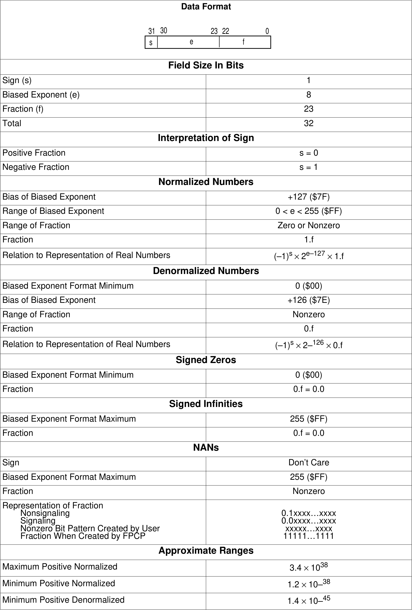

SECTION 2
ADDRESSING CAPABILITIES

Most operations take asource operand and destination operand, compute them, and store the result in the destination location. Single-operand operations take a destination operand, compute it, and store the result in the destination location. External microprocessor references to memory are either program references that refer to program space or data references that refer to data space. They access either instruction words or operands (data items) for an instruction. Program space is the section of memory that contains the program instructions and any immediate data operands residing in the instruction stream. Data space is the section of memory that contains the program data. Data items in the instruction stream can be accessed with the program counter relative addressing modes; these accesses classify as program references.

2.1 INSTRUCTION FORMAT

M68000 family instructions consist of at least one word; some have as many as 11 words. Figure 2-1 illustrates the general composition of an instruction. The first word of the instruction, called the simple effective address operation word, specifies the length of the instruction, the effective addressing mode, and the operation to be performed. The remaining words, called brief and full extension words, further specify the instruction and operands. These words can be floating-point command words, conditional predicates, immediate operands, extensions to the effective addressing mode specified in the simple effective address operation word, branch displacements, bit number or bit field specifications, special register specifications, trap operands, pack/unpack constants, or argument counts.

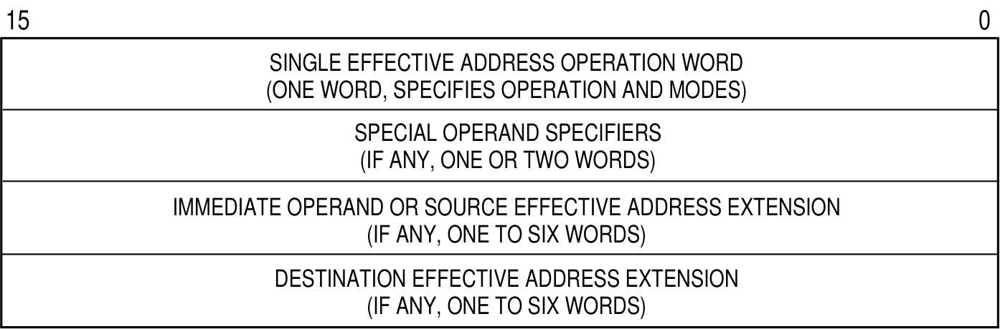

Figure 2-1. Instruction Word General Format

2.2.1 Data Register Direct Mode

In the data register direct mode, the effective address field specifies the data register containing the operand.

```text
GENERATION:                       EA = Dn
ASSEMBLER SYNTAX:                 Dn
EA MODE FIELD:                    000
EA REGISTER FIELD:                REG. NO.
NUMBER OF EXTENSION WORDS:        0
```


2.2.2 Address Register Direct Mode

In the address register direct mode, the effective address field specifies the address register containing the operand.

```text
GENERATION:                       EA = An
ASSEMBLER SYNTAX:                 An
EA MODE FIELD:                    001
EA REGISTER FIELD:                REG. NO.
NUMBER OF EXTENSION WORDS:        0
```


2.2.3 Address Register Indirect Mode

In the address register indirect mode, the operand is in memory. The effective address field specifies the address register containing the address of the operand in memory.

```text
GENERATION:                       EA = (An)
ASSEMBLER SYNTAX:                 (An)
EA MODE FIELD:                    010
EA REGISTER FIELD:                REG. NO.
NUMBER OF EXTENSION WORDS:        0
```

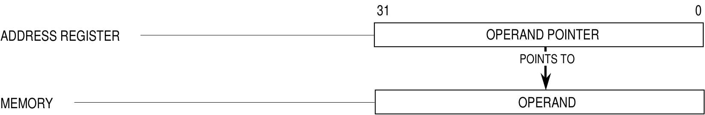

2.5.1 No Memory Indirect Action Mode

No memory indirect action mode uses BR, Xn with its modifiers, and bd to calculate the address of the required operand. Data register indirect (Dn) and absolute address with index (bd,Xn.SIZE*SCALE) are examples of the no memory indirect action mode. Figure 2-5 illustrates the no memory indirect action mode.

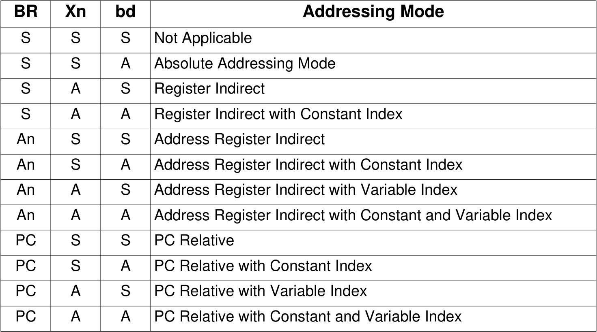

NOTE: S indicates suppressed and A indicates active.

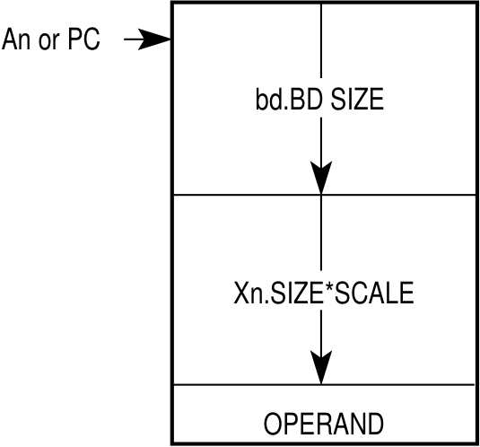

Figure 2-5. No Memory Indirect Action

Table 3-5. Shift and Rotate Operation Format

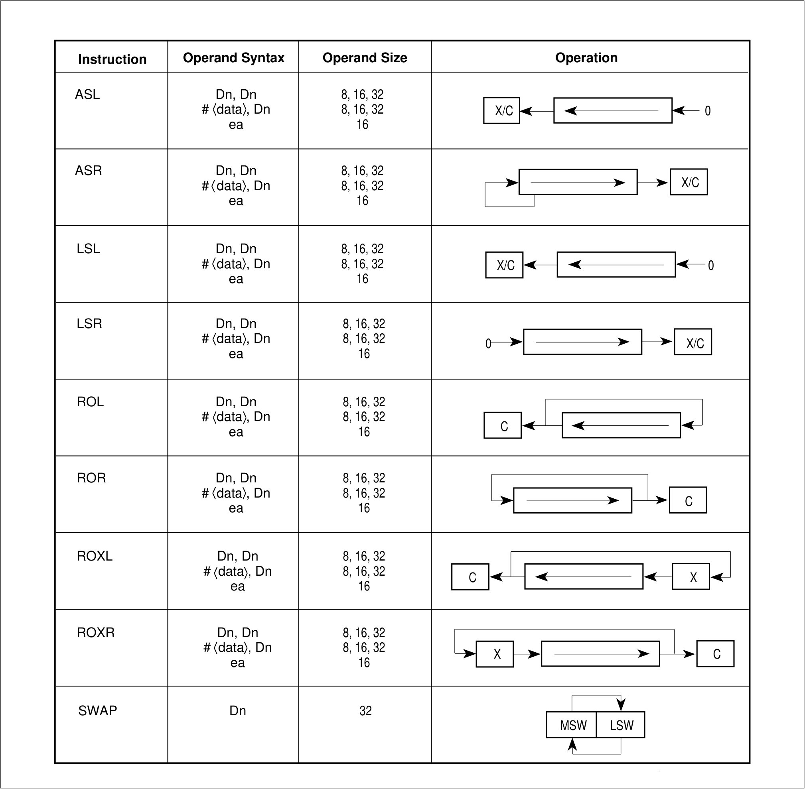

NOTE: X indicates the extend bit and C the carry bit in the CCR.

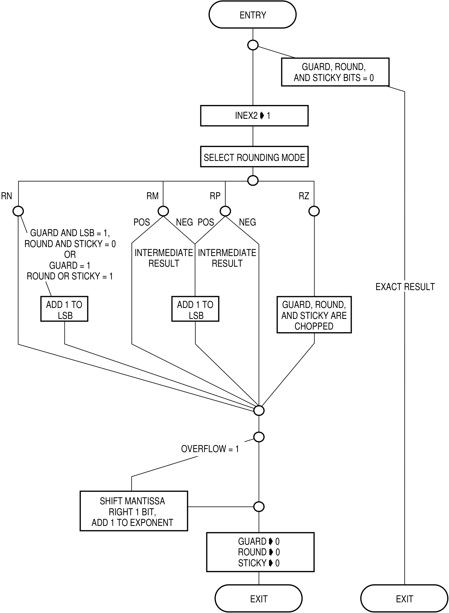

Figure 3-2. Rounding Algorithm Flowchart

The three additional bits beyond the extended-precision format, the difference between the intermediate result’s 67-bit mantissa and the storing result’s 64-bit mantissa, allow the FPU to perform all calculations as though it were performing calculations using a float engine with infinite bit prec The result is always correct for the specified destination’s data format before performing rounding (unless an overflow or underflow error occurs). The specified rounding operation then produces a number that is as close as possible to the infinitely precise

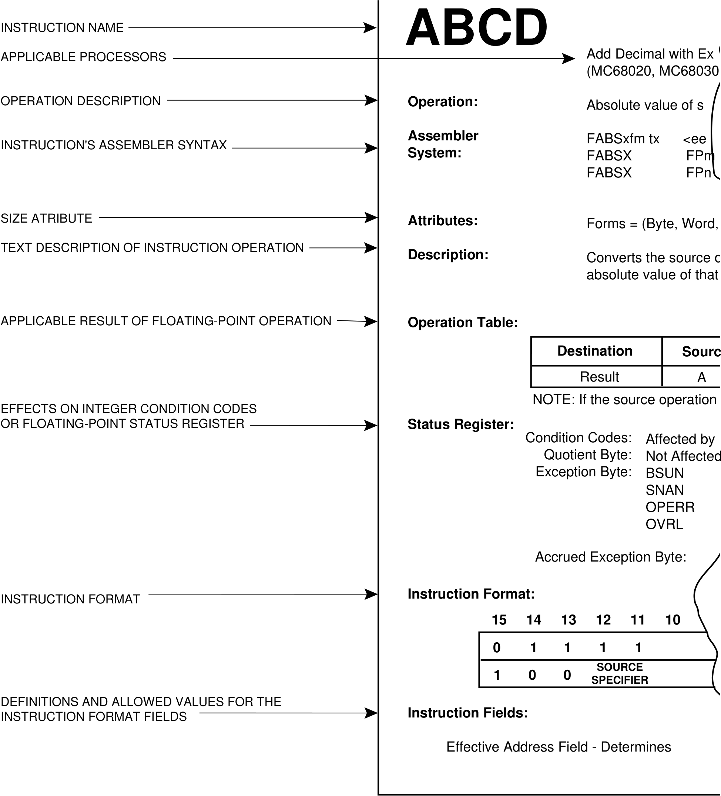

Figure 3-3. Instruction Description Format

SECTION 4
INTEGER INSTRUCTIONS

This section contains detailed information about the integer instructions for the M68000 family. A detailed discussion of each instruction description is arranged in alphabetical order by instruction mnemonic.

Each instruction description identifies the differences among the M68000 family for that instruction. Noted under the title of the instruction are all specific processors that apply to that instruction—for example:

**Test Bit Field and Change**
**(MC68030, MC68040)**

The MC68HC000 is identical to the MC68000 except for power dissipation; therefore, all instructions that apply to the MC68000 also apply to the MC68HC000. All references to the MC68000, MC68020, and MC68030 include references to the corresponding embedded controllers, MC68EC000, MC68EC020, and MC68EC030. All references to the MC68040 include the MC68LC040 and MC68EC040. This referencing applies throughout this section unless otherwise specified.

Identified within the paragraphs are the specific processors that use different instruction fields, instruction formats, etc.—for example:

**MC68020, MC68030, and MC68040 only**


\*\*Can be used with CPU32 processor

**Appendix A Processor Instruction Summary** provides a listing of all processors and the instructions that apply to them for quick reference.


```text
Operation:     Source10 + Destination10 + X → Destination
```

```text
Assembler      ABCD Dy,Dx
Syntax:        ABCD – (Ay), – (Ax)
```

```text
Attributes:    Size = (Byte)
```

**Description:** Adds the source operand to the destination operand along with the extend bit, and stores the result in the destination location. The addition is performed using binary-coded decimal arithmetic. The operands, which are packed binary-coded decimal numbers, can be addressed in two different ways:

1. Data Register to Data Register: The operands are contained in the data registers specified in the instruction.

2. Memory to Memory: The operands are addressed with the predecrement addressing mode using the address registers specified in the instruction.

This operation is a byte operation only.

Condition Codes:

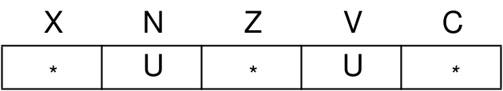

X — Set the same as the carry bit.

N — Undefined.

Z — Cleared if the result is nonzero; unchanged otherwise.

V — Undefined.

C — Set if a decimal carry was generated; cleared otherwise.

NOTE

Normally, the Z condition code bit is set via programming before the start of an operation. This allows successful tests for zero results upon completion of multiple-precision operations.


Instruction Format:

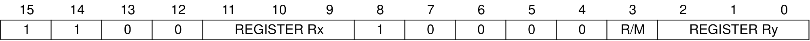

Instruction Fields:

Register Rx field—Specifies the destination register.

If R/M = 0, specifies a data register.
If R/M = 1, specifies an address register for the predecrement addressing mode.

R/M field—Specifies the operand addressing mode.

0 — The operation is data register to data register.
1 — The operation is memory to memory.

Register Ry field—Specifies the source register.

If R/M = 0, specifies a data register.
If R/M = 1, specifies an address register for the predecrement addressing mode.


```text
Operation:     Source + Destination → Destination
```

```text
Assembler      ADD < ea > ,Dn
Syntax:        ADD Dn, < ea >
```

```text
Attributes:    Size = (Byte, Word, Long)
```

**Description:** Adds the source operand to the destination operand using binary addition and stores the result in the destination location. The size of the operation may be specified as byte, word, or long. The mode of the instruction indicates which operand is the source and which is the destination, as well as the operand size.

Condition Codes:

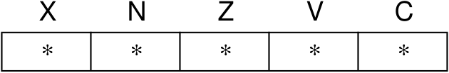

X — Set the same as the carry bit.

N — Set if the result is negative; cleared otherwise.

Z — Set if the result is zero; cleared otherwise.

V — Set if an overflow is generated; cleared otherwise.

C — Set if a carry is generated; cleared otherwise.

Instruction Format:

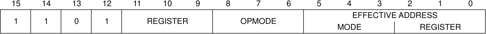


Instruction Fields:

Register field—Specifies any of the eight data registers.

Opmode field

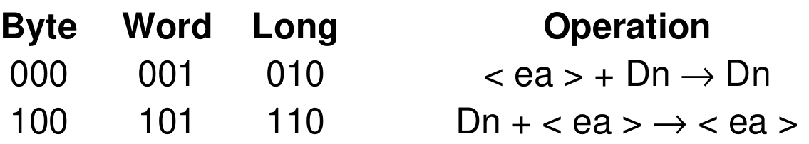

Effective Address field—Determines addressing mode.

a. If the location specified is a source operand, all addressing modes can be used as listed in the following tables:

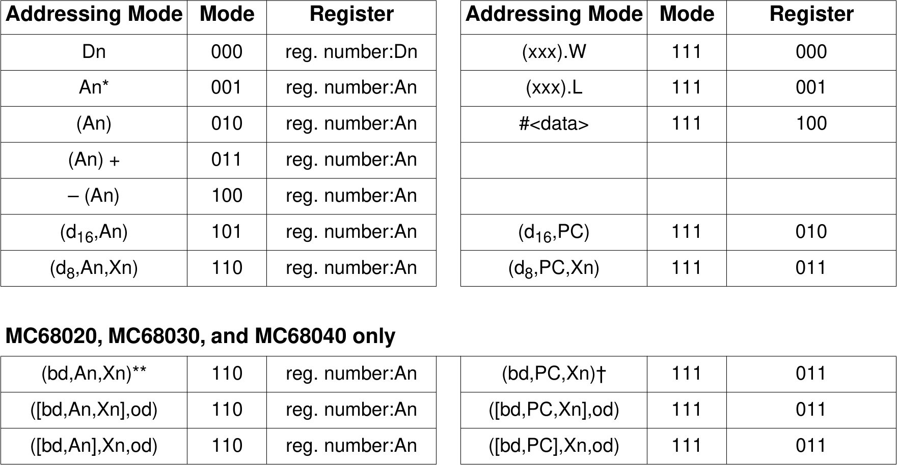

\*Word and long only

\*\*Can be used with CPU32.


b. If the location specified is a destination operand, only memory alterable addressing modes can be used as listed in the following tables:

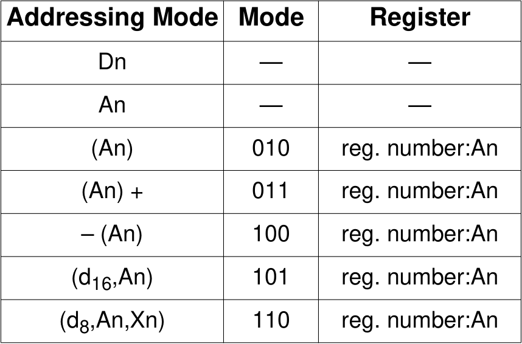

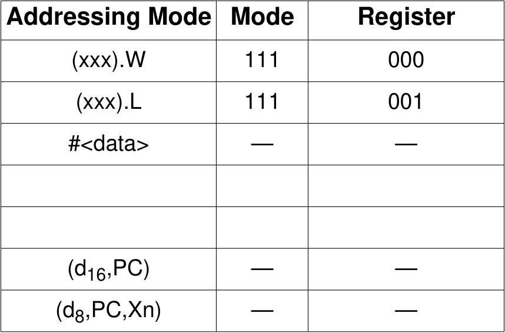

**MC68020, MC68030, and MC68040 only**

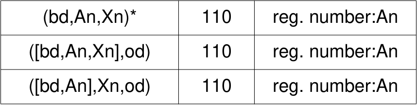

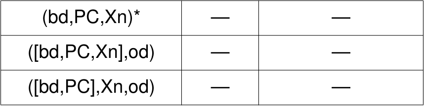

*Can be used with CPU32

NOTE

The Dn mode is used when the destination is a data register; the destination < ea > mode is invalid for a data register.

ADDA is used when the destination is an address register. ADDI and ADDQ are used when the source is immediate data. Most assemblers automatically make this distinction.


```text
Operation:          Source + Destination → Destination
```

```text
Assembler
Syntax:             ADDA < ea > , An
```

```text
Attributes:         Size = (Word, Long)
```

**Description:** Adds the source operand to the destination address register and stores the result in the address register. The size of the operation may be specified as word or long. The entire destination address register is used regardless of the operation size.

Condition Codes:

Not affected.

Instruction Format:

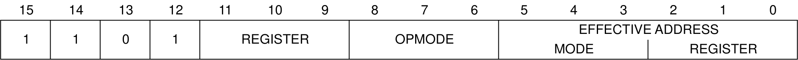

Instruction Fields:

Register field—Specifies any of the eight address registers. This is always the destination.

Opmode field—Specifies the size of the operation.

011— Word operation; the source operand is sign-extended to a long operand and the operation is performed on the address register using all 32 bits.

111— Long operation.


Effective Address field—Specifies the source operand. All addressing modes can be used as listed in the following tables:

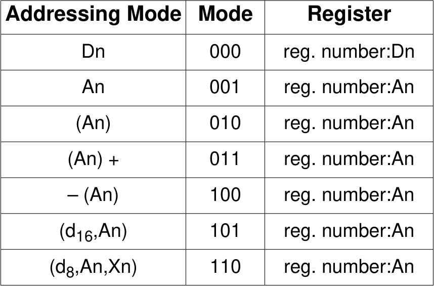

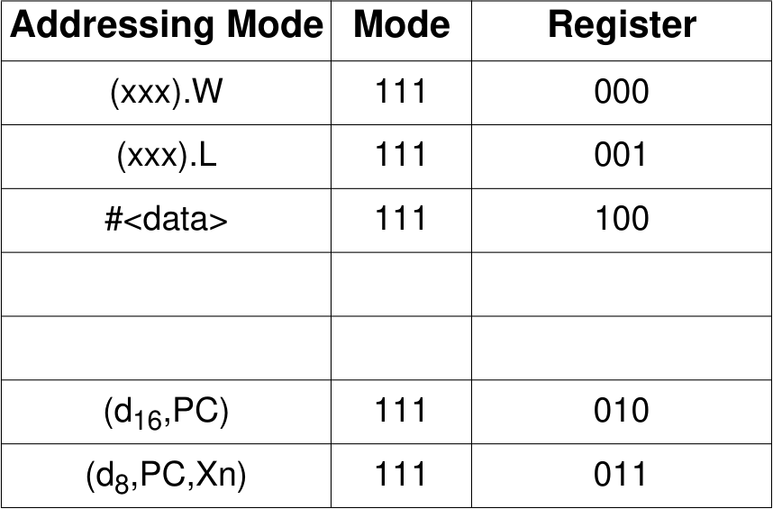

**MC68020, MC68030, and MC68040 only**

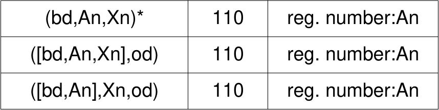

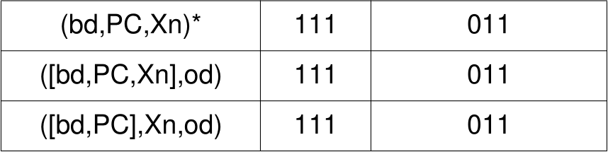

*Can be used with CPU32


```text
Operation:      FPn ÷ Source → FPn
```

```text
Assembler      FDIV. < fmt > < ea > ,FPn
Syntax:        FDIV.X FPm,FPn
               *FrDIV. < fmt > < ea > ,FPn
               *FrDIV.X FPm,FPn
               where r is rounding precision, S or D
```

*Supported by MC68040 only

```text
Attributes:    Format = (Byte, Word, Long, Single, Double, Extended, Packed)
```

**Description:** Converts the source operand to extended precision (if necessary) and divides that number into the number in the destination floating-point data register. Stores the result in the destination floating-point data register.

FDIV will round the result to the precision selected in the floating-point control register. FSDIV and FDDIV will round the result to single or double precision, respectively, regardless of the rounding precision selected in the floating-point control register.

Operation Table:

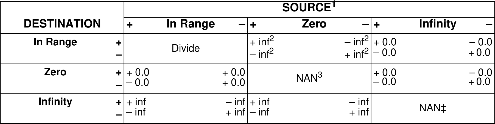

NOTES:

1. If the source operand is a NAN, refer to **1.6.5 Not-A-Numbers** for more information.

2. Sets the DZ bit in the floating-point status register exception byte.

3. Sets the OPERR bit in the floating-point status register exception byte.

APPENDIX A
PROCESSOR INSTRUCTION SUMMARY

This appendix provides a quick reference of the M68000 family instructions. The organization of this section is by processors and their addressing modes. All references to the MC68000, MC68020, and MC68030 include references to the corresponding embedded controllers, MC68EC000, MC68EC020, and MC68EC030. All references to the MC68040 include the MC68LC040 and MC68EC040. This referencing applies throughout this section unless otherwise specified. Table A-1 lists the M68000 family instructions by mnemonic and indicates which processors they apply to.

Table A-1. M68000 Family Instruction Set And
Processor Cross-Reference

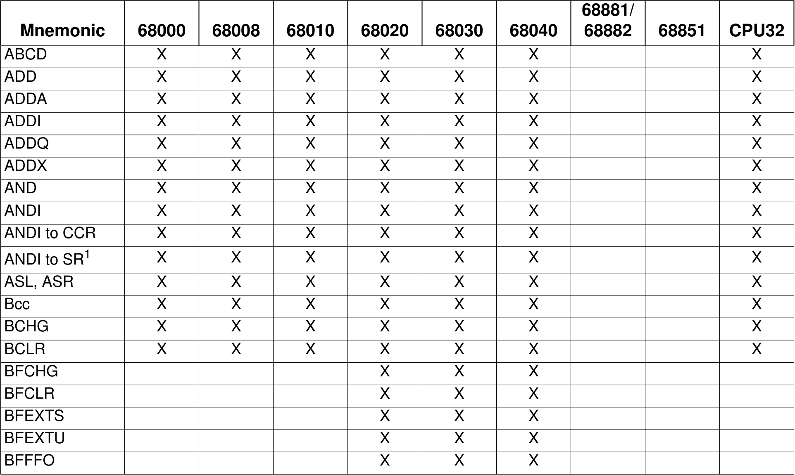

Table A-1. M68000 Family Instruction Set And
Processor Cross-Reference (Continued)

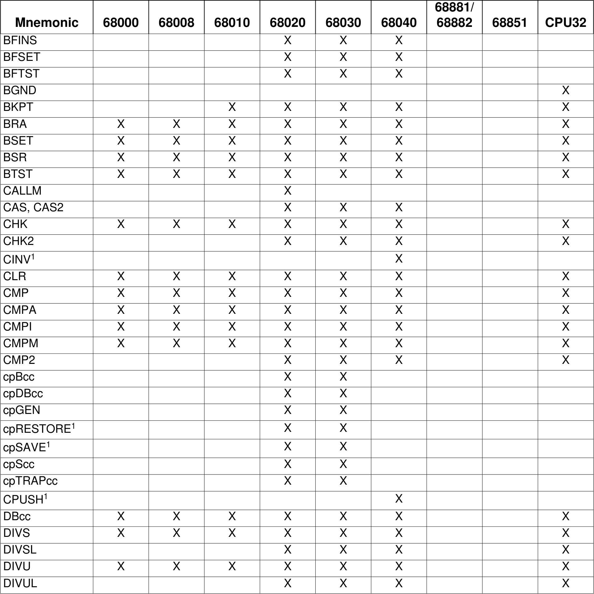

Table A-1. M68000 Family Instruction Set And Processor Cross-Reference (Concluded)

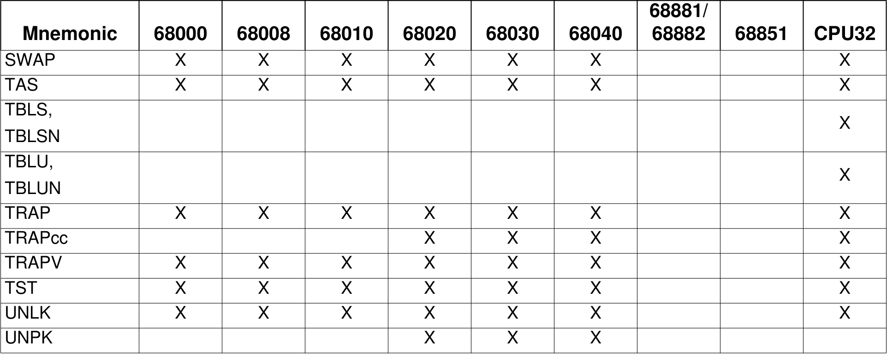

NOTES:
1. Privileged (Supervisor) Instruction.
2. Not applicable to MC68EC040 and MC68LC040
3. These instructions are software supported on the MC68040.
4. This instruction is not privileged for the MC68000 and MC68008.
5. Not applicable to MC68EC030.

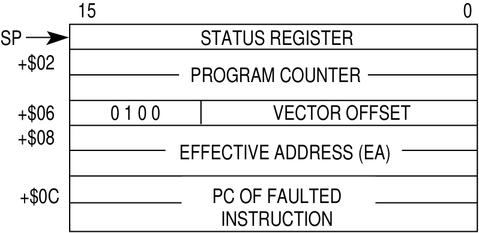

Figure B-7. MC68EC040 and MC68LC040 Floating-Point Unimplemented Stack Frame, Format $4

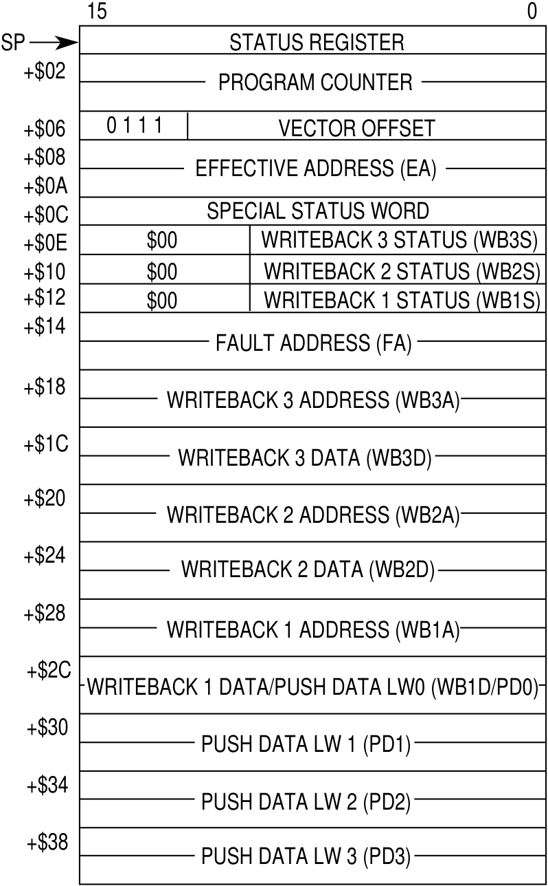

Figure B-8. MC68040 Access Error Stack Frame, Format $7

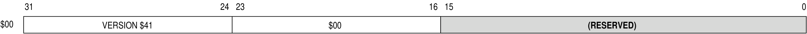

Figure B-21. MC68040 Idle Stack Frame

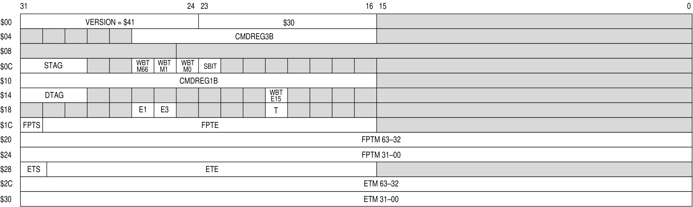

Reserved

Figure B-22. MC68040 Unimplimented Instruction Stack Frame

EXTRA KEYS ON THE KEYBOARD

Both the Amiga 2000 and 500 feature 94-key keyboards, as compared to the A1000's 89-key keyboard. (The European versions of the keyboards have 96 keys.) The new keys are all located on the numeric keypad, and include:

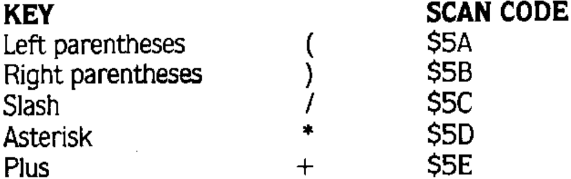

In PC mode on the Amiga 2000 (using a Bridgeboard), these keys assume typical PC functions, including Number lock (left parenthesis), Print screen (asterisk) and Scroll lock (right parenthesis).

On some keyboards, the left Amiga key has been replaced by the Commodore key. This key performs identically in either case.

Keyboard Layout Showing Raw Key Codes

RAW KEY CODES ON THE KEYBOARD

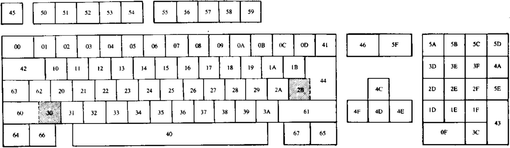

Figure 1.1 Key Codes

**Note:** On the U.S. keyboard, the keys with codes 44 and 60 are extended to include the European keys with codes 2B and 30, respectively. Also note that England uses the U.S. rather than the European keyboard, but not the U.S. keymap.

See Table 1-1 at the end of this section for a table of the raw key codes.

As you will notice, the A500 and 2000 deletes clocks and interrupt lines from the A1000. The +/−5Vdc and reset lines are also deleted. The +/−12Vdc lines are identical to a PC10/20.

The following signals (formerly on the RS232 connector) can be found on other connectors:

```text
ResB = parallel connector
  C2 = video connector
```

Centronics Port

The Centronics port also has some non-standard signals. Below is a table comparing the A1000 Centronics port with the A500/A2000 Centronics port. Again, this is the opposite sex from the A1000 and the same sex connector as an IBM®-PC (i.e., a female DB25 connector).

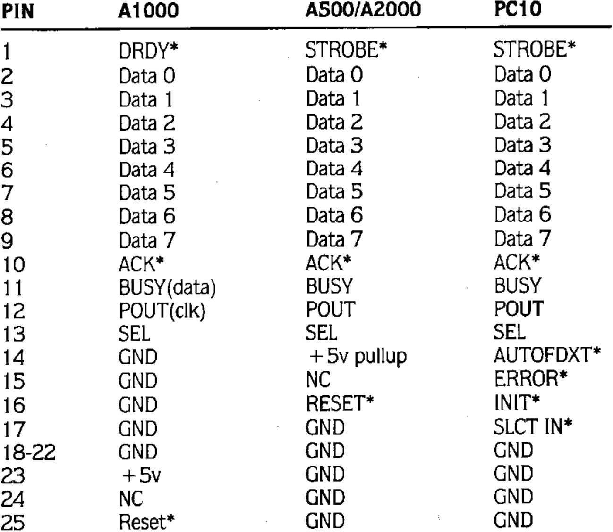

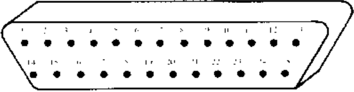

Video Output

The A500 and A2000, like the A1000, use a DB23 video connector.

This 23 pin connector contains all the signals necessary to work with a Genlock, but the current Genlock will need to be redesigned in order to meet the physical requirements of the A500 and A2000, in-

Table 1-1 RAW KEY CODES

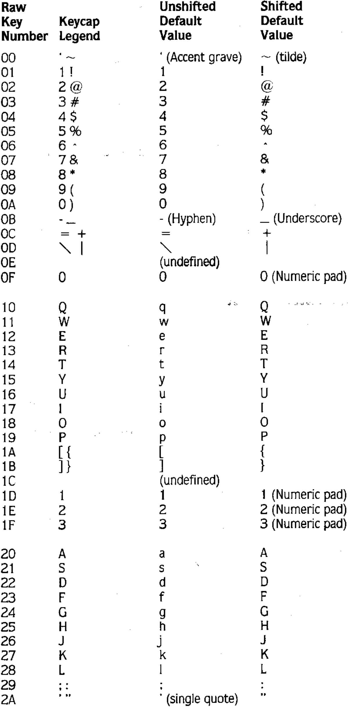

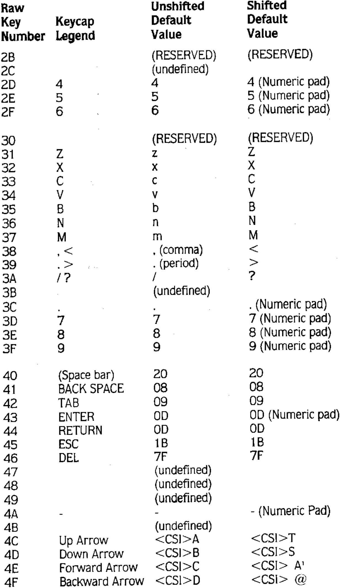

¹ In shifted Forward Arrow and Backward Arrow, note blank space after <CSI>.
<CSI> stands for Command Sequence Initiator.

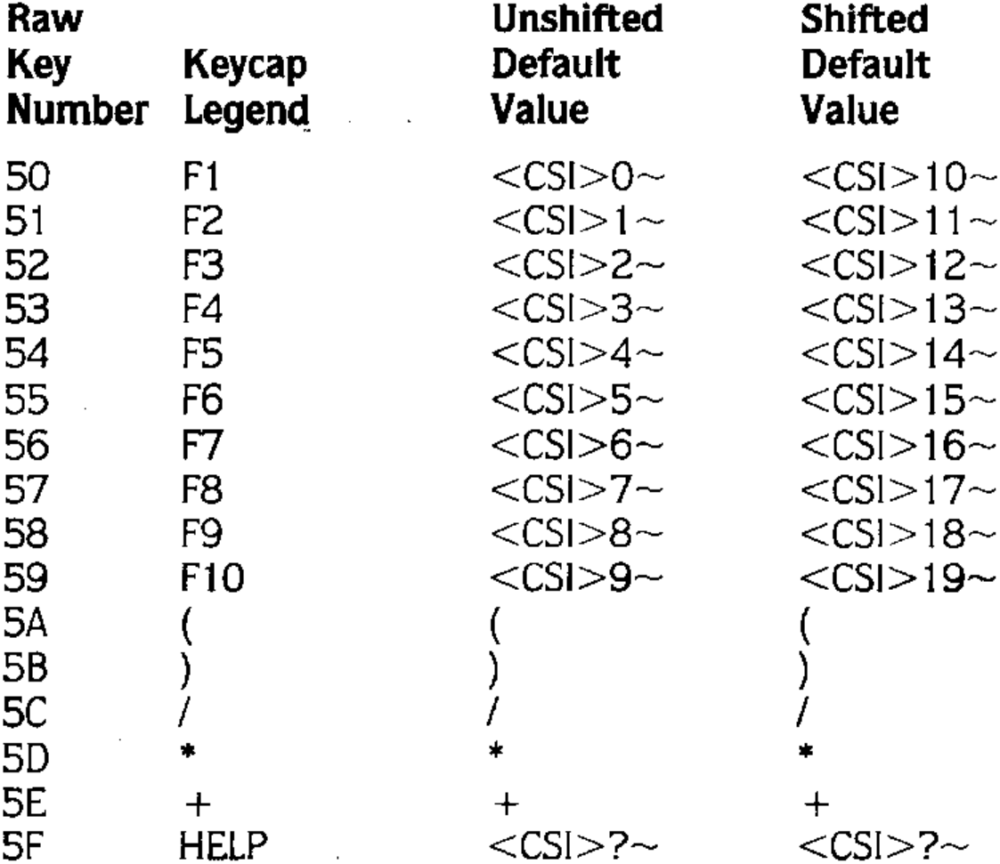

Section 3.1

Designing Hardware for the Amiga Expansion Architecture

INTRODUCTION

This section gives guidelines for designing hardware to reside on the Amiga expansion bus. The Amiga expansion bus is a relatively straightforward extension of the 68000 bus.

Hardware for the bus can be viewed as two categories: backplanes and PICs. Backplanes interface to the 86 pin connector of either another backplane or the Amiga itself. Backplanes buffer the bus and provide 100 pin connectors for PICs to plug into.

PIC is an acronym for plug-in card. A PIC is usually a card that plugs into the standard 100 pin Amiga connectors.

A sub-type of PIC is a combination of backplane and PIC integrated into one package. These combination products should follow all of the applicable backplane and PIC rules, especially auto-configuration.

Software never sees backplanes; all expansion hardware appears to the software as PICs.

**WARNING**

These specifications represent “worst case” design targets. Products that do not comply with these specifications can be expected to fail on worst case production units.

Following conservative design practices and allowing the widest safety margins is your best assurance against problems in the field.

EXPANSION ARCHITECTURE OVERVIEW

As shown in Figure 3.1, “Expansion Architecture Overview,” the expansion bus is implemented as backplane (an expansion box) which accept PICs (boards). The recommended number of PICs to a backplane is five.

Due to timing considerations, it is not possible to daisy-chain more than two buffered backplanes without inserting wait states.

NOTE

You should also take extreme care in controlling signal radiation from your product, in order to pass FCC class B regulations.

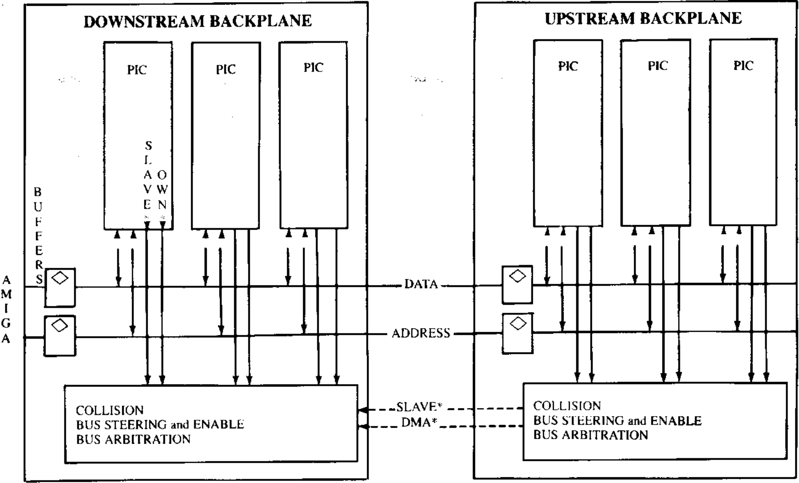

Figure 3.1. Expansion Architecture Overview

requirement is because the eight megabyte space reserved for expansion in the current machine begins at hex 200000 (See auto-config notes below).

Auto-Config Notes

1) There is currently no provision for 6MB PICs. Designers of 8 MB memory boards should consider auto-configs as two PICs to allow partial loading flexibility.

2) PIC size/alignment rules are subject to change. If so, bit(s) will be defined to allow a PIC to specify that it is more flexible than the old rules require.

3) The address map is subject to change. A PIC should assume that it may be placed anywhere in the address space.

4) All expansion devices are strongly encouraged to use the auto-config protocols. Assignment of fixed I/O addresses is subject to negotiation.

Address Specification Table

**All nibbles except 00, 02, 40 and 42 should be inverted.**

Descriptions:

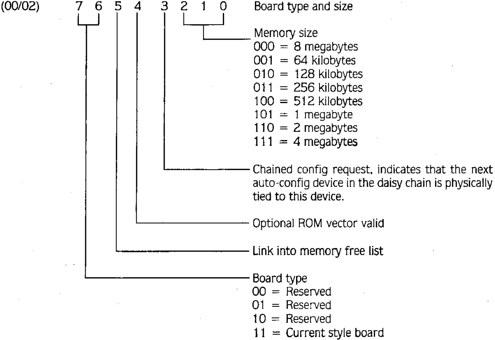

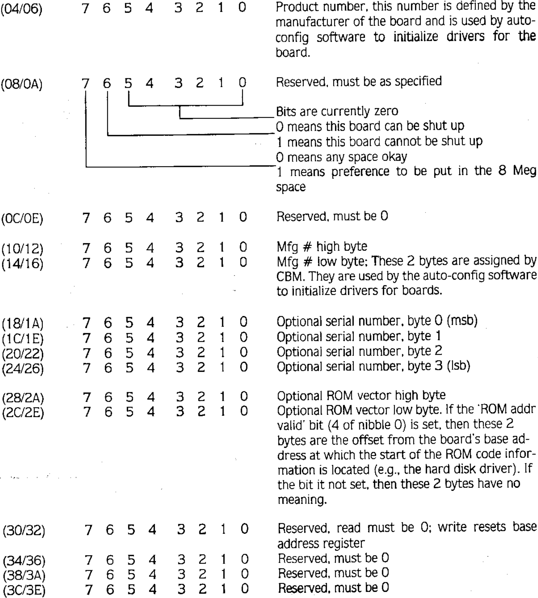

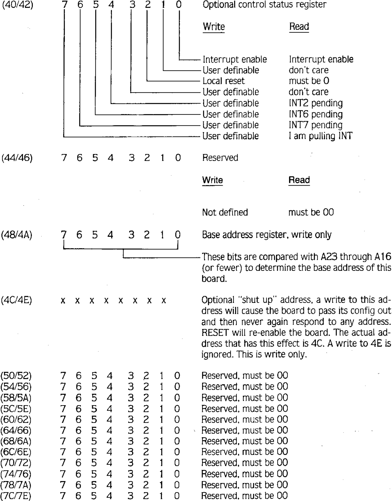

Note: The actual reserved values will be FF rather than 00, because the system will invert them. See the section on reading I/O locations for more information.

The following numbers and notations are used for standard load and drive values:

# 2000 SYSTEM BUS LOADING

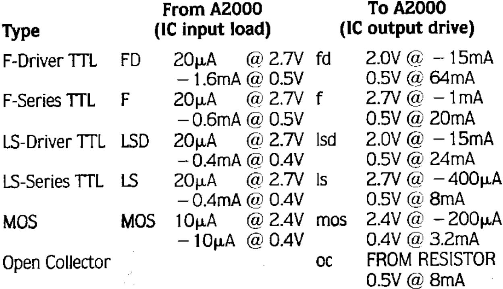

Any lesser input load can be used on a signal in place of a greater load or equivalent load. Varying the number of load elements while still meeting the DC loading criteria can be done if necessary, but it is not a good idea, as it can still exceed the expected capacitive loading on the signal.

A final type of drive is the open collector (oc). Some PIC outputs must be open collector, as they are in a wired-or configuration with the same output from other PICs or motherboard signals.

Most of the system bus signals provide a standard drive to their respective connectors. If your drivers can meet the input specification, don't worry about what is actually required. However, even if your loading doesn't exceed the specified drive capacity of slot signal mentioned above, consult the following chart for specific signals that may provide less drive than a standard signal of that type. Signals that match the STANDARD loading are not separately listed.

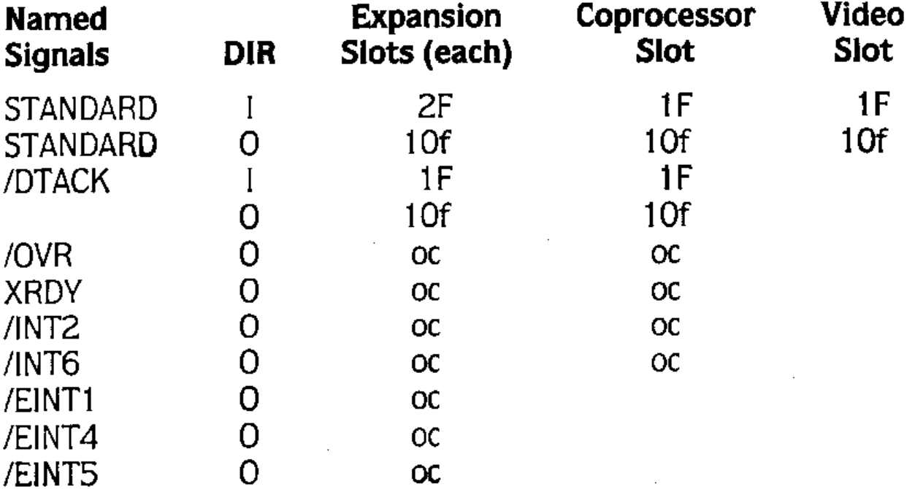

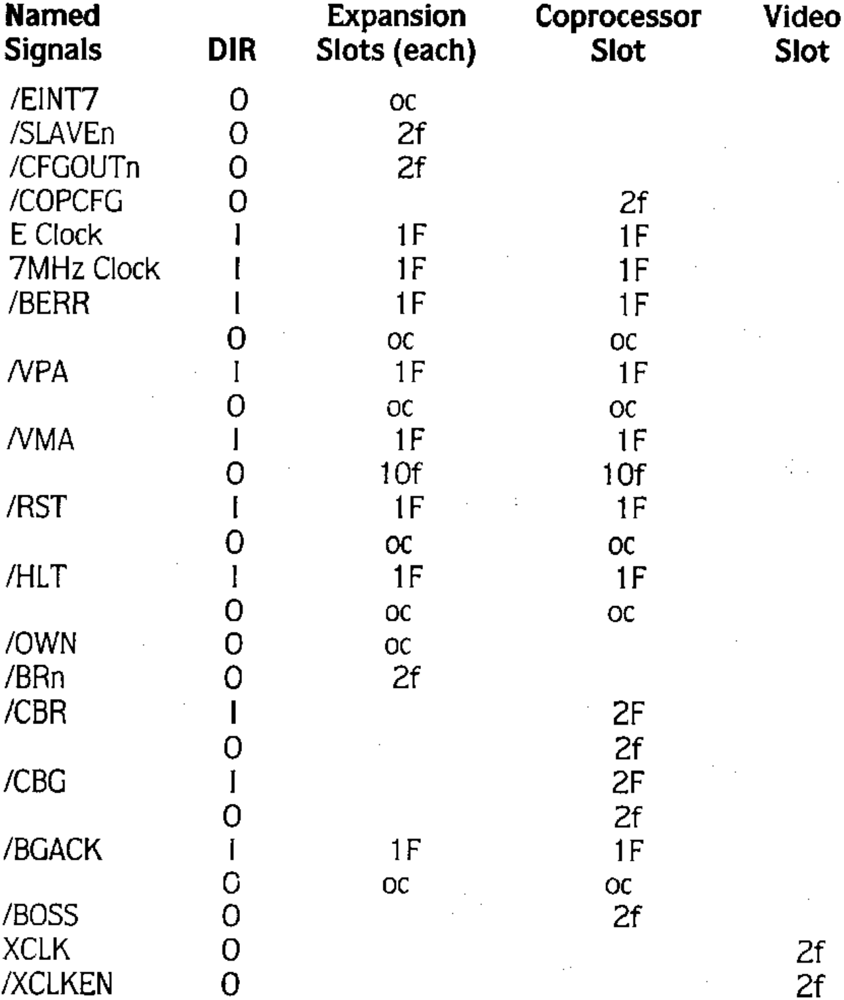

TABLE 3-2

```text
PAL16L8
STEERING15OR17 REV3
11-17-85
AMIGA

/SLVOUT RD /ASQ /ASQ90 COLLIS /BG /AS /BGACK /DMAIN GND
/OWN /AOE /UDS /BERR /DMAOUT /LDS /DBOE /RES /D2P VCC

DBOE    = AS * /RD      * /BERR +        ;DATA DRIVERS DURING WRITE CYCLE
          UDS * RD * ASQ * /BERR +      ;TURN ON DRIVERS LATE FOR RD
          LDS * RD * ASQ * /BERR        ;UDS AND LDS PROTECT RD MOD WR
                                       ;TO AVOID TRI__STATE FIGHT
D2P     = /DMAOUT * SLVOUT * RD +       ;DOWNSTREAM READS UPSTREAM SLAVE
          DMAOUT * /SLVOUT * /RD +      ;UPSTREAM WRITES DOWNSTREAM SLAVE
          DMAOUT * SLVOUT               ;MASTER AND SLAVE ARE UPSTREAM

AOE     = BGACK          +
          /BG * /DMAOUT +
          AS             +             ;AS KEEPS ADDR WHEN /BG DROPS
          ASQ90                        ;ASQ90 MAINTAINS VALID ADDR ON
                                       ; LAST PROC CYCLE

DMAOUT  = DMAIN + OWN

IF (/RES * COLLIS) BERR = VCC

DESCRIPTION

SLVOUT = SLAVEOUT,ASQ = AS DELAYED,ASQ90 = AS CLKD ON LOW EDGE OF 7M,
BG = BUS GRANT,OWN = LOCAL OWN
COLLIS = BUS COLLISION,AOE = ADDR OUTPUT EN,DOE = DATA OE
RES = RESET,D2P = DATA TO PROCESSOR
UDS LDS PROTECT AGAINST RDMODIFYWRITE 3STFIGHT & BERR = /DOE
```

TABLE 3-3

```text
PAL16R6
ARBITRATE REV1
1-6-86
AMIGA

7M /BRIN /RES /BGIN /BR5 /BR4 /BR3 /BR2 /BR1 GND
GROUND /BGOUT /BGOLD /BG5 /BG4 /BG3 /BG2 /BG1 /BR VCC

BG1 = BGIN * /BGOLD * BR1 *                       /RES + ;GENERATE BG1
      BGIN * BG1    *                            /RES   ;HOLD UNTIL /BG

BG2 = BGIN * /BGOLD * BR2 * /BR1 *                /RES +
      BGIN * BG2    *                            /RES

BG3 = BGIN * /BGOLD * BR3 * /BR1 * /BR2 *         /RES +
      BGIN * BG3    *                            /RES

BG4 = BGIN * /BGOLD * BR4 * /BR1 * /BR2 * /BR3 *       /RES +
      BGIN * BG4    *                                 /RES

BG5 = BGIN * /BGOLD * BR5 * /BR1 * /BR2 * /BR3 * /BR4 * /RES +
      BGIN * BG5    *                                 /RES

BGOLD = BGIN                                          ;STORE OLD STATE OF BG

BR    = BRIN * /RES +                                 ;BR IS RQST TO 68K
        BR1  * /RES +
        BR2  * /RES +
        BR3  * /RES +
        BR4  * /RES +
        BR5  * /RES

BGOUT = BGIN * BGOLD * /BG1 * /BG2 * /BG3 * /BG4 * /BG5

DESCRIPTION

BG1 IS HIGHEST PRIORITY
```

Description of PC/XT Emulator for AMIGA 2000

```text
AMIGA ACCESS:  Amiga Interface Offset Address = Base Addr.

               Base Addr. + (00000 – 1FFFF) : Byte Access
               Base Addr. + (20000 – 3FFFF) : Word Access
               Base Addr. + (40000 – 5FFFF) : Graphic Access
               Base Addr. + (60000 – 7FFFF) : I/O Register Access
```

INTERFACE MEMORY MAP:

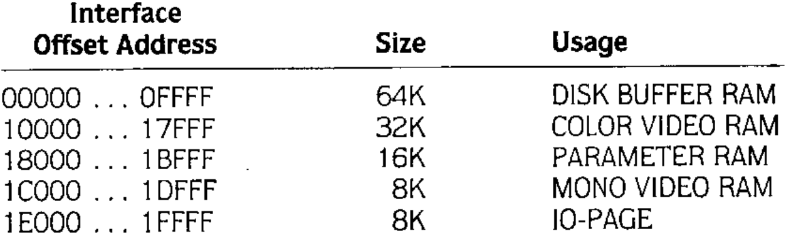

```text
Kinds of memory access on the following pages:
   B = Byte    access
   G = Graphic access
   W = Word    access
```

(*) selectable by BIT 5 and 6 of the MODE REGISTER

```text
BIT 5 = SEL1
BIT 6 = SEL2
```

PC MEMORY AND
I/O MAP:

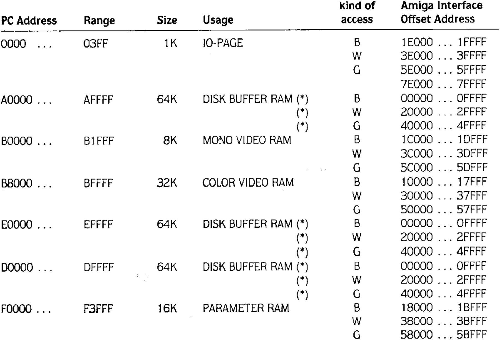

AMIGA MEMORY MAP:

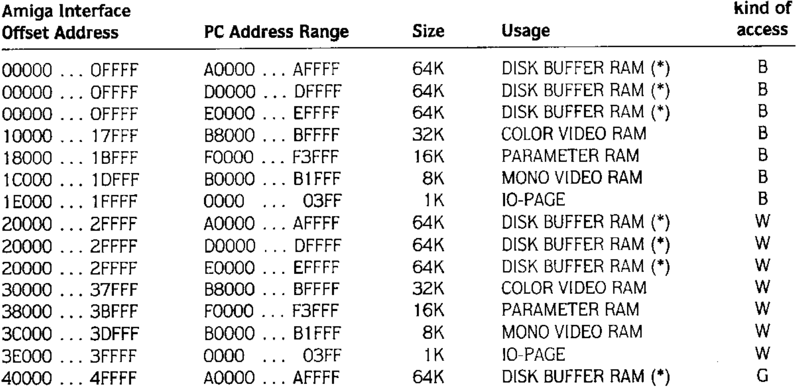

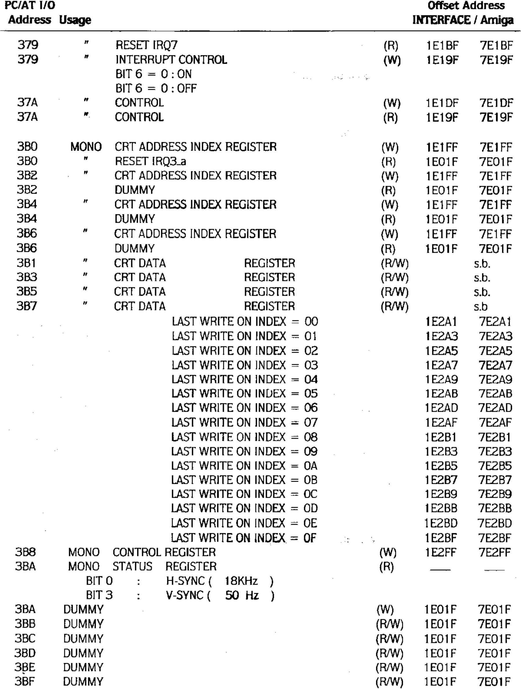

WRITE TELETYPE (AH = 0EH)

```text
INPUT   AL = CHARACTER TO BE WRITTEN
        BL = FOREGROUND COLOR OF CHAR (USED ONLY
             IN GRAPHICS MODE)
        BH = REQUESTED DISPLAY PAGE (REALLY IS
             IGNORED)
```

```text
OUTPUT: None
```

READ CURRENT VIDEO STATE (AH = 0FH)

```text
INPUT:  DS = ROM data segment
```

```text
OUTPUT: AH = NUMBER OF SCREEN COLUMNS
        AL = CURRENT VIDEO MODE
        BH = ACTIVE DISPLAY PAGE
```

```text
OUTPUT: AX = Equipment Flags
```

EQUIPMENT CHECK
VIA S/W INT 11H

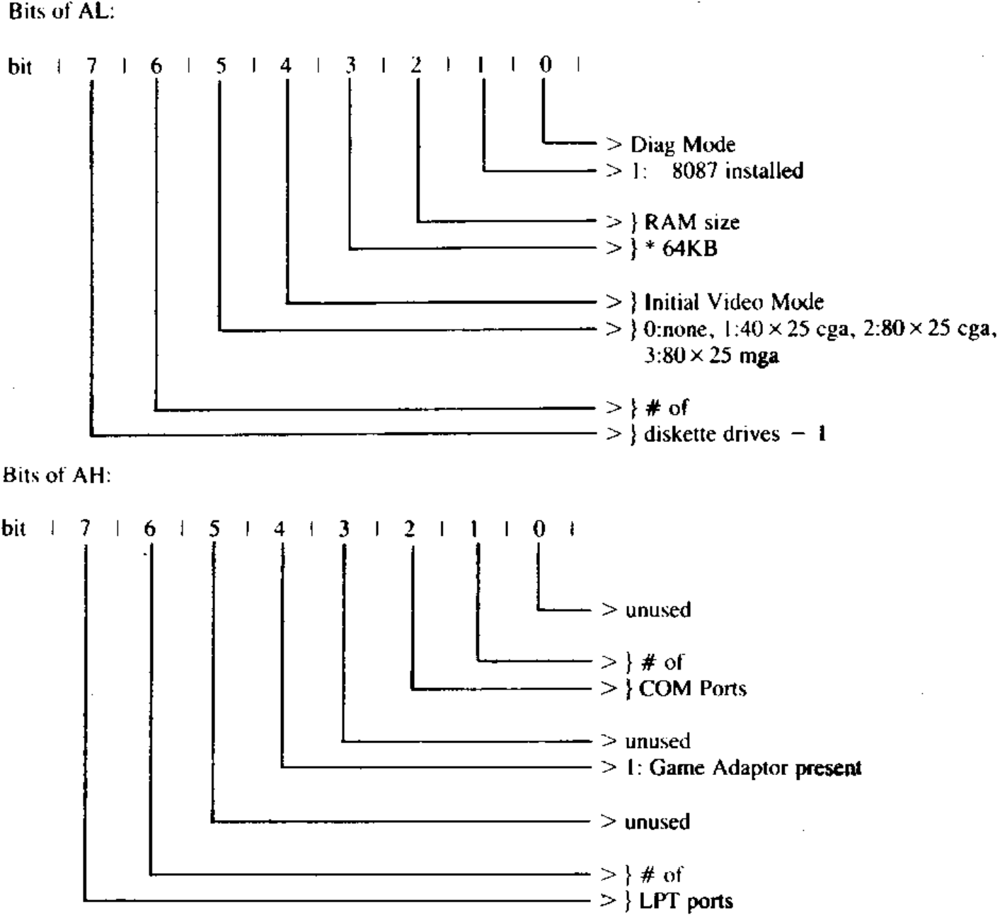

MEMORY SIZE CHECK VIA S/W INT 12H

```text
OUTPUT: AX = Total Memory size in Kilobytes
```

INITIALIZE COMM PORT (AH = 00H)

EIA DSR ENTRY POINT
VIA S/W INT 14H

```text
INPUT:  DX = Modem Control Register port
        AL = Baud Rate and UART control parameters
        BH = 0, upper bits of baud rate index
```

```text
OUTPUT: AH = Line Status
        AL = Modem Status
```

Serial Port Control bits in AL Register

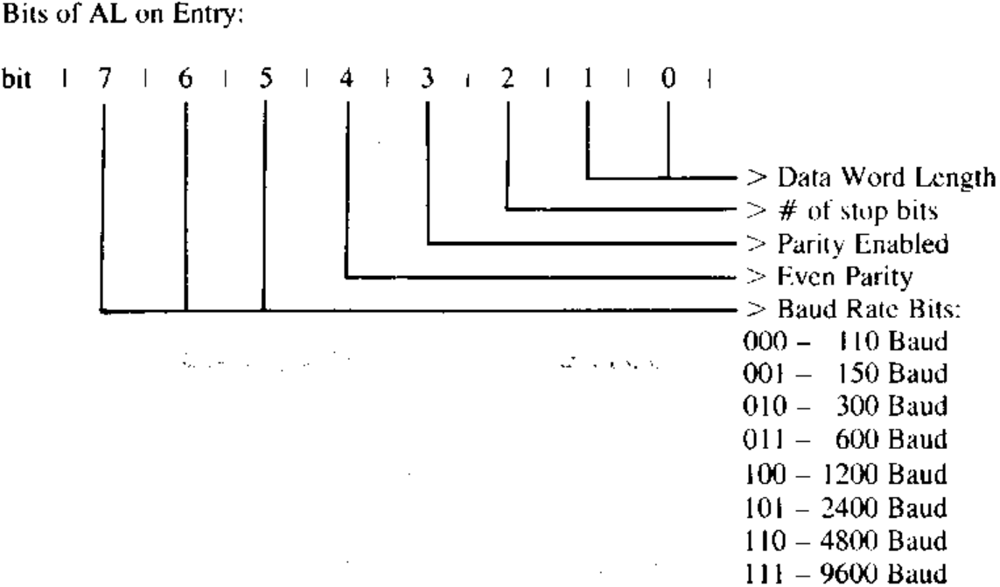

TRANSMIT A CHAR (AH = 01H)

```text
INPUT:  DX = Index into device table
        AL = Character to transmit
        CX = Timeout value
        BX = 0, used as timeout counter
```

```text
OUTPUT: AH = Line Status
```

RECEIVE A CHAR (AH = 02H)

```text
INPUT:  DX = Index into device table
        CX = Timeout value
        BX = 0, used as timeout counter
```

```text
OUTPUT: AH = Line Status (error bits only, = 0 if OK)
        AL = Received Character
```

Janus.Library

PREFACE

This is a brief description of the janus code. This code supports low level access to the “janus” system — the link between a PC and an Amiga.

THE PUBLIC ROUTINES

- AllocJanusMem
- CheckJanusInt
- CleanupJanusSig
- FreeJanusMem
- GetJanusStart
- GetParamOffset
- JBCopy
- JanusLock
- JanusMemBase
- JanusMemToOffset
- JanusMemType
- JanusUnLock
- SendJanusInt
- SetJanusEnable
- SetJanusHandler
- SetJanusRequest
- SetParamOffset
- SetupJanusSig

Contents

Descriptions

The code is packaged as a library (specifically “janus.library”), which is loaded during Autoconfig procedure.

All routines that return a value return it in D0. There is a link library for C routines, “jlib.lib”.

```text
oldHandler = SetJanusHandler( jintnum,  intserver  )
                               D0        A1
```

This routine sets up an interrupt handler for a particular janus interrupt. The old interrupt is returned. A null means that there is no interrupt handler. If there is no interrupt handler then interrupts not will be processed for that jintnum.

```text
oldEnable = SetJanusEnable( jintnum, newvalue )
                             D0       D1
```

INCLUDE FILES

**janus.[hi]:**

gives interface to janus.library. All definitions in this file are amiga specific. The most useful thing in this file are the definitions for janus memory allocation types

**janusreg.[hi]:**

hardware constants. Most people should not need this. If you do, we need to hide more information.

**janusvar.[hi]:**

the shared data structure between the amiga and the pc. Once again, you should not need direct access to these routines. We have tried to provide interface routines to do all the normal things.

**i86block.i:**

command blocks for calling pc’s interrupt’s directly and for the hard disk.

**services.[hi]:**

hard coded constants for interrupt numbers. Eventually these numbers will be gotten at run time, but for now they are constants. These numbers correspond to the “jintnum” parameters below.

**setupsig.[hi]:**

data structure for SetupJanusSig( ) call.

LISTINGS

i86block.i — interface definitions between amiga and commodore-pc

Copyright © 1986, Commodore-Amiga Inc., All rights reserved

```text
        IFND                        JANUS_I86BLOCK_I
JANUS_I86BLOCK_I                            SET 1

; All registers in this section are arranged to be read and written
; from the WordAccessOffset area of the shared memory. If you really
; need to use the ByteAccessArea, all the words will need to be byte
; swapped.
```

```text
  UWORD  adr_BufferAddr          ; offset into MEMF-
                                  _BUFFER memory for
                                  buffer
  UWORD  adr_Err                 ; return code, 0 if all OK
LABEL    AmigaDskReq_SIZEOF

; Function codes for AmigaDskReq adr_Fnctn word:

ADR_FNCTN_INIT       EQU    0     ; given nothings, sets adr_
                                  Part to # partitions
ADR_FNCTN_READ       EQU    1     ; given partition, offset,
                                  count, buffer
ADR_FNCTN_WRITE      EQU    2     ; given partition, offset,
                                  count, buffer
ADR_FNCTN_SEEK       EQU    3     ; given partition, offset
ADR_FNCTN_INFO       EQU    4     ; given part, buff adr, cnt,
                                  copys in a DskPartition
                                  structure. cnt set to actual
                                  number of bytes copied.

; Error codes for adr_Err, returned in low byte:

ADR_ERR_OK          EQU    0     ; no error
ADR_ERR_OFFSET      EQU    1     ; offset not on sector
                                  boundary
ADR_ERR_COUNT       EQU    2     ; dsk_count not a multiple
                                  of sector size
ADR_ERR_PART        EQU    3     ; partition does not exist
ADR_ERR_FNCT        EQU    4     ; illegal function code
ADR_ERR_EOF         EQU    5     ; offset past end of
                                  partition
ADR_ERR_MULPL       EQU    6     ; multiple calls while
                                  pending service

; Error condition from IBM-PC BIOS, returned in high byte:

ADR_ERR_SENSE_FAIL       EQU  $ff
ADR_ERR_UNDEF_ERR        EQU  $bb
ADR_ERR_TIME_OUT         EQU  $80
ADR_ERR_BAD_SEEK         EQU  $40
ADR_ERR_BAD_CNTRLR       EQU  $20
ADR_ERR_DATA_CORRECTED   EQU  $11 ; data corrected
ADR_ERR_BAD_ECC          EQU  $10
ADR_ERR_BAD_TRACK        EQU  $0b
ADR_ERR_DMA_BOUNDARY     EQU  $09
ADR_ERR_INIT_FAIL        EQU  $07
ADR_ERR_BAD_RESET        EQU  $05
ADR_ERR_RECRD_NOT_FOUND  EQU  $04
ADR_ERR_BAD_ADDR_MARK    EQU  $02
ADR_ERR_BAD_CMD          EQU  $01

ENDC     IJANUS_I86BLOCK_I
```

janus.i — software conventions for janus.i

Copyright © 1986, Commodore-Amiga Inc., All rights reserved

```text
IFND        EXEC_TYPES_I
INCLUDE     "exec/types.i"
ENDC        EXEC_TYPES_I

IFND        EXEC_LIBRARIES_I
            INCLUDE "exec/libraries.i"
ENDC        EXEC_LIBRARIES_I

IFND        EXEC_INTERRUPTS_I
INCLUDE     "exec/interrupts.i"
ENDC        EXEC_INTERRUPTS_I

; JanusResource — an entity which keeps track of the reset state of
  the 8088. If this resource does not exist, it is assumed the 8088 can
  be reset.

STRUCTURE JanusResource,LN_SIZE
    APTR    jr_BoardAddress          ; address of JANUS board
    UBYTE   jr_Reset                 ; non_zero indicates 8088
                                      is held reset
    LABEL   JanusResource_SIZEOF

; As a coding convenience, we assume a maximum of 32 handlers.
; People should avoid using this in their code, because we want to
; be able to relax this constraint in the future. All the standard
; commands' syntactically support any number of interrupts, but
; the internals are limited to 32.

MAXHANDLER          EQU     32

; JanusAmiga — amiga specific data structures for janus project:

STRUCTURE JanusAmiga,LIB_SIZE
ULONG       ja_IntReq                ; software copy of out-
                                      standing requests
ULONG       ja_IntEna                ; software copy of enabled
                                      interrupts
APTR        ja_ParamMem              ; ptr to (word arranged)
                                      param mem
APTR        ja_IoBase                ; ptr to base of io register
                                      region
APTR        ja_ExpanBase             ; ptr to start of shared
                                      memory
APTR        ja_ExecBase              ; ptr to exec library
APTR        ja_DOSBase               ; ptr to DOS library
APTR        ja_SegList               ; holds a pointer to our
                                      code segment
```

janus.h—the software data structures for the janus board

Copyright © 1986, Commodore Amiga Inc., All rights reserved

```text
/* all bytes described here are described in the byte order of the
 * 8088. Note that words and longwords in these structures will be
 * accessed from the word access space to preserve the byte order in
 * a word — the 8088 will access longwords by reversing the words:
 * like a 68000 access to the word access memory.
 */
/* JanusMemHead — a data structure roughly analogous to an exec
   mem chunk.
 * It is used to keep track of memory used between the 8088 and the
   68000.
 */

struct JanusMemHead [
        UBYTE  jmh_Lock;         /* lock byte between
                                   processors */
        UBYTE  jmh_pad0;
        APTR   jmh_68000Base;    /* rptr's are relative to this */
        UWORD  jmh_8088Segment;  /* segment base for 8088 */
        RPTR   jmh_First;        /* offset to first free chunk */
        RPTR   jmh_Max;          /* max allowable index */
        UWORD  jmh_Free;         /* total number of free
                                   bytes -1 */
];

/* JanusMemChunk — keep track of individualy freed chunks of
memory.
 * Memory Chunks are longword aligned in this memory.
 */

struct JanusMemChunk [
        RPTR   jmc_Next;         /* rptr to next free chunk */
        UWORD  jmc_Size;         /* size of chunk -1*/
];

#ifdef undef
this stuff is saved for future use, but is not yet thought out
/* JanusList — an RPTR/Exec style list header.
 */
struct JanusList [
        RPTR   jl_Head;
        RPTR   jl_Tail;
        RPTR   jl_TailPred;
        UBYTE  jl_Lock;          /* lock byte between
                                   processors
```

```text
      */UBYTE jl_pad0;
];

/* JanusNode — an RPTR/Exec style node.
 */
struct JanusReqList
      [RPTR   jn_Succ;
      RPTR    jn_Pred;
      RPTR    jn_Name;
      UWORD   jn_ReqIndex;    /* this’ index into jb_
                               CommRegs */
];

#endif undef

/* JanusBase — the master data table for the janus project. It is
  located
 * at the bottom of parameter memory.*/

struct JanusBase [
      UBYTE jb_Lock;          /* lock byte between
                                processors */
      UBYTE jb_8088Go;
      struct JanusMemHead     /* free mem pool for param
             jb_ParamMem;       memory
      struct JanusMemHead     /* free mem pool for buffer
                                memory */
             jb_BufferMem;
      RPTR   jb_Interrupts;   /* (UBYTE *) of request
                                byte-pairs */
      RPTR   jb_Parameters;   /* array of ptrs to parameter
                                areas */
      UWORD jb_NumInterrupts; /* number of interrupts &
                                parameters */];

/* constant to set to indicate a pending software interrupt
*/#define JSETINT    0x7f
```

memrw.i—parameter area definition for access to other processors mem

Copyright © 1986, Commodore-Amiga Inc., All rights reserved

```text
#ifndef JANUS_MEMRW_H
#define JANUS_MEMRW_H

/*
** this is the parameter block for the JSERV_READPC and JSERV_
** READAMIGA services — read and/or write the other processors
   memory.
*/
```

PC JANUS SERVICE

This service is called via INT JANUS.
AH contains a function code

J_GET_SERVICE

Gets a new Service Number

```text
Expects:
    nothing
Returns:
    AL : New Service Number to use
         − 1 if no service available (J_NO_SERVICE)
```

J_GET_BASE

Gets Segments & offset of Janus Memory

```text
Expects:
    AL : Janus Service Number
Returns:
    ES : Janus Parameter Segment
    DI : Janus Parameter Offset (if defined),
         else − 1
    DX : Janus Buffer Segment
    AL : Status (J_OK, J_NO_SERVICE)
```

J_ALLOC_MEM

Allocates Janus Memory

```text
Expects:
    AL : Type of memory to allocate
    BX : Number of Bytes to allocate
Returns:
    BX : Offset of registered memory if success,
    AL : Status (J_OK, J_NO_MEMORY)
```

J_FREE_MEM

Releases Janus Memory

```text
Expects:
    AL : Type of memory to free
    BX : Offset of Memory to free
Returns:
    Crash if offset/type was wrong (J_GOODBYE, later)
```

J_SET_PARAM

Set the default parameter memory pointer

```text
Expects:
    AL : Janus Service Number to support
    BX : Default Offset of Param Memory to install
Returns:
    AL : Status (J_OK, J_NO_SERVICE)
```

COMMAND DESCRIPTION

All commands executed by the HDC are summarized in the table below. Fields of the command block not specified are don't cares. Following this summary is a generalized description of the commands.

Table 5-6. Command Summary

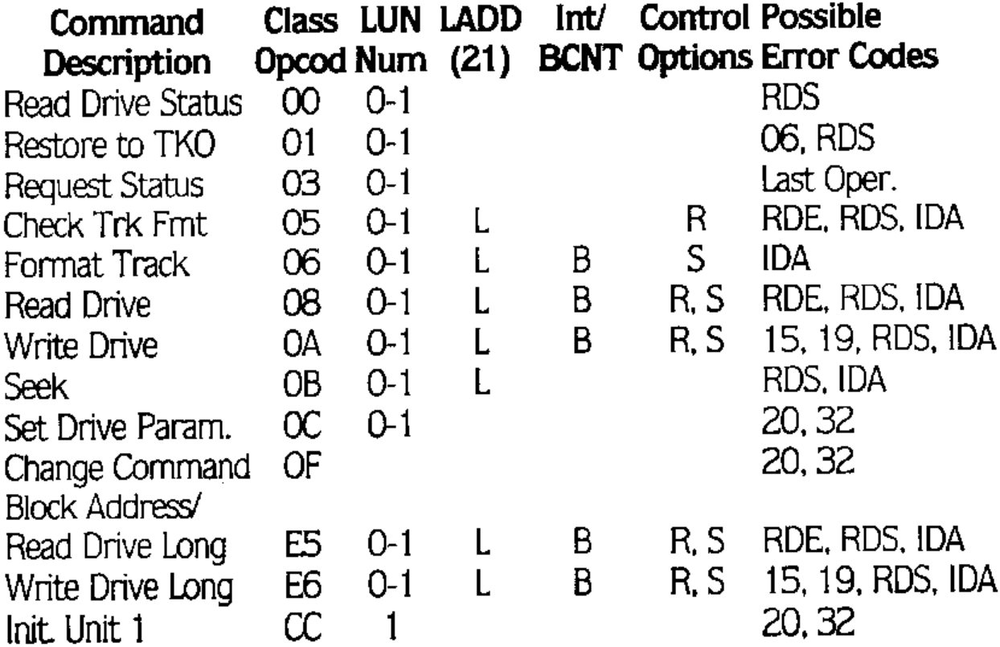

R = 0 Retries/ECC enable
  = 1 Retries/ECC disabled

S = 0 Set correction span to 5 bits
  = 1 Set correction span to 11 bits

L = Logical Sector Address

B = Block or sector count required

Read Drive Status (RDS) = 02, 03, 04, 20, 32
Illegal Disk Access (IDA) = 20, 21, 22, 32
Read Sector Error (RDE) = 11, 12, 13, 14, 15

Action

Read Drive Status (Class 0, Opcode 0)

Read the drive's status and determine if drive is ready. For Hard disk drives supporting buffered seeks this command is useful for determining the first drive to reach its target track. The command will be aborted, if the drive status read is incorrect.

Possible Error Codes

No error, invalid command, seek in progress, drive not ready, write fault, DMA error.

Action

Restore (Class 0, Opcode 1)

This four bit field can be used to specify options as indicated below:

```text
Bit 7 = 0  5 bit correction span (default value)
      = 1  11 bit correction span

Bit 6 = 0  Retries & ECC enabled (default value)
      = 1  Retries & ECC disabled

Bit 5 = 0  Not Used

Bit 4 = 0  Not Used
```

Step Rate

```text
Step Rate 14 = 11.1 usec
Step Rate 15 = 30 usec
All Others   =  3 msec
```

Possible Error Codes

No error, invalid command, DMA error.

Action

Initialize Unit 1
(Opcode CC)

This command with initialize or set drive parameters of unit 1 only. This allows for the HDC to support two different drive types at the same time. The action of this command is identical to the action of the ‘Set Drive Parameter’ command noted above except that it will effect only unit 1. For command details see section 6.2.9.

Action

Change Command Block
(Class 0, Opcode F)

The Change Command Block is used to move the location of the command block from the default on power up to a new location. Bytes 6 and 7 of the command block are used as indirect address pointers for the beginning of a 7 byte block of memory organized as follows:

Table 5-10. Change Command Block Address

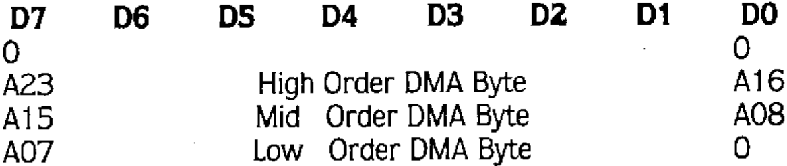

LINE DRAW: BLTADAT is used as an index register and must be preloaded with 8000. BLTBDAT is used for texture. It must be preloaded with FF if no texture (solid line) is desired.

BLTDDAT — *Blitter destination data register*

This register holds the data resulting from each word of Blitter operation until it is sent to a RAM destination. This is a dummy address and cannot be read by the micro. The transfer is automatic during Blitter operation.

BLTCON0 — *Blitter control register 0*

BLTCON1 — *Blitter control register 1*

These two control registers are used together to control Blitter operations. There are 2 basic modes, area and line, which are selected by bit 0 of BLTCON1, as shown below.

AREA MODE ("normal")

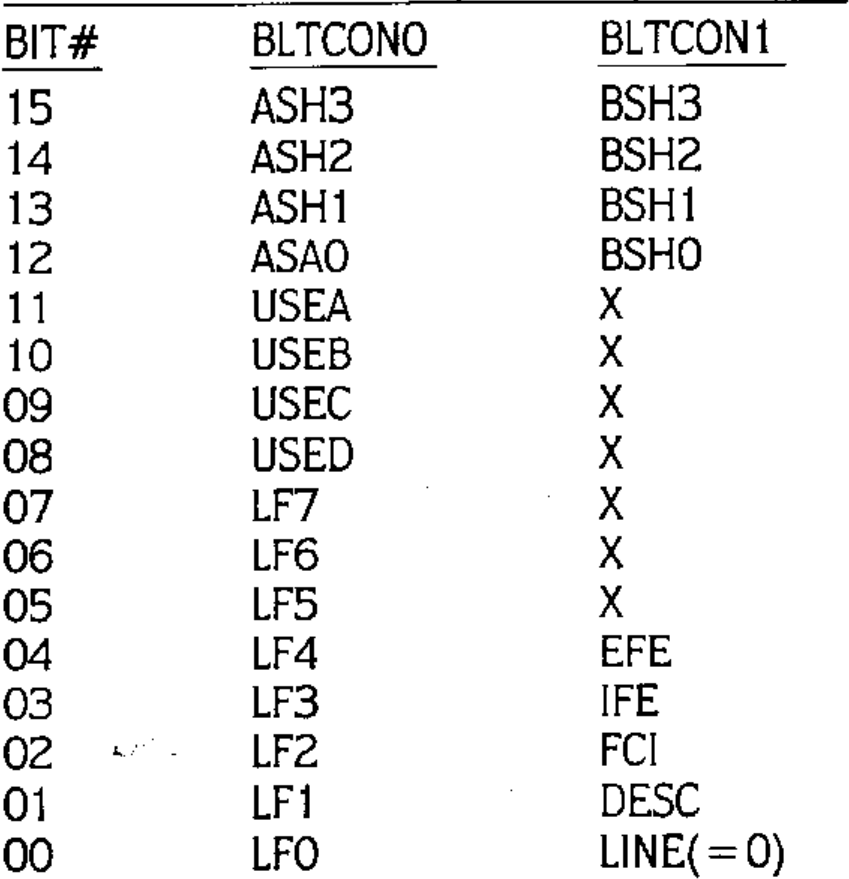

ASH3-0 — Shift value of A source

BSH3-0 — Shift value of B source

USEA — Mode control bit to use Surce A

USEB — Mode control bit to use Source B

USEC — Mode control bit to use Source C

USED — Mode control bit to use Destination D

LF7-0 — Logic function minterm select lines

EFE — Exclusive fill enable

IFE — Inclusive fill enable

FCI — Fill carry input

DESC — Descending (decreasing address) control bit

LINE — Line mode control bit (set to 0)

LINE DRAW:

LINE MODE (line draw)

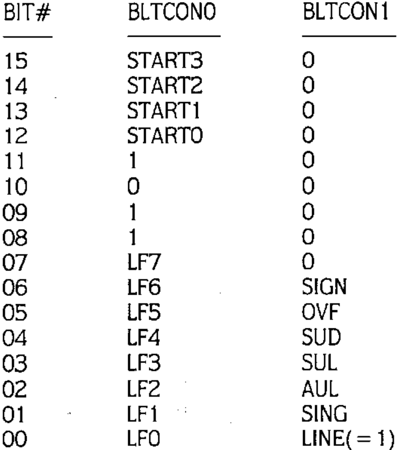

START3-0 Starting point of line (0 thru 15 hex)

LF7-0 Logic function minterm select lines should be preloaded with 4A in order to select the equation D = (A̅C + ABC̅). Since A contains a single bit true (8000), most bits will pass the C field unchanged (not A and C), but one bit will invert the C Field and combine it with texture (A and B and not C). The A bit is automatically moved across the word by the hardware.

LINE Line mode control bit (set to 1)

SIGN Sign flag

OVF Word overflow flag

SING Single bit per horiz. line for use with subsequent Area Fill

SUD Sometimes Up or Down (= AUD*)

SUL Sometimes Up or Left

AUL Always Up or Left

The 3 bits above select the Octant for line draw:

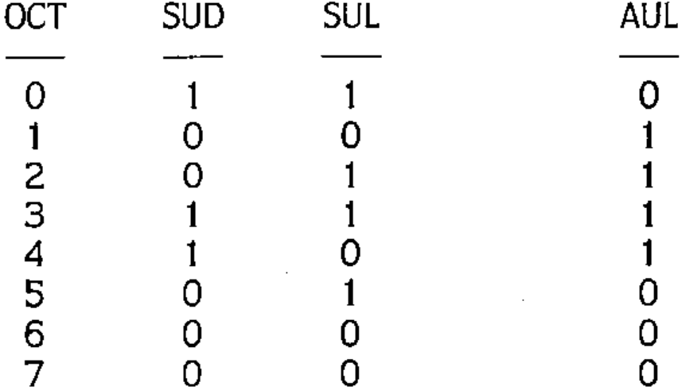

Blitter start and size (Window, width height)

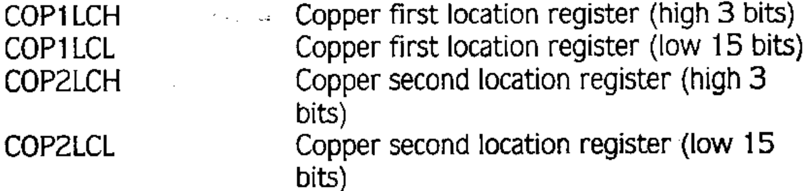

COP1NS — *Copper instruction fetch identify*

This is a dummy address that is generated by the Copper whenever it is loading instructions into its own instruction register. This actually occurs every Copper cycle except for the second (IR2) cycle of the MOVE instruction. The three types of instructions are shown below:

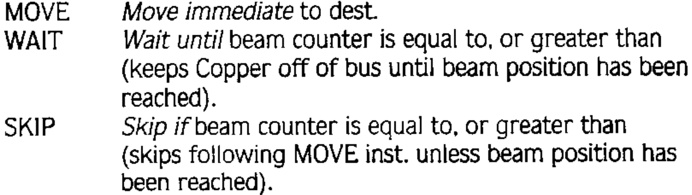

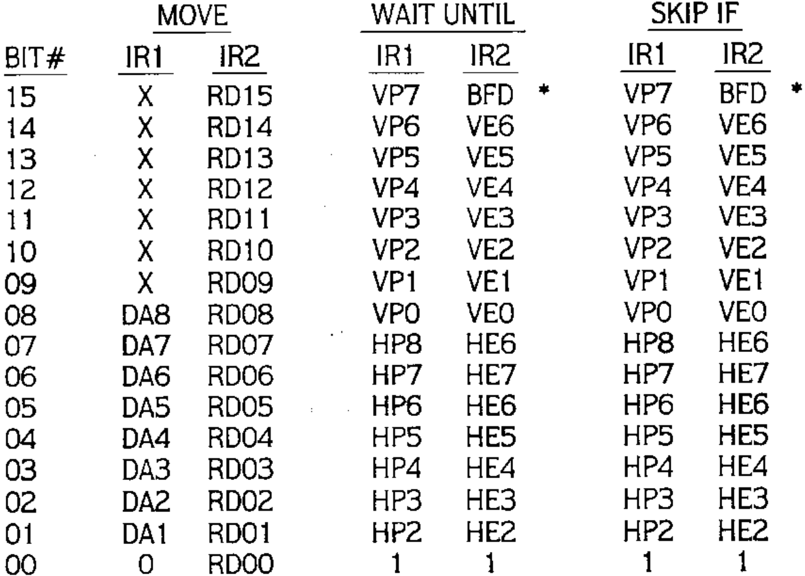

IR1 = First instruction register

IR2 = Second instruction register

DA = Destination Address for MOVE instruction. Fetched during IR1 time, used during IR2 time on RGA bus.

RD = RAM data moved by MOVE instruction at IR2 time directly from RAM to the address given by the DA field.

VP = Vertical Beam Position comparison bit

HP = Horizontal Beam Position comparison bit

VE = Enable comparison (mask bit)

HE = Enable comparison (mask bit)

These registers control the horizontal timing of the beginning and end of the Bit Plane DMA display data fetch. The vertical Bit Plane DMA timing is identical to the Display windows described above. The Bit Plane Modulos are dependent on the Bit Plane horizontal size, and on this data fetch window size.

Register bit assignment

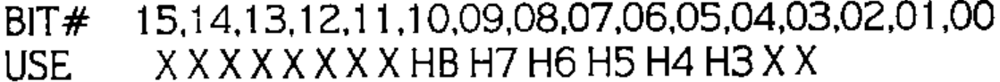

(X bits should always be driven with 0 to maintain upward compatibility)

The tables below show the start and stop timing for different register contents.

DDFSTRT (Left edge of display data fetch)

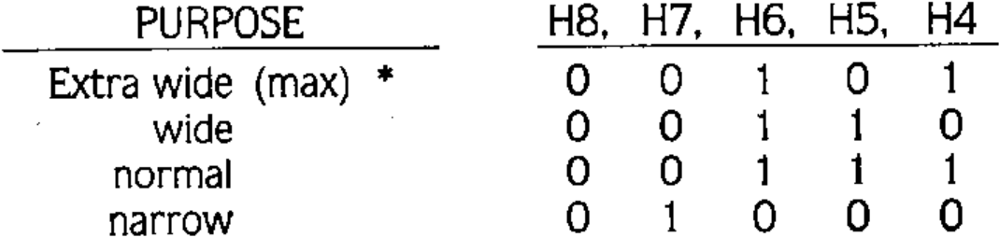

DDFSTOP (Right edge of display data fetch)

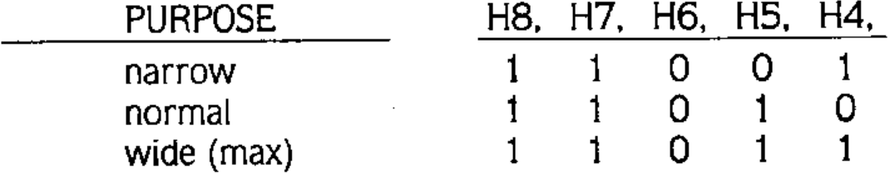

```text
DMACON     DMA control write (clear or set)
DMACONR    DMA control (and Blitter status) read
```

This register controls all of the DMA channels, and contains Blitter DMA status bits.

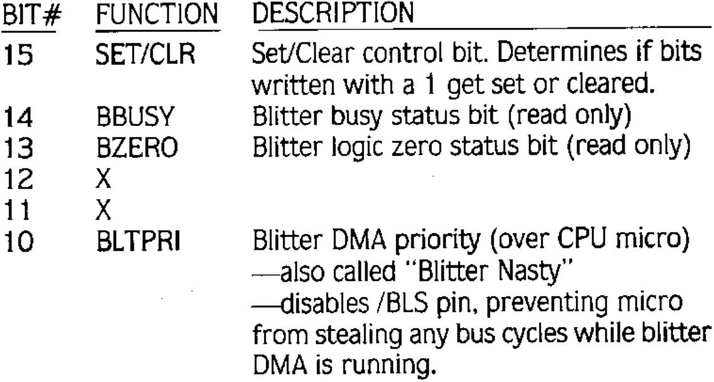

DMA Time Slot Allocation/Horizontal Line (Cont’d)

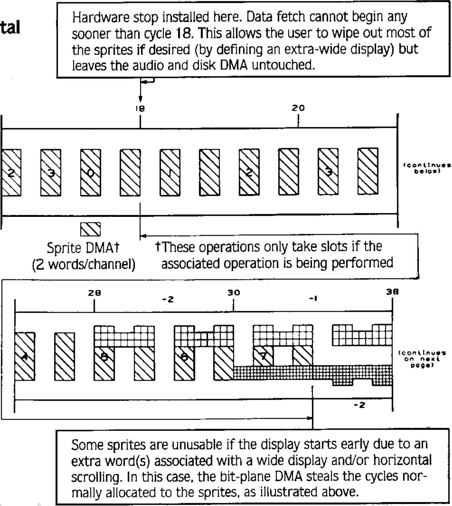

A2000 PAL Equations

```text
PAL20L8'                                           PAL DESIGN SPECIFICATION
PART NO.: 380 XXX-01  DESCRPT.:PALEN    REV.2        FRANK ULLMANN   03-09-86
MEM- AND DTACK-DECODER FOR A2500 MAINBOARD (U26) ASSY 380...
COMMODORE BSW         !! PRELIMENARY !!

A23 A22 A21 A20 A19 A18 PRW AS DBR OVL OVR GND
C1 C3 VPA MYRAME CLKE RGAE RE DTACK BLS ROME XRDY VCC


IF (OVR) /VPA = /AS*A23*/A22*A21                    ; PERIPHERAL ACCESS
                                                   ; $A00000-BFFFFF

/MYRAME  = /AS*DTACK*A23*A22*A21*OVR*/C1*C3          ; $E00000-FFFFFF
         + /AS*DTACK*/A23*/A22*/A21*OVR*OVL*/C1*C3   ; $000000-1FFFFF IF
                                                   ; OVL=H, OVR=H !
         + /AS*DTACK*A23*A22*/A21*A20*A19*/A18*OVR*/C1*C3   ; $D80000-DBFFFF
         + /MYRAME*/C1
         + /MYRAME*/C3

/RE      = DBR*/AS*DTACK*/A23*/A22*/A21*OVR*/OVL*    ; $000000-1FFFFF IF
           /C1*C3                                  ; OVL=L, OVR=H !
         + /RE*/C1
         + /RE*/C3

IF (OVR) /DTACK =
           /AS*/A23*/A22*A21*XRDY                   ; $200000-3FFFFF EXP RAM
         + /AS*/A23*A22*XRDY                        ; $400000-7FFFFF  "   "
         + /AS*A23*/A22*/A21*XRDY                   ; $800000-9FFFFF  "   "
         + /MYRAME*XRDY*/C3                        ; $000000-1FFFFF OVL=H
                                                   ; AND $E00000-FFFFFF
         + /RE*/C3                                 ; $000000-1FFFFF OVL=L
         + /RGAE*/C3                               ; $C00000-D7FFFF
                                                   ; AND $DC0000-DF0000
         + /DTACK*/AS*XRDY

/RGAE    = DBR*/AS*DTACK*A23*A22*/A21*A20*/A19*   OVR*/C1*C3;$D00000-$D7FFFF
         + DBR*/AS*DTACK*A23*A22*/A21*A20*A19*A18*OVR*/C1*C3;$DC0000-$DFFFFF
         + DBR*/AS*DTACK*A23*A22*/A21*/A20*       OVR*/C1*C3;$C00000-$CFFFFF
         + /RGAE*/C1
         + /RGAE*/C3

/BLS     = /AS*DTACK*/A23*/A22*/A21*OVR*/OVL*/C1*C3 ; $000000-1FFFFF OVL=L
         + /AS*DTACK*A23*A22*/A21*OVR*/C1*C3         ; $C00000-DFFFFF
         + /BLS*/C1
         + /BLS*/C3
```

List of B2000 Motherboard Jumpers

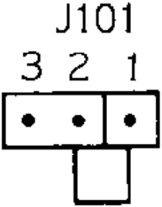

This jumper determines the high-order address bit for Fat Agnus. In its normal position shown the high-order bit is A23; in its other position, this bit is A19. The current Fat Agnus chip requires the A23 signal for proper management of the memory at $C00000. Future Fat Agnus chips may map things differently.

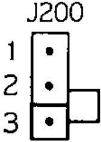

This jumper is used to set the light-pen port number. In the normal position shown, the light pen input will be the FIRE input of mouse/joystick port 1, as with the A500. With the jumper in the other position, the light pen input will be the FIRE input of mouse/joystick port 0, which is the scheme used on the A1000 machine.

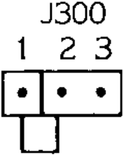

This jumper determines the time base used for the 50/60Hz CIA timer chip. In the normal position, the 50/60Hz TICK clock, based on AC line frequency, is used as a time base. In the alternate position, the vertical sync pulse from the video section is used. The system will not operate properly without one of these clocks.

```text
J301

X X
```

This jumper is closed to add a second internal floppy drive, open to leave the second floppy out of the main unit box.

```text
J500

 X-X
```

This jumper is used to enable the 512K of RAM at $C00000. It is normally closed; opening it will disable this extra RAM.


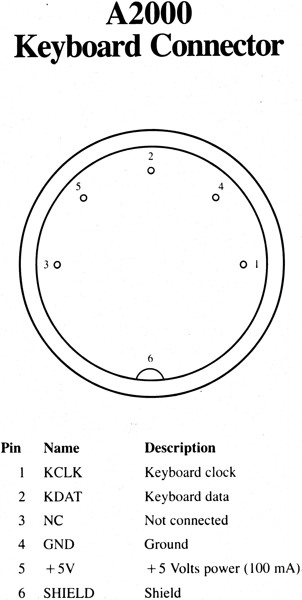

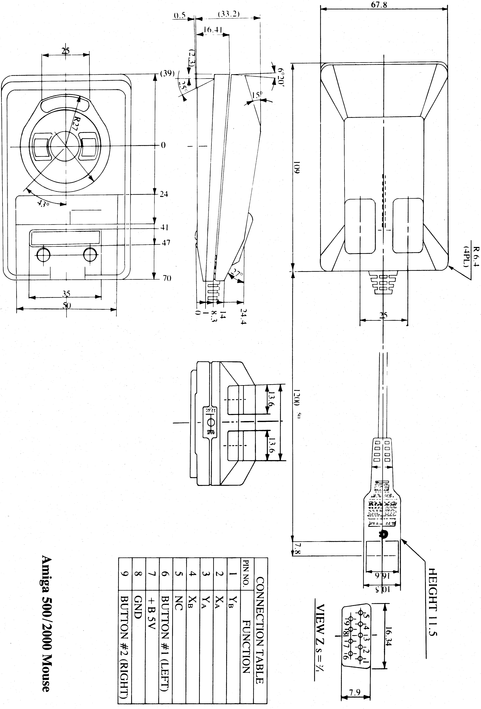

NOTE

The offset values of the registers are the addresses that the Copper must use to talk to the registers.

For example, in assembler:

```text
        INCLUDE "exec/types.i"
        INCLUDE "hardware/custom.i"

        XREF    _custom                 ; External reference...

Start:  lea     _custom,a0              ; Use a0 as base register
        move.w  #$7FFF,intena(a0)        ; Disable all interupts
```

In C, you would use the structure definitions in hardware/custom.h For example:

```text
#include        "exec/types.h"
#include        "hardware/custom.h"

extern  struct  Custom  custom;

/* You may need to define the above external as
**  extern struct Custom far custom;
**  Check you compiler manual.
*/

main()
{
custom.intena = 0x7FFF;         /* Disable all interupts */
}
```

The Amiga hardware include files are generally supplied with your compiler or assembler. Listings of the hardware include files may also be found in the Addison-Wesley Amiga ROM Kernel Manual “Includes and Autodocs”. Generally, the include file label names are very similar to the equivalent hardware register list names with the following typical differences.

- Address registers which have low word and high word components are generally listed as two word sized registers in the hardware register list, with each register name containing either a suffix or embedded “L” or “H” for low and high. The include file label for the same register will generally treat the whole register as a longword (32 bit) register, and therefore will not contain the “L” or “H” distinction.
- Related sequential registers which are given individual names with number suffixes in the hardware register list, are generally referenced from a single base register definition in the include files. For example, the color registers in the hardware list (COLOR00, COLOR01, etc.) would be referenced from the “color” label defined in “hardware/custom.i” (color+0, color+2, etc.).
- Examples of how to define the correct register offset can be found in the hw_examples.i file listed in Appendix J.

Do not read, write, or use any currently undefined address ranges. The current and future usage of such areas is reserved by Commodore and is definitely subject to change.

If you are using the system libraries, devices, and resources, you must follow the defined interface. Assembler programmers (and compiler writers) must enter functions through the library base jump tables, with arguments passed as longs and library base address in A6. Results returned in D0 must be tested, and the contents of D0-D1/A0-A1 must be assumed gone after a system call.

NOTE

The assembler TAS instruction should not be used in any Amiga program. The TAS instruction assumes an indivisible read-modify-write but this can be defeated by system DMA. Instead use BSET and BCLR. These instructions perform a test and set operation which cannot be interrupted.

TAS is only needed for a multiple CPU system. On a single CPU system, the BSET and BCLR instructions are identical to TAS, as the 68000 does not interrupt instructions in the middle. BSET and BCLR first test, then set bits.

Do not use assembler instructions which are privileged on any 68000 family processor, most notably MOVE SR,<ea> which is privileged on the 68010/20/30. Use the Exec function GetCC() instead of MOVE SR, or use the appropriate non-privileged instruction as shown below:

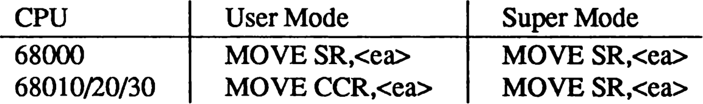

All addresses must be 32 bits. Do not use the upper 8 bits for other data, and do not use signed variables or signed math for addresses. Do not execute code on your stack or use self-modifying code since such code can be defeated by the caching capabilities of some 68xxx processors. And never use processor or clock speed dependent software loops for timing delays. See Appendix F for information on using an 8520 timer for delays.

NOTE

When strobing any register which responds to either a read or a write, (for example copjmp2) be sure to use a MOVE.W #$00, not CLR.W. The CLR instruction causes a read and a clear (two accesses) on a 68000, but only a single access on 68020 and above. This will give different results on different processors.

If you are programming at the hardware level, you must follow hardware interfacing specifications. All hardware is NOT the same. Do not assume that low level hacks for speed or copy protection will work on all drives, or all keyboards, or all systems, or future systems. Test your software on many different systems, with different processors, OS, hardware, and RAM configurations.

The WAIT Instruction

The WAIT instruction causes the Copper to wait until the video beam counters are equal to (or greater than) the coordinates specified in the instruction. While waiting, the Copper is off the bus and not using memory cycles.

The first instruction word contains the vertical and horizontal coordinates of the beam position. The second word contains enable bits that are used to form a “mask” that tells the system which bits of the beam position to use in making the comparison.

FIRST INSTRUCTION WORD (IR1)

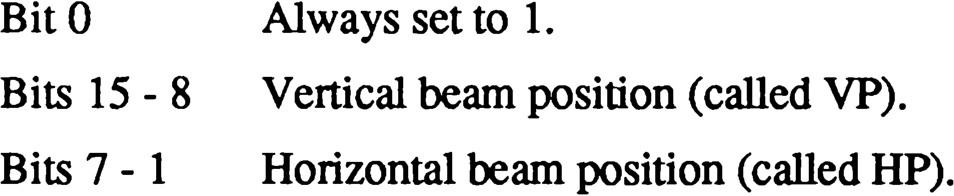

SECOND INSTRUCTION WORD (IR2)

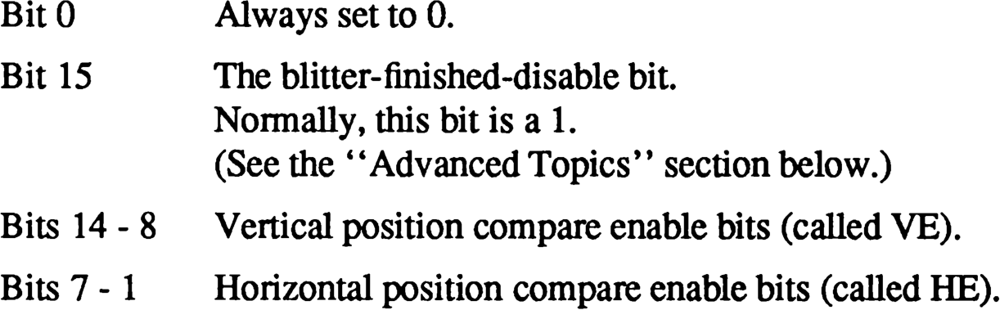

The following example WAIT instruction waits for scan line 150 ($96) with the horizontal position masked off.

```text
DC.W    $9601,$FF00     ;Wait for line 150,
                       ;   ignore horizontal counters.
```

The following example WAIT instruction waits for scan line 255 and horizontal position 254. This event will never occur, so the Copper stops until the next vertical blanking interval begins.

```text
DC.W    $FFFF,$FFFE     ;Wait for line 255,
                       ;   H = 254 (ends Copper list).
```

To understand why position VP=$FF HP=$FE will never occur, you must look at the comparison operation of the Copper and the size restrictions of the position information. Line number 255 is a valid line to wait for, in fact it is the maximum value that will fit into this field. Since 255 is the maximum number, the next line will wrap to zero (line 256 will appear as a zero in the

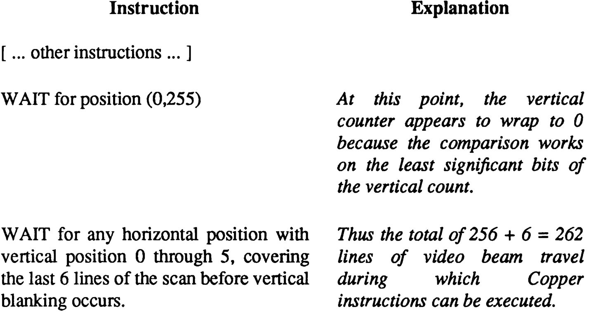

NOTE

The vertical is like the horizontal—as there are alternating long and short lines, there are also long and short fields (interlace only). In NTSC, the fields are 262, then 263 lines and in PAL, 312,313.

This alternation of lines & fields produces the standard NTSC 4 field repeating pattern:

short field ending on short line  
long field ending on long line  
short field ending on long line  
long field ending on short line  
& back to the beginning...

1 horiz count takes 1 cycle of the system clock. (Processor is twice this)

NTSC- 3,579,545 Hz  
PAL- 3,546,895 Hz  
genlocked- basic clock frequency plus or minus about 2%.

THE COMPARISON ENABLE BITS

Bits 14-1 are normally set to all 1s. The use of the comparison enable bits is described later in the “Advanced Topics” section.

COMPLETE SAMPLE COPPER LIST

The following example shows a complete Copper list. This list is for two bit-planes—one at $21000 and one at $25000. At the top of the screen, the color registers are loaded with the following values:

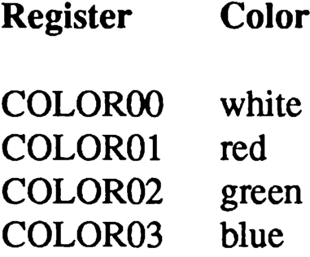

At line 150 on the screen, the color registers are reloaded:

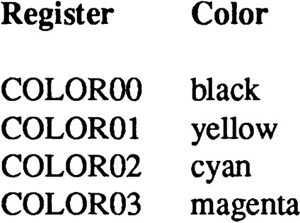

The complete Copper list follows.

```text
;
; Notes:
;       1. Copper lists must be in CHIP ram.
;       2. Bitplane addresses used in the example are arbitrary.
;       3. Destination register addresses in copper move instructions
;          are offsets from the base address of the custom chips.
;       4. As always, hardware manual examples assume that your
;          application has taken full control of the hardware,
;          and is not conflicting with operating system use of
;          the same hardware.
;       5. Many of the examples just pick memory addresses to
;          be used.  Normally you would need to allocate the
;          required type of memory from the system with AllocMem()
;       6. As stated earlier, the code examples are mainly to help
;          clarify the way the hardware works.
;       7. The following INCLUDES are required by all example code
;          in this chapter.
;

        INCLUDE "exec/types.i"
        INCLUDE "hardware/custom.i"
        INCLUDE "hardware/dmabits.i"
        INCLUDE "hardware/hw_examples.i"
```

```text
COPPERLIST:
;
;  Set up pointers to two bit planes
;
        DC.W    BPL1PTH,$0002   ;Move $0002 into register $0E0 (BPL1PTH)
        DC.W    BPL1PTL,$1000   ;Move $1000 into register $0E2 (BPL1PTL)
        DC.W    BPL2PTH,$0002   ;Move $0002 into register $0E4 (BPL2PTH)
        DC.W    BPL2PTL,$5000   ;Move $5000 into register $0E6 (BPL2PTL)
;
;  Load color registers
;
        DC.W    COLOR00,$0FFF   ;Move white into register $180 (COLOR00)
        DC.W    COLOR01,$0F00   ;Move red into register $182 (COLOR01)
        DC.W    COLOR02,$00F0   ;Move green into register $184 (COLOR02)
        DC.W    COLOR03,$000F   ;Move blue into register $186 (COLOR03)
;
;   Specify 2 lo-res bitplanes
;
        DC.W    BPLCON0,$2200   ;2 lores planes, coloron
;
;  Wait for line 150
;
        DC.W    $9601,$FF00     ;Wait for line 150, ignore horiz. position
;
;  Change color registers mid-display
;
        DC.W    COLOR00,$0000   ;Move black into register $0180 (COLOR00)
        DC.W    COLOR01,$0FF0   ;Move yellow into register $0182 (COLOR01)
        DC.W    COLOR02,$00FF   ;Move cyan into register $0184 (COLOR02)
        DC.W    COLOR03,$0F0F   ;Move magenta into register $0186 (COLOR03)
;
; End Copper list by waiting for the impossible
;
        DC.W    $FFFF,$FFFE     ;Wait for line 255, H = 254 (never happens)
```

For more information about color registers, see Chapter 3, “Playfield Hardware.”

LOOPS AND BRANCHES

Loops and branches in Copper lists are covered in the “Advanced Topics” section below.

Starting and Stopping the Copper

STARTING THE COPPER AFTER RESET

At power-on or reset time, you must initialize one of the Copper location registers (COP1LC or COP2LC) and write to its strobe address before Copper DMA is turned on. This ensures a known start address and known state. Usually, COP1LC is used because this particular register is reused during each vertical blanking time. The following sequence of instructions shows how to

- Vertical resolution, or interlacing.
- Data fetch and modulo, which tell the system how much data to put on a horizontal line and how to fetch data from memory to the screen.

In addition, you need to allocate memory to store the playfield, set pointers to tell the system where to find the data in memory, and (optionally) write a Copper routine to handle redisplay of the playfield.

HEIGHT AND WIDTH OF THE PLAYFIELD

To create a playfield that is the same size as the screen, you can use a width of either 320 pixels or 640 pixels, depending upon the resolution you choose. The height is either 200 or 400 lines for NTSC, 256 or 512 lines for PAL, depending upon whether or not you choose interlaced mode.

BIT-PLANES AND COLOR

You define playfield color by:

1. Deciding how many colors you need and how you want to color each pixel.
2. Loading the colors into the color registers.
3. Allocating memory for the number of bit-planes you need and setting a pointer to each bit-plane.
4. Writing instructions to place a value in each bit in the bit-planes to give you the correct color.

Table 3-1 shows how many bit-planes to use for the color selection you need.

Table 3-1: Colors in a Single Playfield

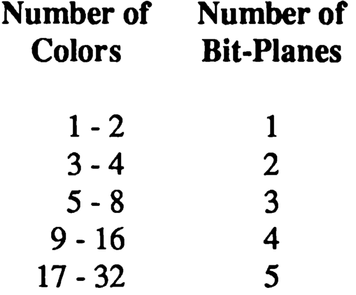

## The Color Table

The color table contains 32 registers, and you may load a different color into each of the registers. Here is a condensed view of the contents of the color table:

Table 3-2: Portion of the Color Table

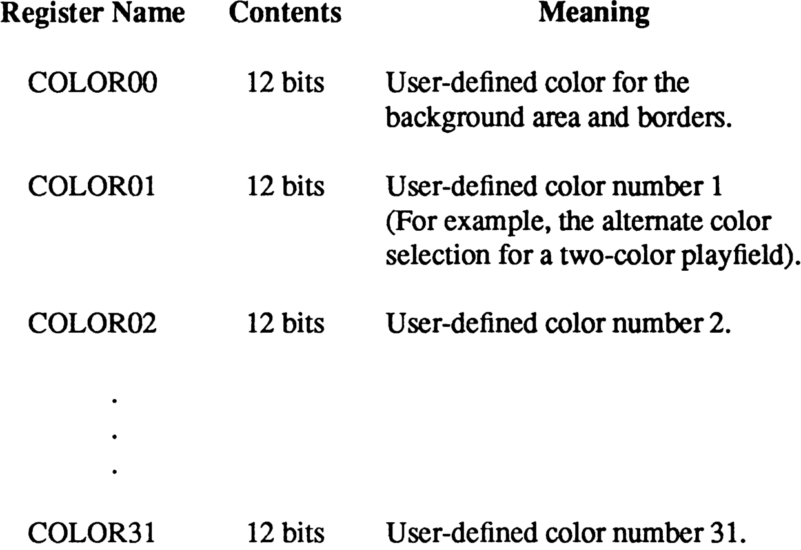

COLOR00 is always reserved for the background color. The background color shows in any area on the display where there is no other object present and is also displayed outside the defined display window, in the border area.

**NOTE**

If you are using the optional genlock board for video input from a camera, VCR, or laser disk, the background color will be replaced by the incoming video display.

Twelve bits of color selection allow you to define, for each of the 32 registers, one of 4,096 possible colors, as shown in Table 3-3.

The following example sets DIWSTOP for a basic playfield to $F4 for the vertical position and $C1 for the horizontal position.

```text
LEA     CUSTOM,a0               ; Get base address of custom hardware...
MOVE.W  #$F4C1,DIWSTOP(a0)       ; Display window stop register...
```

Table 3-9: DIWSTRT AND DIWSTOP Summary.

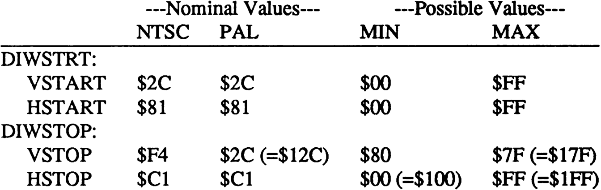

TELLING THE SYSTEM HOW TO FETCH AND DISPLAY DATA

After defining the size and position of the display window, you need to give the system the on-screen location for data fetched from memory. To do this, you describe the horizontal positions where each line starts and stops and write these positions to the data-fetch registers. The data-fetch registers have a four-pixel resolution (unlike the display window registers, which have a one-pixel resolution). Each position specified is four pixels from the last one. Pixel 0 is position 0; pixel 4 is position 1, and so on.

The data-fetch start and display window starting positions interact with each other. It is recommended that data-fetch start values be restricted to a programming resolution of 16 pixels (8 clocks in low-resolution mode, 4 clocks in high-resolution mode). The hardware requires some time after the first data fetch before it can actually display the data. As a result, there is a difference between the value of window start and data-fetch start of 4.5 color clocks.

The normal low-resolution DDFSTRT is ($0038).
The normal high-resolution DDFSTRT is ($003C).

Recall that the hardware resolution of display window start and stop is twice the hardware resolution of data fetch:

$$\frac{\$81}{2} - 8.5 = \$38$$

$$\frac{\$81}{2} - 4.5 = \$3C$$

Combination 000 selects transparent mode, to show the color of whatever object (the other playfield, a sprite, or the background color) may be “behind” the playfield.

Table 3-12 shows the color registers for high-resolution, dual-playfield mode.

Table 3-12: Playfields 1 and 2 Color Registers — High-resolution Mode

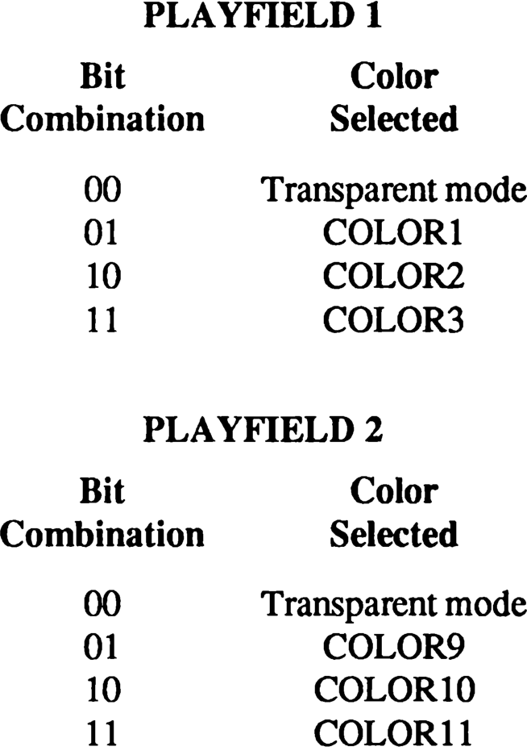

DUAL-PLAYFIELD PRIORITY AND CONTROL

Either playfield 1 or 2 may have priority; that is, either one may be displayed in front of the other. Playfield 1 normally has priority. The bit known as PF2PRI (bit 6) in register BPLCON2 is used to control priority. When PF2PRI = 1, playfield 2 has priority over playfield 1. When PF2PRI = 0, playfield 1 has priority.

You can also control the relative priority of playfields and sprites. Chapter 7, “System Control Hardware,” shows you how to control the priority of these objects.

You can control the two playfields separately as follows:

- They can have different-sized representations in memory, and different portions of each one can be selected for display.
- They can be scrolled separately.

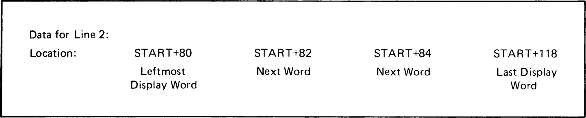

Figure 3-16: Data Fetch for the Second Line When Modulo = 40

To display the right half of the big picture, you set up a vertical blanking routine to start the bit-plane pointers at location START+40 rather than START with the modulo remaining at 40. The data layout is shown in Figures 3-17 and 3-18.

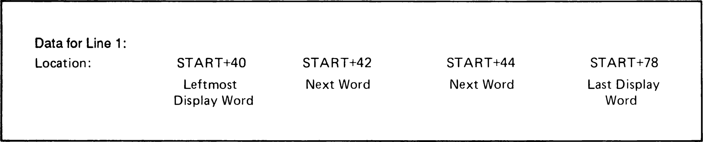

Figure 3-17: Data Layout for First Line—Right Half of Big Picture

Now, the bit-plane pointers contain the value START+80. The modulo (40) is added to the pointers so that when they begin the data fetch for the second line, the correct data is fetched.

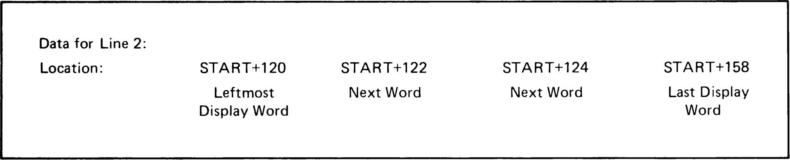

Figure 3-18: Data Layout for Second Line—Right Half of Big Picture

Remember, in high-resolution mode, you need to fetch twice as many bytes as in low-resolution mode. For a normal-sized display, you fetch 80 bytes for each horizontal line instead of 40.

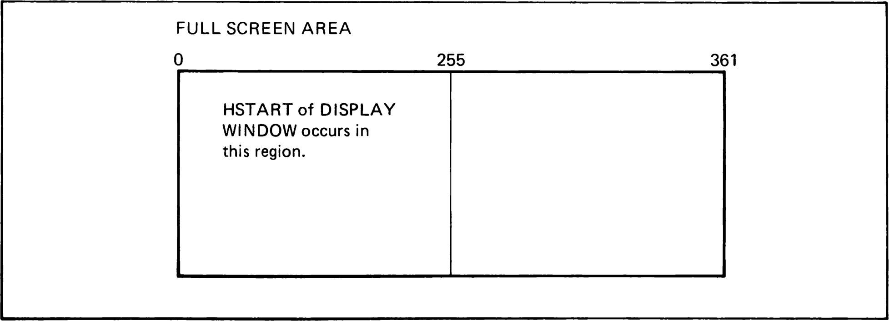

Figure 3-19: Display Window Horizontal Starting Position

The eight bits allocated to VSTART are assigned to the first 256 positions counting down from the top of the display.

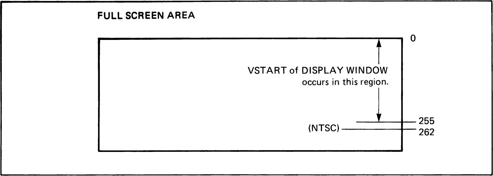

Figure 3-20: Display Window Vertical Starting Position

Recall that you select the values for the starting position as if the display were in low-resolution, non-interlaced mode. Keep in mind, though, that for interlaced mode the display window should be an even number of lines in height to allow for equal-sized odd and even fields.

To set the display window starting position, write the value for HSTART into bits 0 through 7 and the value for VSTART into bits 8 through 15 of DIWSTRT.

Table 3-19: High-resolution Color Selection

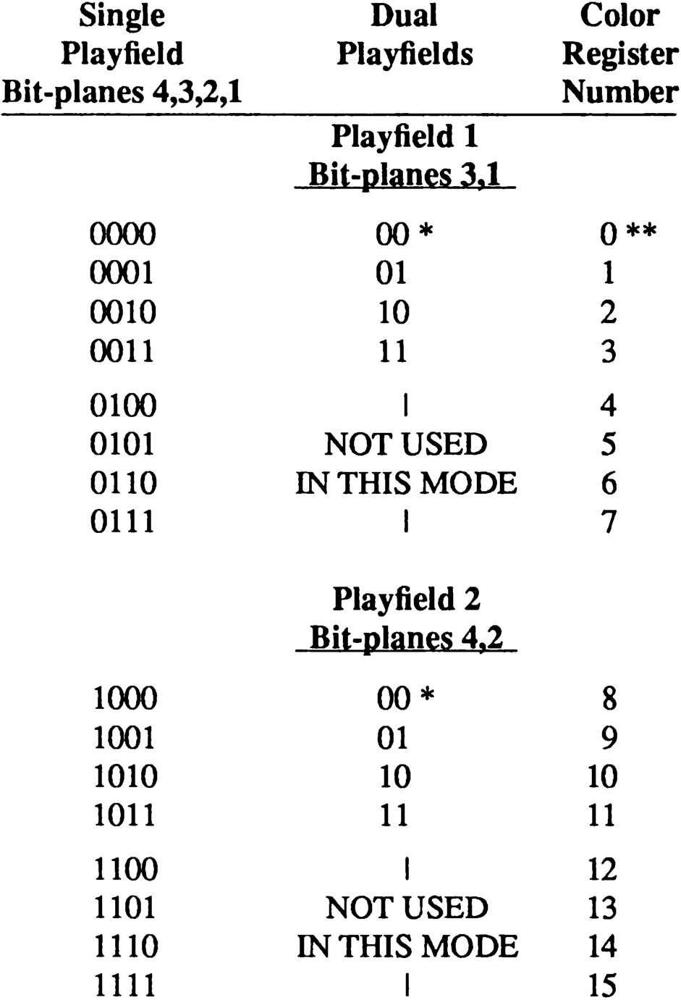

\* Selects “transparent” mode.

\*\* Color register 0 always defines the background color.

hardware in the same manner as the original words that were first loaded into the control registers. If the VSTART value contained in these words is lower than the current beam position, this sprite will not be reused in this display field. For consistency, the value 0 should be used for both words when ending the usage of a sprite. Sprite reuse is discussed later.

The following data structure is for the spaceship sprite. It will be located at V = 65 and H = 128 on the normally visible part of the screen.

```text
SPRITE:
        DC.W    $6D60,$7200     ;VSTART, HSTART, VSTOP
        DC.W    $0990,$07E0     ;First pair of descriptor words
        DC.W    $13C8,$0FF0
        DC.W    $23C4,$1FF8
        DC.W    $13C8,$0FF0
        DC.W    $0990,$07E0
        DC.W    $0000,$0000     ;End of sprite data
```

Displaying a Sprite

After building the data structure, you need to tell the system to display it. This section describes the display of sprites in “automatic” mode. In this mode, once the sprite DMA channel begins to retrieve and display the data, the display continues until the VSTOP position is reached. Manual mode is described later on in this chapter.

The following steps are used in displaying the sprite:

1. Decide which of the eight sprite DMA channels to use (making certain that the chosen channel is available).
2. Set the sprite pointers to tell the system where to find the sprite data.
3. Turn on sprite direct memory access if it is not already on.
4. For each subsequent display field, during the vertical blanking interval, rewrite the sprite pointers.

CAUTION

If sprite DMA is turned off while a sprite is being displayed (that is, after VSTART but before VSTOP), the system will continue to display the line of sprite data that was most recently fetched. This causes a vertical bar to appear on the screen. It is recommended that sprite DMA be turned off only during vertical blanking or during some portion of the display where you are *sure* that no sprite is being displayed.

Sprites can be attached in the following combinations:

Sprite 1 to sprite 0  
Sprite 3 to sprite 2  
Sprite 5 to sprite 4  
Sprite 7 to sprite 6

Any or all of these attachments can be active during the same display field. As an example, assume that you wish to have more colors in the spaceship sprite and you are using sprite DMA channels 0 and 1. There are five colors plus transparent in this sprite.

```text
0000154444510000
0001564444651000
0015676446765100
0001564444651000
0000154444510000
```

The first line in this sprite requires the four data words shown in Table 4-4 to form the correct binary color selector numbers.

Table 4-4: Data Words for First Line of Spaceship Sprite

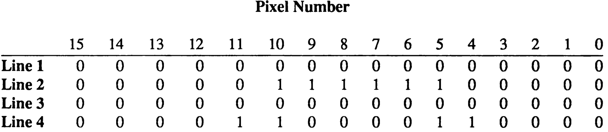

The highest numbered sprite (number 1, in this example) contributes the highest order bits (leftmost) in the binary number. The high-order data word in each sprite contributes the leftmost digit. Therefore, the lines above are written to the sprite data structures as follows:

```text
Line 1    Sprite 1 high-order word for sprite line 1
Line 2    Sprite 1 low-order word for sprite line 1
Line 3    Sprite 0 high-order word for sprite line 1
Line 4    Sprite 0 low-order word for sprite line 1
```

See Figure 4-7 for the order these words are stored in memory. Remember that this data is contained in *two* sprite structures.

Table 4-6: Color Registers for Single Sprites

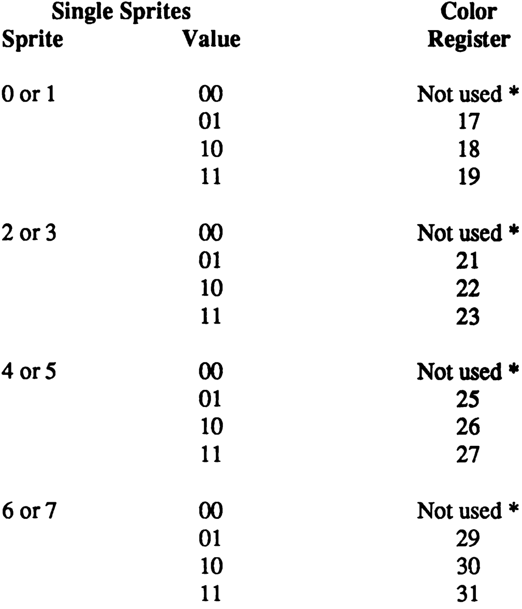

\* Selects transparent mode.

If the bit combinations from attached sprites are as shown in Table 4-7, then the colors will be taken from the registers shown.

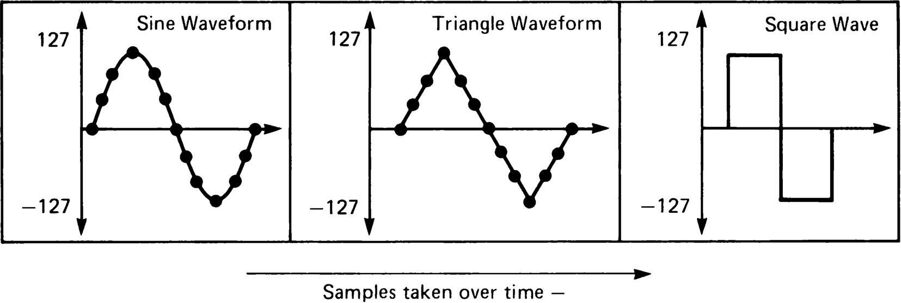

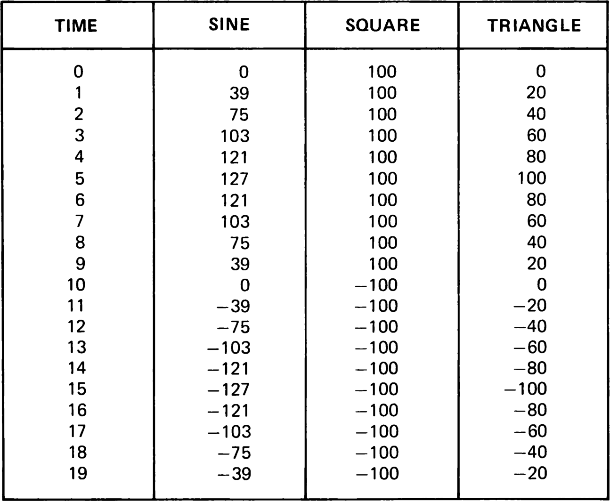

Figure 5-2: Digitized Amplitude Values

THE AMIGA SOUND HARDWARE

The Amiga has four hardware sound channels. You can independently program each of the channels to produce complex sound effects. You can also attach channels so that one channel modulates the sound of another or combine two channels for stereo effects.

Sound data is organized as a set of eight-bit data items; each item is a sample from the waveform. Each data word retrieved for the audio channel consists of two samples. Sample values can range from -128 to +127.

As an example, the data set shown below produces a close approximation to a sine wave.

NOTE

The data is stored in byte address order with the first digitized amplitude value at the lowest byte address, the second at the next byte address, and so on. Also, note that the first byte of data must start at a word-address boundary. This is because the audio DMA retrieves one word (16 bits) at a time and uses the sample it reads as two bytes of data.

To use audio channel 0, write the address of “audiodata” into AUD0LC, where the audio data is organized as shown below. For simplicity, “AUDxLC” in the table below stands for the combination of the two actual location registers (AUDxLCH and AUDxLCL). For the audio DMA channels to be able to retrieve the data, the data address to which AUD0LC points must be somewhere in chip RAM.

Table 5-1: Sample Audio Data Set for Channel 0

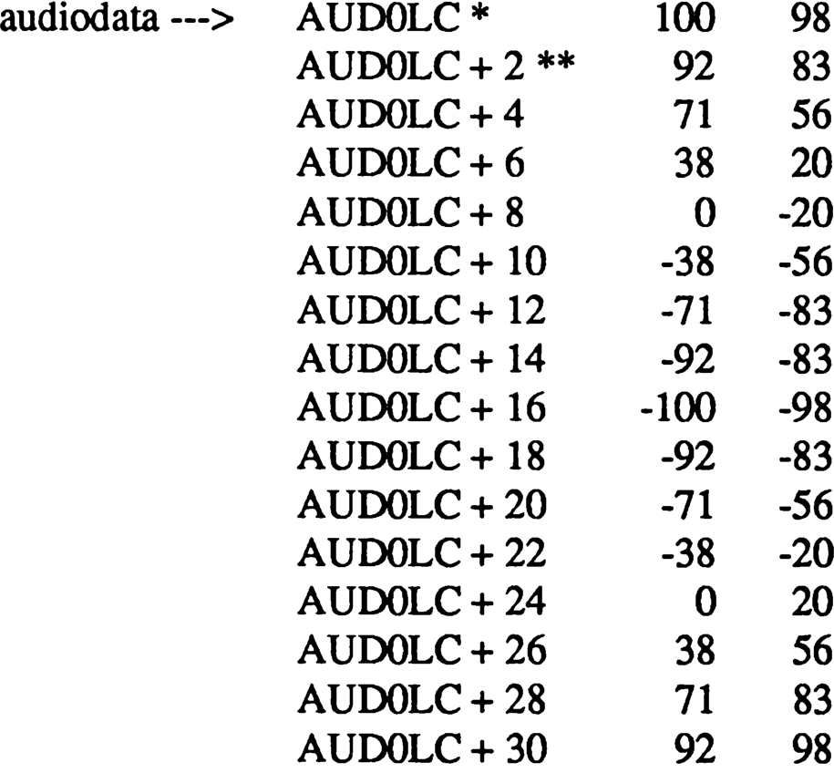

**Notes**

\* Audio data is located on a word-address boundary.

\*\* AUD0LC stands for AUD0LCL and AUD0LCH.

For a typical output at volume 64, with maximum data values of -128 to 127, the voltage output is between +.4 volts and -.4 volts. Some volume levels and the corresponding decibel values are shown in Table 5-2.

Table 5-2: Volume Values

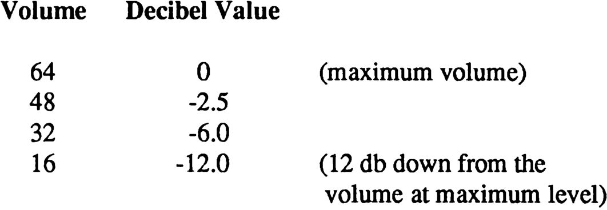

For any volume setting from 64 to 0, you write the value into bits 5-0 of AUD0VOL. For example:

```text
SETAUD0VOLUME:
       LEA     CUSTOM,a0
       MOVE.W  #48,AUD0VOL(a0)
```

The decibels are shown as negative values from a maximum of 0 because this is the way a recording device, such as a tape recorder, shows the recording level. Usually, the recorder has a dial showing 0 as the optimum recording level. Anything less than the optimum value is shown as a minus quantity.

SELECTING THE DATA OUTPUT RATE

The pitch of the sound produced by the waveform depends upon its frequency. To tell the system what frequency to use, you need to specify the sampling period. The sampling period specifies the number of system clock ticks, or timing intervals, that should elapse between each sample (byte of audio data) fed to the digital-to-analog converter in the audio channel. There is a period register for each audio channel. The value of the period register is used for count-down purposes; each time the register counts down to 0, another sample is retrieved from the waveform data set for output. In units, the period value represents clock ticks per sample. The minimum period value you should use is 124 ticks per sample NTSC (123 PAL) and the maximum is 65535. These limits apply to both PAL and NTSC machines. For high-quality sound, there are other constraints on the sampling period (see the section called “Producing High-quality Sound”).

NOTE

A low period value corresponds to a higher frequency sound and a high period value corresponds to a lower frequency sound.

Limitations on Selection of Sampling Period

The sampling period is limited by the number of DMA cycles allocated to an audio channel. Each audio channel is allocated one DMA slot per horizontal scan line of the screen display. An audio channel can retrieve two data samples during each horizontal scan line. The following calculation gives the maximum sampling rate in samples per second.

*2 samples/line \* 262.5 lines/frame \* 59.94 frames/second = 31,469 samples/second*

The figure of 31,469 is a theoretical maximum. In order to save buffers, the hardware is designed to handle 28,867 samples/second. The system timing interval is 279.365 nanoseconds, or .279365 microseconds. The maximum sampling rate of 28,867 samples per second is 34.642 microseconds per sample (1/28,867 = .000034642). The formula for calculating the sampling period is:

$$\text{Period value} = \frac{\text{sample interval}}{\text{clock interval}} = \frac{\text{clock constant}}{\text{samples per second}}$$

Thus, the minimum period value is derived by dividing 34.642 microseconds per sample by the number of microseconds per interval:

$$\text{Minimum period} = \frac{34.642\ \text{microseconds/sample}}{0.279365\ \text{microseconds/interval}} = 124\ \text{timing intervals/sample}$$

or:

$$\text{Minimum period} = \frac{3,579,545\ \text{ticks/second}}{28,867\ \text{samples/second}} = 124\ \text{ticks/sample}$$

Therefore, a value of at least 124 must be written into the period register to assure that the audio system DMA will be able to retrieve the next data sample. If the period value is below 124, by the time the cycle count has reached 0, the audio DMA will not have had enough time to retrieve the next data sample and the previous sample will be reused.

28,867 samples/second is also the maximum sampling rate for PAL systems. Thus, for PAL systems, a value of at least 123 ticks/sample must be written into the period register.

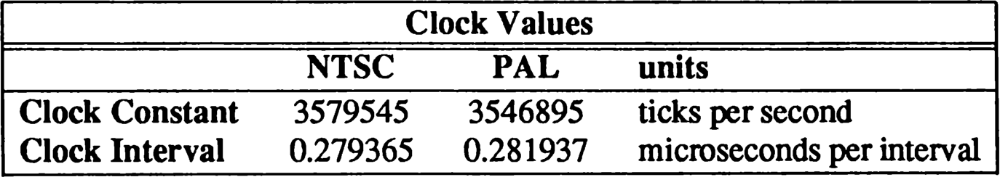

Table 5-3: DMA and Audio Channel Enable Bits

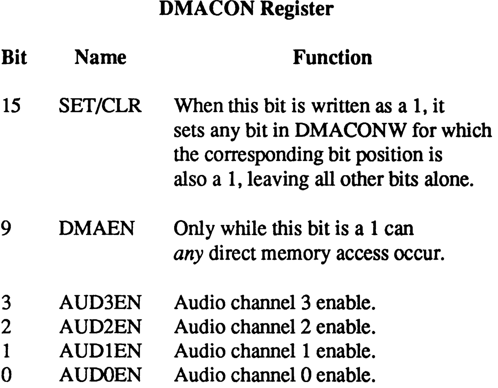

For example, if you are using channel 0, then you write a 1 into bit 9 to enable DMA and a 1 into bit 0 to enable the audio channel, as shown below.

```text
BEGINCHAN0:
        LEA     CUSTOM,a0
        MOVE.W  #(DMAF_SETCLR!DMAF_AUD0!DMAF_MASTER),DMACON(a0)
```

STOPPING THE AUDIO DMA

You can stop the channel by writing a 0 into the AUDxEN bit at any time. However, you cannot resume the output at the same point in the waveform by just writing a 1 in the bit again. Enabling an audio channel almost always starts the data output again from the top of the list of data pointed to by the location registers for that channel. If the channel is disabled for a very short time (less than two sampling periods) it may stay on and thus continue from where it left off.

The following example shows how to stop audio DMA for one channel.

```text
STOPAUDCHAN0:
        LEA     CUSTOM,a0
        MOVE.W  #(DMAF_AUD0),DMACON(a0)
```

Table 5-6: Sampling Rate and Frequency Relationship

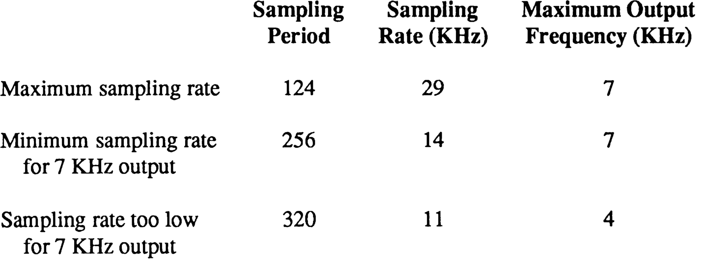

In A2000s with 2 layer motherboards and later A500 models there is a control bit that allows the audio output to bypass the low pass filter. This control bit is the same output bit of the 8520 CIA that controls the brightness of the red “power” LED. Bypassing the filter allows for improved sound in some applications, but an external filter with an appropriate cutoff frequency may be required.

Using Direct (Non-DMA) Audio Output

It is possible to create sound by writing audio data one word at a time to the audio output addresses, instead of setting up a list of audio data in memory. This method of controlling the output is more processor-intensive and is therefore not recommended.

To use direct audio output, do not enable the DMA for the audio channel you wish to use; this changes the timing of the interrupts. The normal interrupt occurs after a data address has been read; in direct audio output, the interrupt occurs after one data word has been output.

Unlike in the DMA-controlled automatic data output, in direct audio output, if you do not write a new set of data to the output addresses before two sampling intervals have elapsed, the audio output will cease changing. The last value remains as an output of the digital-to-analog converter.

The volume and period registers are set as usual.

256 Byte Sample

```text
   0    2    4    6    8   10   12   14   16   18   20   22   24   26   28   30
  32   34   36   38   40   42   44   46   48   50   52   54   56   58   60   62
  64   66   68   70   72   74   76   78   80   82   84   86   88   90   92   94
  96   98  100  102  104  106  108  110  112  114  116  118  120  122  124  126
 128  126  124  122  120  118  116  114  112  110  108  106  104  102  100   98
  96   94   92   90   88   86   84   82   80   78   76   74   72   70   68   66
  64   62   60   58   56   54   52   50   48   46   44   42   40   38   36   34
  32   30   28   26   24   22   20   18   16   14   12   10    8    6    4    2
   0   -2   -4   -6   -8  -10  -12  -14  -16  -18  -20  -22  -24  -26  -28  -30
 -32  -34  -36  -38  -40  -42  -44  -46  -48  -50  -52  -54  -56  -58  -60  -62
 -64  -66  -68  -70  -72  -74  -76  -78  -80  -82  -84  -86  -88  -90  -92  -94
 -96  -98 -100 -102 -104 -106 -108 -110 -112 -114 -116 -118 -120 -122 -124 -126
-127 -126 -124 -122 -120 -118 -116 -114 -112 -110 -108 -106 -104 -102 -100  -98
 -96  -94  -92  -90  -88  -86  -84  -82  -80  -78  -76  -74  -72  -70  -68  -66
 -64  -62  -60  -58  -56  -54  -52  -50  -48  -46  -44  -42  -40  -38  -36  -34
 -32  -30  -28  -26  -24  -22  -20  -18  -16  -14  -12  -10   -8   -6   -4   -2
```

128 Byte Sample

```text
   0    4    8   12   16   20   24   28   32   36   40   44   48   52   56   60
  64   68   72   76   80   84   88   92   96  100  104  108  112  116  120  124
 128  124  120  116  112  108  104  100   96   92   88   84   80   76   72   68
  64   60   56   52   48   44   40   36   32   28   24   20   16   12    8    4
   0    4    8   12   16   20   24   28   32   36   40   44   48   52   56   60
  64   68   72   76   80   84   88   92   96  100  104  108  112  116  120  124
-127 -124 -120 -116 -112 -108 -104 -100  -96  -92  -88  -84  -80  -76  -72  -68
 -64  -60  -56  -52  -48  -44  -40  -36  -32  -28  -24  -20  -16  -12   -8   -4
```

64 Byte Sample

```text
   0    8   16   24   32   40   48   56   64   72   80   88   96  104  112  120
 128  120  112  104   96   88   80   72   64   56   48   40   32   24   16    8
   0   -8  -16  -24  -32  -40  -48  -56  -64  -72  -80  -88  -96 -104 -112 -120
-127 -120 -112 -104  -96  -88  -80  -72  -64  -56  -48  -40  -32  -24  -16   -8
```

32 Byte Sample

```text
   0   16   32   48   64   80   96  112  128  112   96   80   64   48   32   16
   0  -16  -32  -48  -64  -80  -96 -112 -127 -112  -96  -80  -64  -48  -32  -16
```

16 Byte Sample

```text
   0   32   64   96  128   96   64   32    0  -32  -64  -96 -127  -96  -64  -32
```

Each of the DMA channels can be independently enabled or disabled. The enable bits are bits SRCA, SRCB, SRCC, and DEST in control register zero (BLTCON0).

When disabled, no memory cycles will be executed for that channel and, for a source channel, the constant value stored in the data register of that channel will be used for each blitter cycle. For this purpose, each of the three source channels have preloadable data registers, called BLTxDAT.

Images in memory are usually stored in a linear fashion; each word of data on a line is located at an address that is one greater than the word on its left. i.e. Each line is a “plus one” continuation of the previous line. (See Figure 6-1.)


Figure 6-1: How Images are Stored in Memory

The map in Figure 6-1 represents a single bit-plane (one bit of color) of an image at word addresses 20 through 61. Each of these addresses accesses one word (16 pixels) of a single bit-plane. If this image required sixteen colors, four bit-planes like this would be required in memory, and four copy (move) operations would be required to completely move the image.

The blitter is very efficient at copying such blocks because it needs to be told only the starting address (20), the destination address, and the size of the block (height = 6, width = 7). It will then automatically move the data, one word at a time, whenever the data bus is available. When the transfer is complete, the blitter will signal the processor with a flag and an interrupt.

NOTE

This copy (move) operation operates on memory and may or may not change the memory currently being used for display.

All data copy blits are performed as rectangles of words, with a given width and height. All four DMA channels use a single blit size register, called BLTSIZE, used for both the width and height. The width can take a value of from 1 to 64 words (16 to 1024 bits). The height can run from 1 to 1024 rows. The width is stored in the least significant six bits of the BLTSIZE register. If a value of zero is stored, a width count of 64 words is used. This is the only parameter in the blitter

Function Generator

The blitter can combine the data from the three source DMA channels in up to 256 different ways to generate the values stored by the destination DMA channel. These sources might be one bit-plane from each of three separate graphics images. While each of these sources is a rectangular region composed of many points, the same logic operation will be performed on each point throughout the rectangular region. Thus, for purposes of defining the blitter logic operation it is only necessary to consider what happens for all of the possible combinations of one bit from each of the three sources.

There are eight possible combinations of values of the three bits, for each of which we need to specify the corresponding destination bit as a zero or one. This can be visualized with a standard truth table, as shown below. We have listed the three source channels, and the possible values for a single bit from each one.

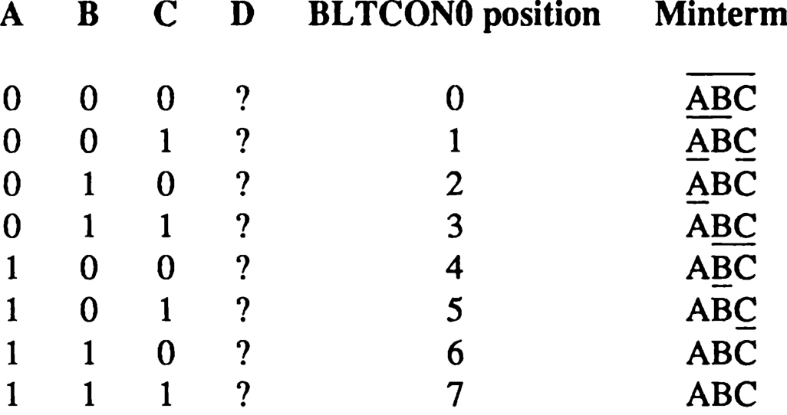

This information is collected in a standard format, the LF control byte in the BLTCON0 register. This byte programs the blitter to perform one of the 256 possible logic operations on three sources for a given blit.

To calculate the LF control byte in BLTCON0, fill in the truth table with desired values for D, and read the function value from the bottom of the table up.

For example, if we wanted to set all bits in the destination where the corresponding A source bit is 1 or the corresponding B source bit is 1, we would fill in the last four entries of the truth table with 1 (because the A bit is set) and the third, fourth, seven, and eight entries with 1 (because the B bit is set), and all others (the first and second) with 0, because neither A nor B is set. Then, we read the truth table from the bottom up, reading 11111100, or $FC.¹

¹ “$” indicates hex notation.

For another example, an LF control byte of $80 (= 1000 0000 binary) turns on bits only for those points of the D destination rectangle where the corresponding bits of A, B, and C sources were all on (ABC = 1, bit 7 of LF on). All other points in the rectangle, which correspond to other combinations for A, B, and C, will be 0. This is because bits 6 through 0 of the LF control byte, which specify the D output for these situations, are set to 0.

DESIGNING THE LF CONTROL BYTE WITH MINTERMS

One approach to designing the LF control byte uses logic equations. Each of the rows in the truth table corresponds to a “minterm”, which is a particular assignment of values to the A, B, and C bits. For instance, the first minterm is usually written $\overline{ABC}$, or “not A and not B and not C”. The last is written as ABC.

NOTE

Two terms that are adjacent are and’ed, and two terms that are separated by “+” are or’ed. “And” has a higher precedence, so AB + BC is equal to (AB) + (BC).

Any function can be written as a sum of minterms. If we wanted to calculate the function where D is one when the A bit is set and the C bit is clear, or when the B bit is set, we can write that as $A\overline{C}+B$, or “A and not C or B”. Since “1 and A” is “A”:

$$D = A\overline{C} + B$$

$$D = A(1)\overline{C} + (1)B(1)$$

Since either A or $\overline{A}$ is true ($1 = A + \overline{A}$), and similarly for B, and C; we can expand the above equation further:

$$D = A(1)\overline{C} + (1)B(1)$$

$$D = A(B + \overline{B})\overline{C} + (A + \overline{A})B(C + \overline{C})$$

$$D = AB\overline{C} + A\overline{B}\overline{C} + AB(C + \overline{C}) + \overline{A}B(C + \overline{C})$$

$$D = AB\overline{C} + A\overline{B}\overline{C} + ABC + AB\overline{C} + \overline{A}BC + \overline{A}B\overline{C}$$

After eliminating duplicates, we end up with the five minterms:

$$A\overline{C}+B = AB\overline{C} + A\overline{B}\overline{C} + ABC + \overline{A}BC + \overline{A}B\overline{C}$$

These correspond to BLTCON0 bit positions of 6, 4, 7, 3, and 2, according to our truth table, which we would then set, and clear the rest.

The wide range of logic operations allow some sophisticated graphics techniques. For instance, you can move the image of a car across some pre-existing building images with a few blits. Producing this effect requires predrawn images of the car, the buildings (or background), and a car

3. To use a function that is the inverse, or “not”, of one of the sources, such as $\overline{A}$, take all of the minterms not enclosed by the circle represented by A on the above Figure. In this case, we have minterms 0, 1, 2, and 3.

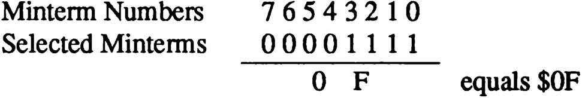

4. To combine minterms, or “or” them, “or” the values together. For example, the equation AB+BC becomes

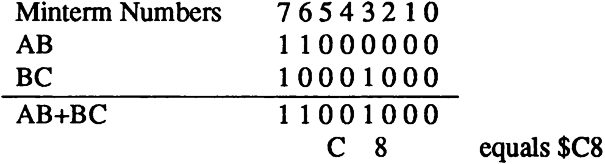

Shifts and Masks

Up to now we have dealt with the blitter only in moving words of memory around and combining them with logic operations. This is sufficient for moving graphic images around, so long as the images stay in the same position relative to the beginning of a word. If our car image has its leftmost pixel on the second pixel from the left, we can easily draw it on the screen in any position where the leftmost pixel also starts two pixels from the beginning of some word. But often we want to draw that car shifted left or right by a few pixels. To this end, both the A and B DMA channels have a barrel shifter that can shift an image between 0 and 15 bits.

This shifting operation is completely free; it requires no more time to execute a blit with shifts than a blit without shifts, as opposed to shifting with the 68000. The shift is normally towards the right. This shifter allows movement of images on pixel boundaries, even though the pixels are addressed 16 at a time by each word address of the bit-plane image.

So if the incoming data is shifted to the right, what is shifted in from the left? For the first word of the blit, zeros are shifted in; for each subsequent word of the same blit, the data shifted out from the previous word is shifted in.

The shift value for the A channel is set with bits 15 through 12 of BLTCON0; the B shift value is set with bits 15 through 12 of BLTCON1. For most operations, the same value will be used for both shifts. For shifts of greater than fifteen bits, load the address register pointer of the destination with a higher address; a shift of 100 bits would require the destination pointer to be advanced 100/16 or 6 words (12 bytes), and a right shift of the remaining 4 bits to be used.

As an example, let us say we are doing a blit that is three words wide, two words high, and we are using a shift of 4 bits. For simplicity, let us assume we are doing a straight copy from A to D. The first word that will be written to D is the first word fetched from A, shifted right four bits

Table 6-2: Typical Blitter Cycle Sequence

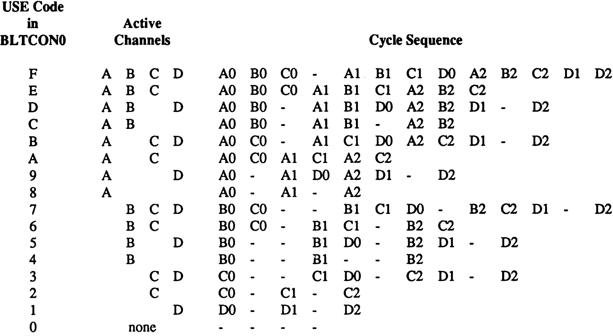

**Notes for the above Table:**

- No fill.
- No competing bus activity.
- Three-word blit.
- Typical operation involves fetching all sources twice before the first destination becomes available. This is due to internal pipelining. Care must be taken with overlapping source and destination regions.

**NOTE**

This Table is only meant to be an illustration of the typical order of blitter cycles on the bus. Bus cycles are dynamically allocated based on blitter operating mode; competing bus activity from processor, bit-planes, and other DMA channels; and other factors. Commodore Amiga does not guarantee the accuracy of or future adherence to this chart. We reserve the right to make product improvements or design changes in this area without notice.

Table 6-3: BLTCON1 Code Bits for Octant Line Drawing

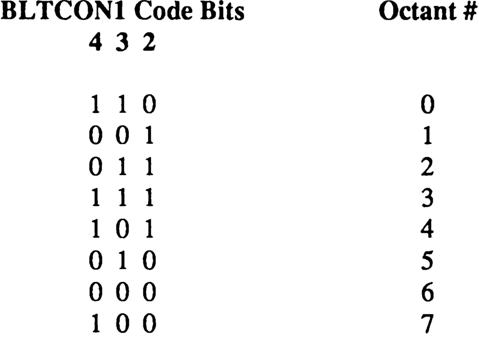

We initialize BLTCON1 bits 4 through 2 according to the above Table. Now, we introduce the variables *dx* and *dy*, and set them to the absolute values of the difference between the *x* coordinates and the *y* coordinates of the endpoints of the line, respectively.

```text
dx = abs(x2 - x1) ;
dy = abs(y2 - y1) ;
```

Now, we rearrange them if necessary so *dx* is greater than *dy*.

```text
if (dx < dy)
        {
        temp = dx ;
        dx = dy ;
        dy = temp ;
        }
```

Alternately, set *dx* and *dy* as follows:

```text
dx = max(abs(x2 - x1), abs(y2 - y1)) ;
dy = min(abs(x2 - x1), abs(y2 - y1)) ;
```

These calculations have the effect of “normalizing” our line into octant 0; since we have already informed the blitter of the real octant to use, it has no difficulty drawing the line.

We initialize the A pointer register to 4 * *dy* − 2 * *dx*. If this value is negative, we set the sign bit (SIGNFLAG in BLTCON1), otherwise we clear it. We set the A modulo register to 4 * (*dy* − *dx*) and the B modulo register to 4 * *dy*.

The A data register should be preloaded with $8000. Both word masks should be set to $FFFF. The A shift value should be set to the *x* coordinate of the first point (*x1*) modulo 15.

The B data register should be initialized with the line texture pattern, if any, or $FFFF for a solid line. The B shift value should be set to the bit number at which to start the line texture (zero means the last significant bit.)

The C and D pointer registers should be initialized to the word containing the first pixel of the line; the C and D modulo registers should be set to the width of the bitplane in bytes.

The SRCA, SRCC, and DEST bits of BLTCON0 should be set to one, and the SRCB flag should be set to zero. The OVFLAG should be cleared. If only a single bit per horizontal row is desired, the ONEDOT bit of BLTCON1 should be set; otherwise it should be cleared.

The logic function remains. The C DMA channel represents the original source, the A channel the bit to set in the line, and the B channel the pattern to draw. Thus, to draw a line, the function \(AB+\overline{A}C\) is the most common. To draw the line using exclusive-or mode, so it can be easily erased by drawing it again, the function \(AB\overline{C}+\overline{A}C\) can be used.

We set the blit height to the length of the line, which is *dx* + 1. The width must be set to two for all line drawing. (Of course, the BLTSIZE register should not be written until the very end, when all other registers have been filled.)

REGISTER SUMMARY FOR LINE MODE

Preliminary setup:

The line goes from (*x1,y1*) to (*x2,y2*).

```text
dx = max(abs(x2 - x1), abs(y2 - y1)) ;
dy = min(abs(x2 - x1), abs(y2 - y1)) ;
```

```text
Register setup:

    BLTADAT = $8000
    BLTBDAT = line texture pattern ($FFFF for a solid line)

    BLTAFWM = $FFFF
    BLTALWM = $FFFF

    BLTAMOD = 4 * (dy - dx)
    BLTBMOD = 4 * dy
    BLTCMOD = width of the bitplane in bytes
    BLTDMOD = width of the bitplane in bytes

    BLTAPT  = (4 * dy) - (2 * dx)
    BLTBPT  = unused
    BLTCPT  = word containing the first pixel of the line
    BLTDPT  = word containing the first pixel of the line
```

## Blitter Speed

The speed of the blitter depends entirely on which DMA channels are enabled. You might be using a DMA channel as a constant, but unless it is enabled, it does not count against you. The minimum blitter cycle is four ticks; the maximum is eight ticks. Use of the A register is always free. Use of the B register always adds two ticks to the blitter cycle. Use of either C or D is free, but use of both adds another two ticks. Thus, a copy cycle, using A and D, takes four clock ticks per cycle; a copy cycle using B and D takes six ticks per cycle, and a generalized bit copy using B, C, and D takes eight ticks per cycle. When in line mode, each pixel takes eight ticks.

The system clock speed for NTSC Amigas is 7.16 megahertz (PAL Amigas 7.09 megahertz). The clock for the blitter is the system clock. To calculate the total time for the blit in microseconds, excluding setup and DMA contention, you use the equation (for NTSC):

$$t = \frac{n * H * W}{7.16}$$

For PAL:

$$t = \frac{n * H * W}{7.09}$$

where t is the time in microseconds, n is the number of clocks per cycle, and H and W are the height and width (in words) of the blit, respectively.

For instance, to copy one bitplane of a 320 by 200 screen to another bitplane, we might choose to use the A and D channels. This would require four ticks per blitter cycle, for a total of

$$\frac{4 * 200 * 20}{7.16} = 2235\text{ microseconds.}$$

These timings do not take into account blitter setup time, which is the time required to calculate and load the blitter registers and start the blit. They also ignore DMA contention.

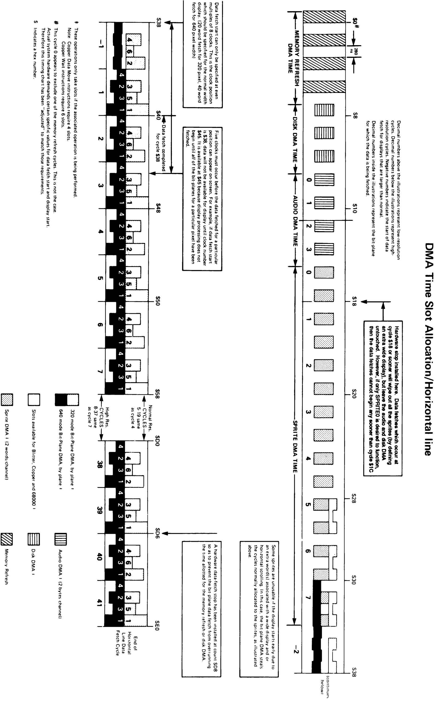

Figure 6-9: DMA Time Slot Allocation

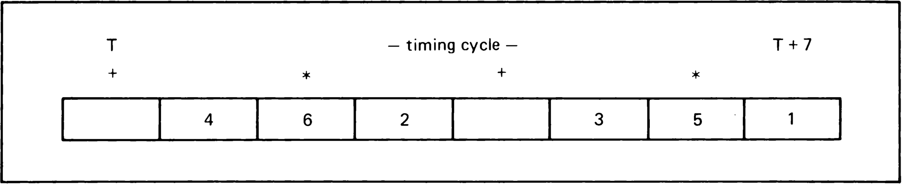

Figure 6-11: Time Slots Used by a Six Bit Plane Display

If you specify four high-resolution bit-planes (640 pixels wide), bit-plane DMA needs all of the available memory time slots during the display time just to fetch the 40 data words for each line of the four bit-planes (40 * 4 = 160 time slots). This effectively locks out the 68000 (as well as the blitter or Copper) from any memory access during the display, except during horizontal and vertical blanking.

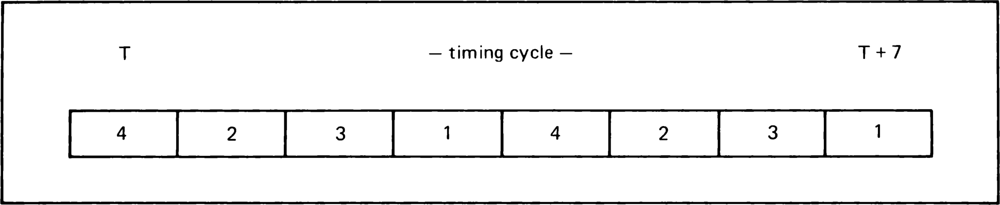

Figure 6-12: Time Slots Used by a High Resolution Display

Each horizontal line in a normal, full-sized display contains 320 pixels in low-resolution mode or 640 pixels in high-resolution mode. Thus, either 20 or 40 words will be fetched during the horizontal line display time. If you want to scroll a playfield, one extra data word per line must be fetched from the memory.

Display size is adjustable (see Chapter 3, “Playfield Hardware”), and bit-plane DMA takes precedence over sprite DMA. As shown in Figure 6-9, larger displays may block out one or more of the highest-numbered sprites, especially with scrolling.

Table 7-5: Contents of the Beam Position Counter

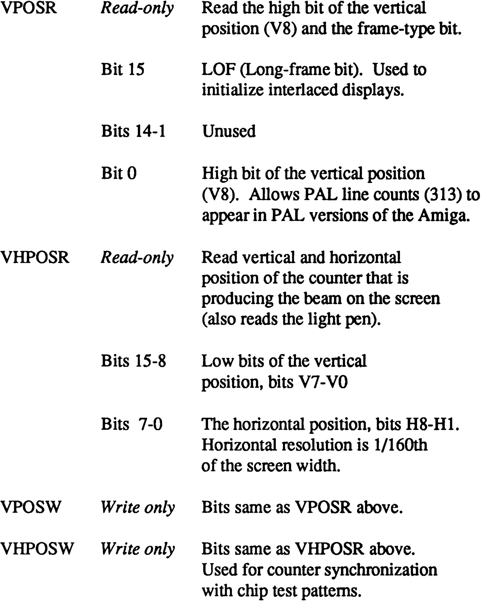

As usual, the address pairs VPOSR,VHPOSR and VPOSW,VHPOSW can be read from and written to as long words, with the most significant addresses being VPOSR and VPOSW.

Interrupts

This system supports the full range of 68000 processor interrupts. The various kinds of interrupts generated by the hardware are brought into the peripherals chip and are translated into six of the seven available interrupts of the 68000.

Bit 1, DSKBLK, indicates “disk block finished.” It is used to indicate that the specified disk DMA task that you have requested has been completed. This bit generates a level 1 interrupt.

More information about disk data transfer and interrupts may be found in Chapter 8, “Interface Hardware.”

Serial Port Interrupts

The following serial interrupts are associated with the specified bits of the interrupt registers.

Bit 11, RBF (for receive buffer full), specifies that the input buffer of the UART has data that is ready to read. This bit generates a level 5 interrupt.

Bit 0, TBE (for “transmit buffer empty”), specifies that the output buffer of the UART needs more data and data can now be written into this buffer. This bit generates a level 1 interrupt.

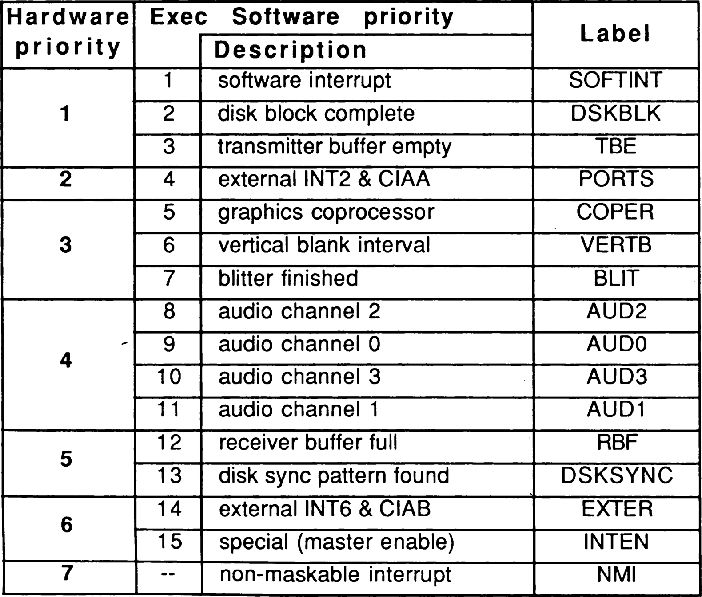

Figure 7-4: Interrupt Priorities

Table 8-1: Typical Controller Connections

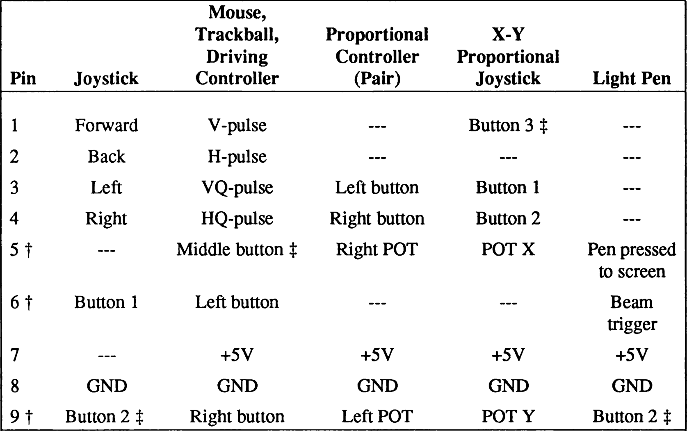

† These pins may also be configured as outputs

‡ These buttons are optional

REGISTERS USED WITH THE CONTROLLER PORT

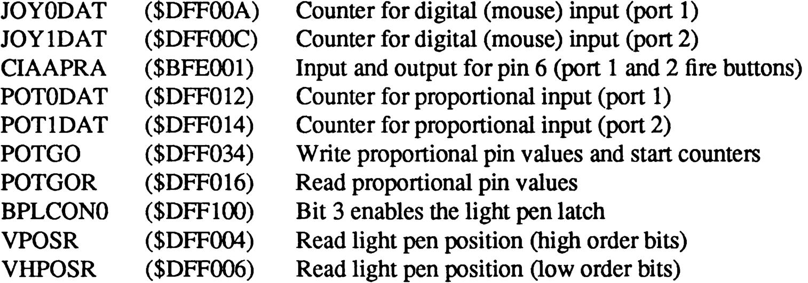

CIAAPRA/CIABPRB - Disk selection, control and sensing

The following table lists how 8520 chip bits used by the disk subsystem. Bits labeled "PA" are input bits in CIAAPRA ($BFE001). Bits labeled "PB" are output bits located in CIAAPRB ($BFD100). More information on how the 8520 chips operate can be found in Appendix F.

Table 8-5: Disk Subsystem

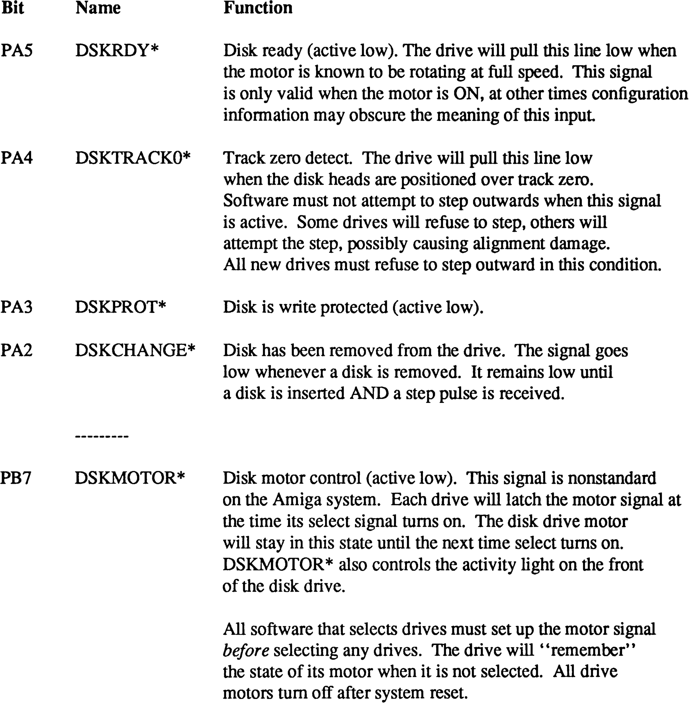

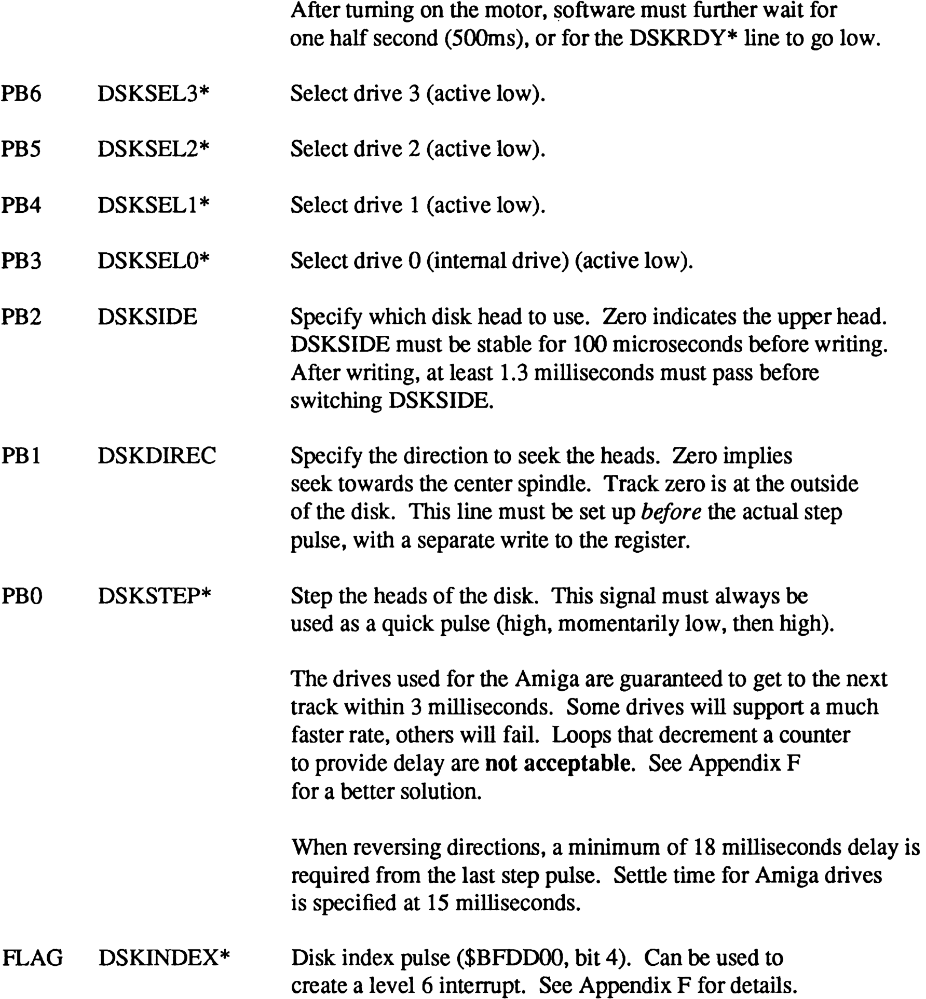

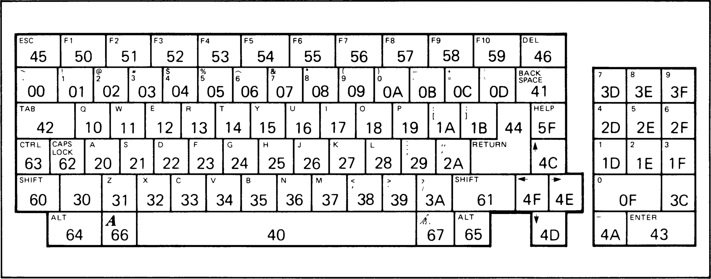

Figure 8-9: The Amiga 1000 Keyboard, Showing Keycodes in Hexadecimal

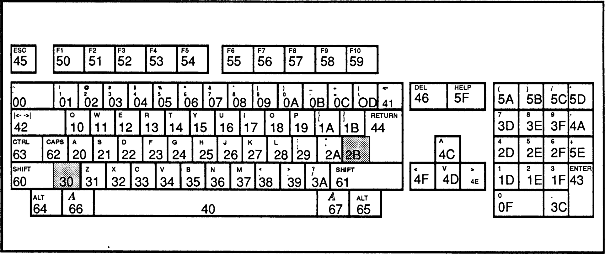

Figure 8-10: The Amiga 500/2000 Keyboard, Showing Keycodes in Hexadecimal

Table 8-10 shows the definitions of the various bit positions within SERDATR.

Table 8-9: SERDATR / ADKCON Registers

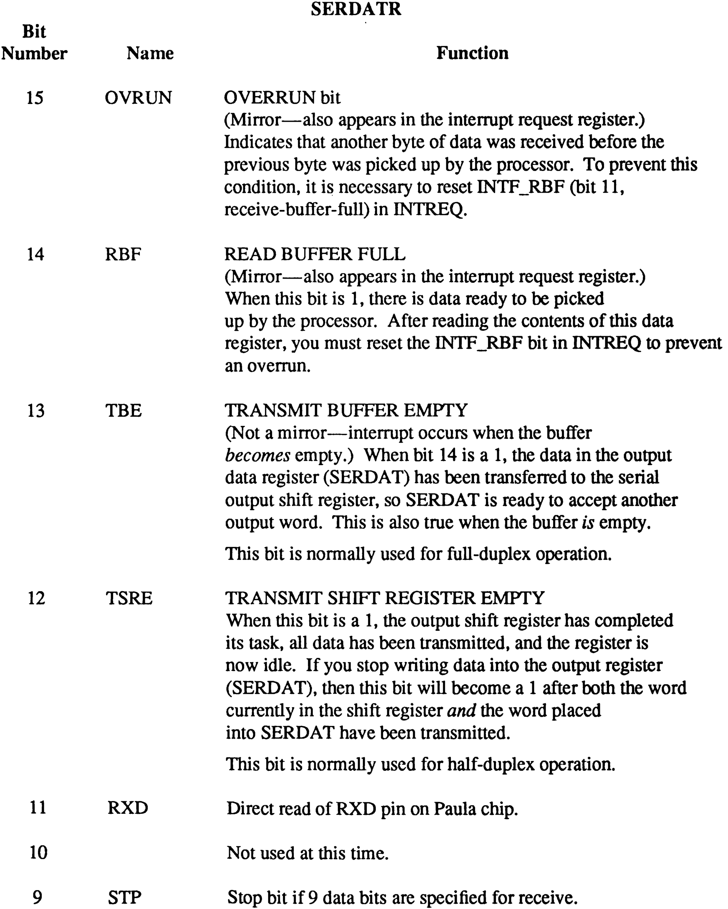

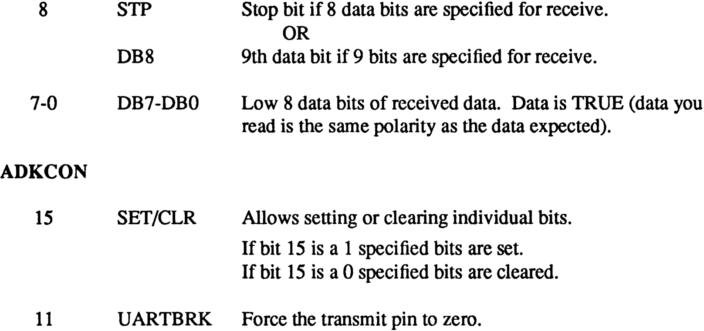

HOW OUTPUT DATA IS TRANSMITTED

You send data out on the transmit lines by writing into the serial data output register (SERDAT). This register is write-only.

Data will be sent out at the same rate as you have established for the read. Immediately after you write the data into this register, the system will begin the transmission at the baud rate you selected.

At the start of the operation, this data is transferred from SERDAT into an internal serial shift register. When the transfer to the serial shift register has been completed, SERDAT can accept new data; the TBE interrupt signals this fact.

Data will be moved out of the shift register, one bit during each time interval, starting with the least significant bit. The shifting continues until all 1 bits have been shifted out. Any number or combination of data and stop bits may be specified this way.

SERDAT is a 16-bit register that allows you to control the format (appearance) of the transmitted data. To form a typical data sequence, such as one start bit, eight data bits, and one stop bit, you write into SERDAT the contents shown in Figures 8-11 and 8-12.

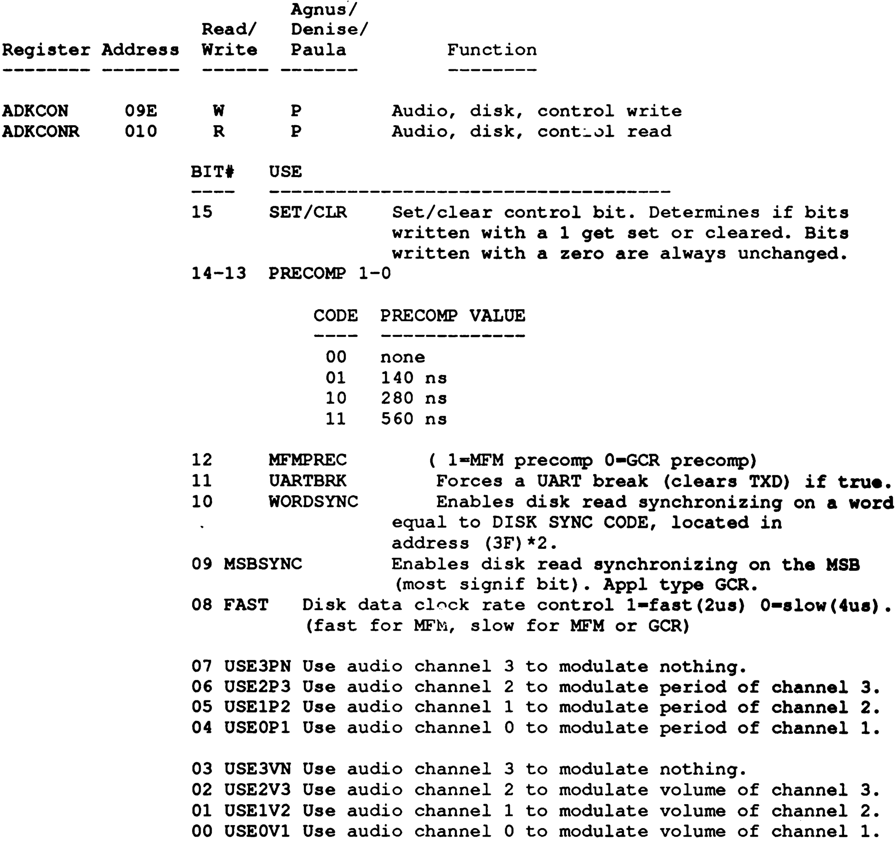

**NOTE:** If both period and volume are modulated on the same channel, the period and volume will be alternated. First word xxxxxxxx V6-V0 , Second word P15-P0 (etc)


This register is the audio channel x (x=0,1,2,3) DMA data buffer. It contains 2 bytes of data that are each 2’s complement and are outputted sequentially (with digital-to-analog conversion) to the audio output pins. (LSB = 3 MV) The DMA controller automatically transfers data to this register from RAM. The processor can also write directly to this register. When the DMA data is finished (words outputted=length) and the data in this register has been used, an audio channel interrupt request is set.

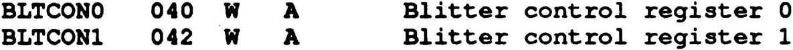

These two control registers are used together to control blitter operations. There are two basic modes, area and line, which are selected by bit 0 of BLTCON1, as shown below.

```text
   AREA MODE ("normal")
-------------------------
BIT# BLTCON0     BLTCON1
---- -------     -------
15   ASH3        BSH3
14   ASH2        BSH2
13   ASH1        BSH1
12   ASA0        BSH0
11   USEA         X
10   USEB         X
09   USEC         X
08   USED         X
07   LF7          X
06   LF6          X
05   LF5          X
04   LF4         EFE
03   LF3         IFE
02   LF2         FCI
01   LF1         DESC
00   LF0         LINE(=0)

ASH3-0  Shift value of A source
BSH3-0  Shift value of B source
USEA    Mode control bit to use source A
USEB    Mode control bit to use source B
USEC    Mode control bit to use source C
USED    Mode control bit to use destination D
LF7-0   Logic function minterm select lines
EFE     Exclusive fill enable
IFE     Inclusive fill enable
FCI     Fill carry input
DESC    Descending (decreasing address) control bit
LINE    Line mode control bit (set to 0)
```

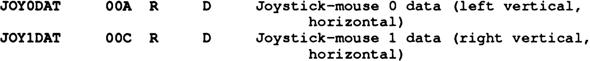

These addresses each read a pair of 8-bit mouse counters. 0=left controller pair, 1=right controller pair (four counters total). The bit usage for both left and right addresses is shown below. Each counter is clocked by signals from two controller pins. Bits 1 and 0 of each counter may be read to determine the state of these two clock pins. This allows these pins to double as joystick switch inputs.

```text
Mouse counter usage:
(pins 1,3=Yclock, pins 2,4=Xclock)

BIT# 15,14,13,12,11,10,09,08  07,06,05,04,03,02,01,00
     -----------------------  -----------------------
0DAT Y7 Y6 Y5 Y4 Y3 Y2 Y1 Y0  X7 X6 X5 X4 X3 X2 X1 X0
1DAT Y7 Y6 Y5 Y4 Y3 Y2 Y1 Y0  X7 X6 X5 X4 X3 X2 X1 X0
```

The following table shows the mouse/joystick connector pin usage. The pins (and their functions) are sampled (multiplexed) into the DENISE chip during the clock times shown in the table. This table is for reference only and should not be needed by the programmer. (Note that the joystick functions are all "active low" at the connector pins.)

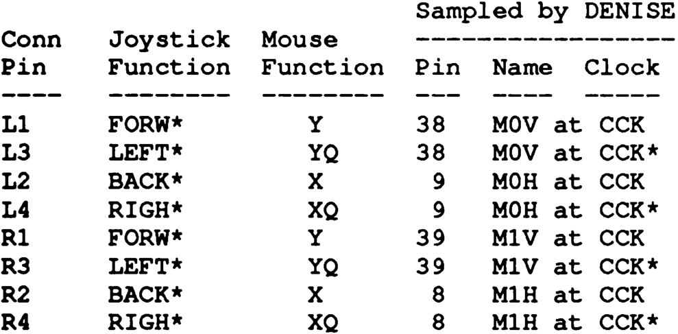

After being sampled, these connector pin signals are used in quadrature to clock the mouse counters. The LEFT and RIGHT joystick functions (active high) are directly available on the Y1 and X1 bits of each counter. In order to recreate the FORWARD and BACK joystick functions, however, it is necessary to logically combine (exclusive OR) the lower two bits of each counter. This is illustrated in the following table.

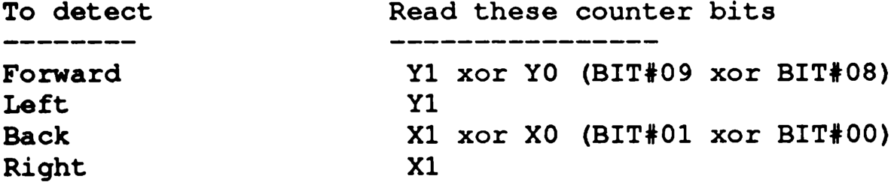

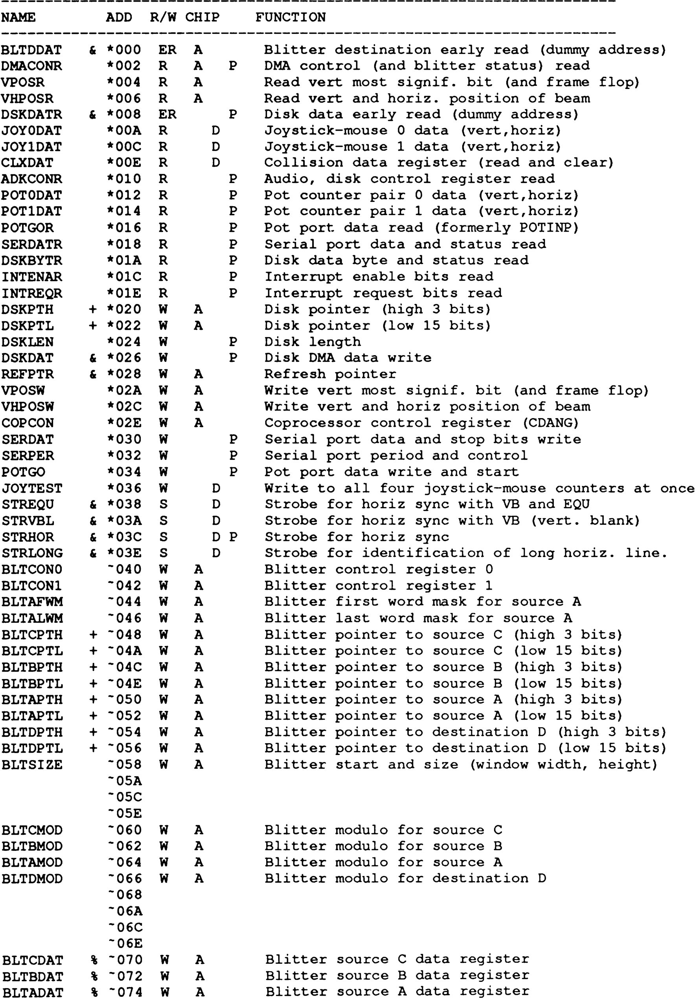

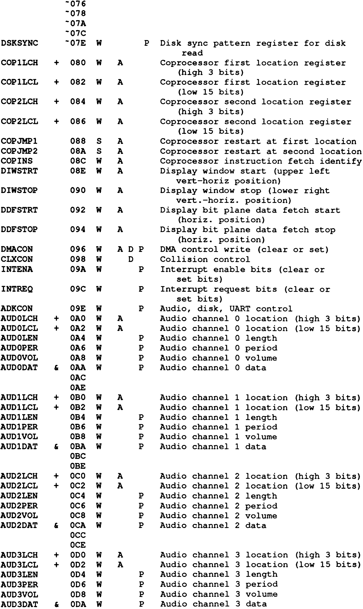

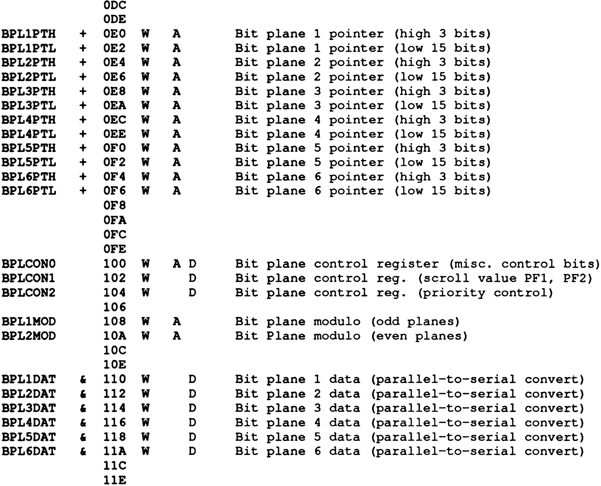

AGNUS PIN ASSIGNMENT

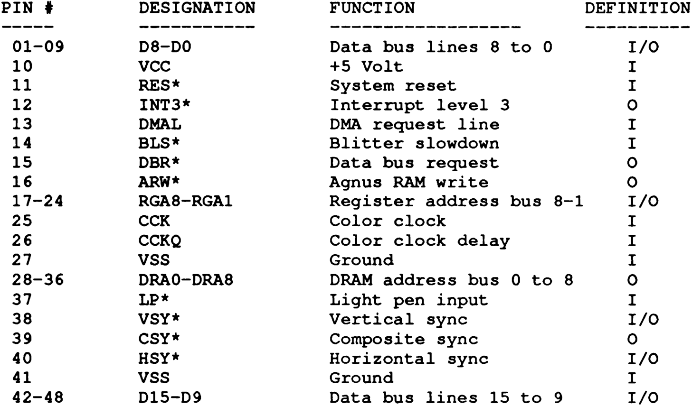

DENISE PIN ASSIGNMENT

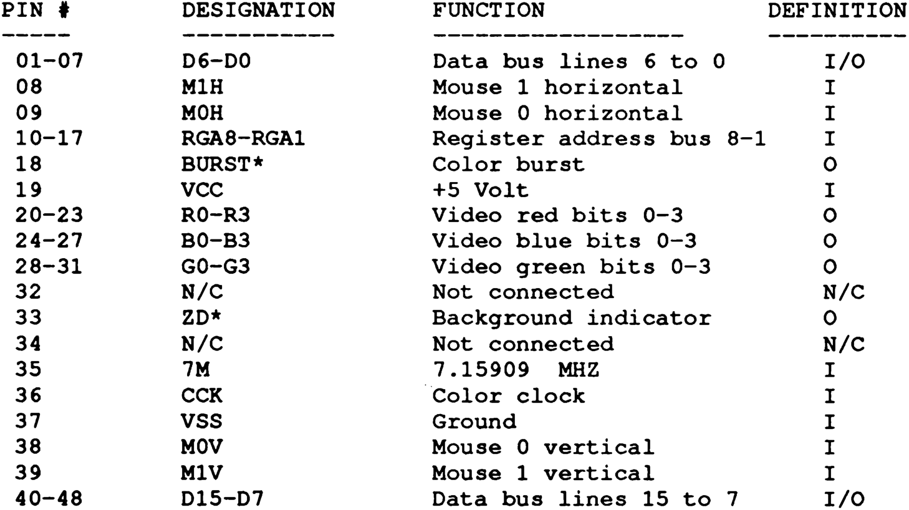

A true software memory map, showing system utilization of the various sections of RAM and free space is not provided, or possible with the Amiga. All memory is dynamically allocated by the memory manager, and the actual locations may change from release-to-release, machine-to-machine or boot-to-boot (see the exec/AllocMem function for details). To find the locations of system structures software must use the defined access procedures, starting by fetching the address of the exec.library from location 4; the only absolute memory location in the system. All software is written so that it can be loaded and relocated anywhere in memory by the loader. What follows is the general layout of memory areas withing the current generation of Amiga computers.

```text
ADDRESS RANGE           NOTES
-------------           -------------------------------------------
000000-03FFFF           256K Bytes of chip RAM

040000-07FFFF           256K bytes of chip RAM (option card)

080000-0FFFFF           512K Extended chip RAM (to 1 MB).

100000-1FFFFF           Reserved. Do not use.

200000-9FFFFF           Primary 8 MB Auto-config space.

A00000-BEFFFF           Reserved. Do not use.

BFD000-BFDF00           8520-B (access at even-byte addresses only)
   -      -
BFE001-BFEF01           8520-A (access at odd-byte addresses only)
   -      -
                        The underlined digit chooses which of the
                        16 internal registers of the 8520 is to be
                        accessed.  See Appendix F.

C00000-DFEFFF           Reserved. Do not use.
   |
   | C00000-D7FFFF      Internal expansion memory.
   |
   | D80000-DBFFFF      Reserved. Do not use.
   |
   | DC0000-DCFFFF      Real time clock.
   |
   | DFF000-DFFFFF      Chip registers. See Appendix A and Appendix B.
   +--

E00000-E7FFFF           Reserved. Do not use.

E80000-E8FFFF           Auto-config space. Boards appear here before
                        the system relocates them to their final address.

E90000-EFFFFF           Secondary auto-config space (usually 64K I/O
                        boards).

F00000-FBFFFF           Reserved. Do not use.

FC0000-FFFFFF           256K System ROM.
```

PARALLEL INTERFACE CONNECTOR SPECIFICATION

The 25-pin D-type connector with pins (DB25P=male for the A1000, female for A500/A2000 and IBM compatibles) at the rear of the Amiga is nominally used to interface to parallel printers. In this capacity, data flows from the Amiga to the printer. This interface may also be used for input or bidirectional data transfers. The implementation is similar to Centronics, but the pin assignment and drive characteristics vary significantly from that specification (see Pin Assignment). Signal names correspond to those used in the other places in this appendix, when possible.

PARALLEL CONNECTOR PIN ASSIGNMENT (J8)

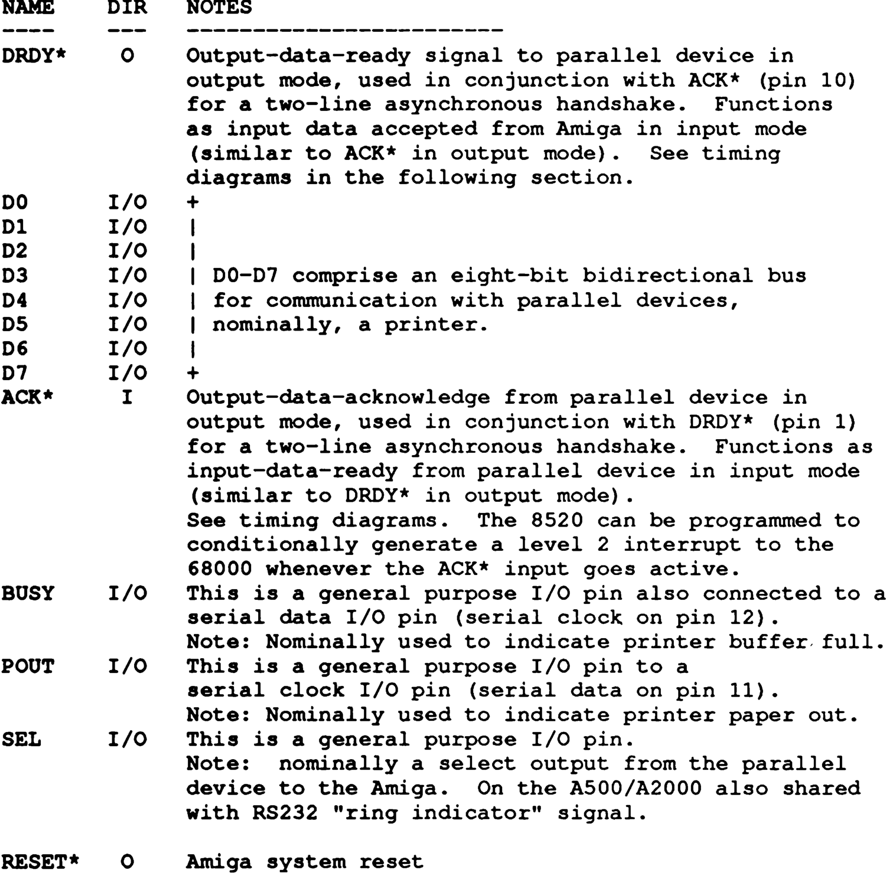

PARALLEL CONNECTOR INTERFACE TIMING, OUTPUT CYCLE

```text
PA<7:0>
PB<7:0>_______X_________________________________________X__
       ______X_________________________________________X__
           |<-- T1 --->|                                |
                       |        |<--------- T2 -------->|
                       V        V
       _______________            ________________________
DRDY*                  |________|
  Output data ready    |<- T3 ->|
                       |<--- T4 --->|
                                    |<- T5 -->|
       _____________________________           ___________
ACK*                                |_________|
  Output data acknowledge

        Microseconds
        Min Typ Max
        --- --- ---
    T1: 4.3 -x- 5.3         Output data setup to ready delay.
    T2: nsp -x- upc         Output data hold time.
    T3: nsp 1.4 nsp         Output data ready width.
    T4:  0  -x- upc         Ready to acknowledge delay.
    T5: nsp -x- upc         Acknowledge width.

        nsp = not specified
        upc = under program control
```

PARALLEL CONNECTOR INTERFACE TIMING, INPUT CYCLE

```text
PA<7:0>
PB<7:0>_______X_________________________________________X__
       ______X_________________________________________X__
           |<-- T1 --->|
                       |               T2 -->|<------->|
                       V                     |
       _______________            ___________|____________
ACK*                   |________|            |
  Input data ready     |<- T3 ->|             |
                       |<-- T4 --->|
                                   |<- T5 -->|
       ____________________________           ____________
DRDY*                              |_________|
  Input data acknowledge

        Microseconds
        Min Typ Max
        --- --- ---
    T1:  0  -x- upc         Input data setup time.
    T2: nsp -x- upc         Input data hold time.
    T3: nsp -x- upc         Input data ready width.
    T4: upc -x- upc         Input data ready to data
                              acknowledge delay.
    T5: nsp 1.4 nsp         Input data acknowledge width.

        nsp = not specified
        upc = under program control
```

CIAA Address Map

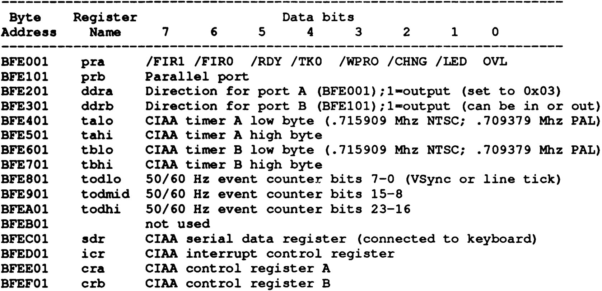

**Note:** CIAA can generate interrupt INT2.

CIAB Address Map

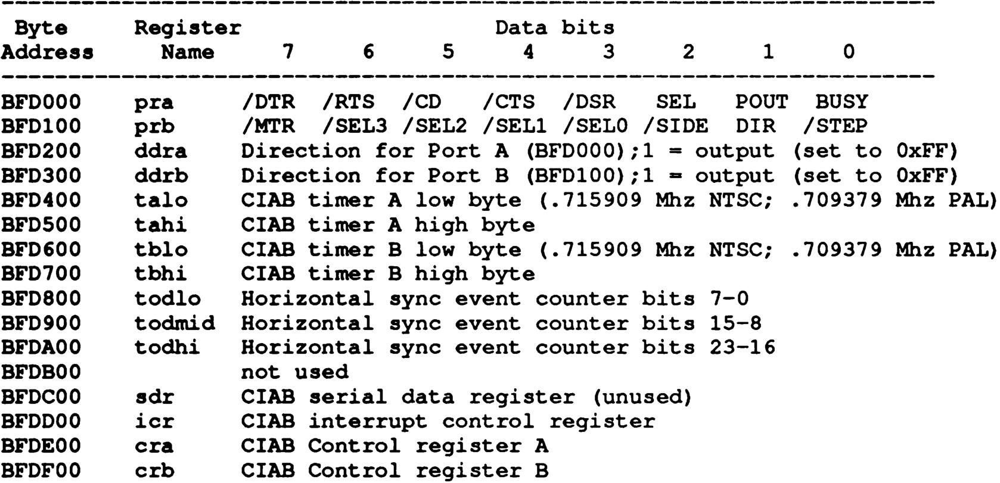

**Note:** CIAB can generate INT6.

## BIT MAP OF REGISTER CRA

```text
REG# NAME  UNUSED  SPMODE   INMODE  LOAD     RUNMODE  OUTMODE  PBON     START

 E   CRA   unused  0=input  0=02   1=force  0=cont.  0=pulse  0=PB6OFF 0=stop
           unused  1=output 1=CNT    load   1=one-   1=toggle 1=PB6ON  1=start
                                 (strobe)   shot

                           |<--------- Timer A Variables ----------------->|
```

All unused register bits are unaffected by a write and forced to 0 on a read.

### CONTROL REGISTER B:

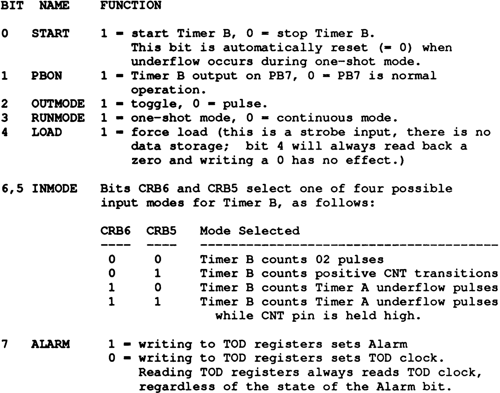

```text
Board Offset
($00/02)    7  6  5  4   3  2  1  0   Description of nibbles
R/W info   \___ ___/    \___ ___/
               \/          \/
     Nibble at $E80000  Nibble at $E80002
```

Figure G-1: How to read the Address Specification Table

**NOTE**

The bit numbering (7 6 5 4 3 2 1 0) is for use when two nibbles are to be interpreted together as a byte. Physically, each nibble is the high nibble of the word at its address (ie. bits 15 14 13 12).

Table G-1: Address Specification Table

```text
OFFSET:         Address 1    Address 2                 Description
===========================================================================

($00/02)        7  6  5  4   3  2  1  0___Board size   000=8meg   100=512k
 Read           |  |  |  |   |  \__|__/                001=64k    101=1meg
 Not Inverted   |  |  |  |   |                         010=128k   110=2meg
                |  |  |  |   |                         011=256k   111=4meg
                |  |  |  |   \----------  1 = Next card is also on this board
                |  |  |  \--------------  1 = Optional ROM vector valid
                |  |  \-----------------  1 = Link into memory free list (RAM)
                |  \--------------\
                |                  \____
                \------------------/     Board type       00 = Reserved
                                                         01 = Reserved
                                                         10 = Reserved
                                                         11 = Current type


($04/06)        7  6  5  4   3  2  1  0   Manufacturer chosen product number
 Read           \___ ___/   \___ ___/
 Inverted           \/          \/
                 Hi nibble   Lo nibble


($08/0A)        7  6  5  4   3  2  1  0   (Remember - these read inverted)
 Read           |  |  |__|___|__|__|__|_  Reserved - Should be 0 currently
 Inverted       |  |
                |  \--------------------  0 = this board can be shut-up
                |                         1 = this board ignores shut-up
                |
                \-----------------------  0 = any space OK
                                          1 = 8 Meg area preferred
```

# Keyboard Communications

The keyboard transmits 8-bit data words serially to the main unit. Before the transmission starts, both KCLK and KDAT are high. The keyboard starts the transmission by putting out the first data bit (on KDAT), followed by a pulse on KCLK (low then high); then it puts out the second data bit and pulses KCLK until all eight data bits have been sent. After the end of the last KCLK pulse, the keyboard pulls KDAT high again.

When the computer has received the eighth bit, it must pulse KDAT low for at least 1 (one) microsecond, as a handshake signal to the keyboard. The handshake detection on the keyboard end will typically use a hardware latch. *The keyboard must be able to detect pulses greater than or equal to 1 microsecond. Software MUST pulse the line low for 85 microseconds to ensure compatibility with all keyboard models.*

All codes transmitted to the computer are rotated one bit before transmission. The transmitted order is therefore 6-5-4-3-2-1-0-7. The reason for this is to transmit the up/down flag last, in order to cause a key-up code to be transmitted in case the keyboard is forced to restore lost sync (explained in more detail below).

The KDAT line is active low; that is, a high level (+5V) is interpreted as 0, and a low level (0V) is interpreted as 1.

```text
KCLK  ______\_/_____\_/_____\_/_____\_/_____\_/_____\_/_____\_/_____\_/____________

      ______________________________________________________________________________
KDAT      \_______X_______X_______X_______X_______X_______X_______X_______/
             (6)     (5)     (4)     (3)     (2)     (1)     (0)     (7)

           First                                                   Last
           sent                                                    sent
```

The keyboard processor sets the KDAT line about 20 microseconds before it pulls KCLK low. KCLK stays low for about 20 microseconds, then goes high again. The processor waits another 20 microseconds before changing KDAT.

Therefore, the bit rate during transmission is about 60 microseconds per bit, or 17 kbits/sec.

Matrix Table

```text
           Row 5   Row 4   Row 3   Row 2   Row 1   Row 0
Column    (Bit 7) (Bit 6) (Bit 5) (Bit 4) (Bit 3) (Bit 2)
        +-------+-------+-------+-------+-------+-------+
  15    |(spare)|(spare)|(spare)|(spare)|(spare)|(spare)|
(PD.7)  |       |       |       |       |       |       |
        | (0E)  | (1C)  | (2C)  | (47)  | (48)  | (49)  |
        +-------+-------+-------+-------+-------+-------+
  14    |   *   |<SHIFT>| CAPS  |  TAB  |   ~   |  ESC  |
(PD.6)  |note 1 |note 2 | LOCK  |       |   `   |       |
        | (5D)  | (30)  | (62)  | (42)  | (00)  | (45)  |
        +-------+-------+-------+-------+-------+-------+
  13    |   +   |   Z   |   A   |   Q   |   !   |   (   |
(PD.5)  |note 1 |       |       |       |   1   |note 1 |
        | (5E)  | (31)  | (20)  | (10)  | (01)  | (5A)  |
        +-------+-------+-------+-------+-------+-------+
  12    |  9    |   X   |   S   |   W   |   @   |  F1   |
(PD.4)  |note 3 |       |       |       |   2   |       |
        | (3F)  | (32)  | (21)  | (11)  | (02)  | (50)  |
        +-------+-------+-------+-------+-------+-------+
  11    |  6    |   C   |   D   |   E   |   #   |  F2   |
(PD.3)  |note 3 |       |       |       |   3   |       |
        | (2F)  | (33)  | (22)  | (12)  | (03)  | (51)  |
        +-------+-------+-------+-------+-------+-------+
  10    |  3    |   V   |   F   |   R   |   $   |  F3   |
(PD.2)  |note 3 |       |       |       |   4   |       |
        | (1F)  | (34)  | (23)  | (13)  | (04)  | (52)  |
        +-------+-------+-------+-------+-------+-------+
   9    |  .    |   B   |   G   |   T   |   %   |  F4   |
(PD.1)  |note 3 |       |       |       |   5   |       |
        | (3C)  | (35)  | (24)  | (14)  | (05)  | (53)  |
        +-------+-------+-------+-------+-------+-------+
   8    |  8    |   N   |   H   |   Y   |   ^   |  F5   |
(PD.0)  |note 3 |       |       |       |   6   |       |
        | (3E)  | (36)  | (25)  | (15)  | (06)  | (54)  |
        +-------+-------+-------+-------+-------+-------+
   7    |  5    |   M   |   J   |   U   |   &   |   )   |
(PC.7)  |note 3 |       |       |       |   7   |note 1 |
        | (2E)  | (37)  | (26)  | (16)  | (07)  | (5B)  |
        +-------+-------+-------+-------+-------+-------+
   6    |  2    |   <   |   K   |   I   |   *   |  F6   |
(PC.6)  |note 3 |   ,   |       |       |   8   |       |
        | (1E)  | (38)  | (27)  | (17)  | (08)  | (55)  |
        +-------+-------+-------+-------+-------+-------+
   5    | ENTER |   >   |   L   |   O   |   (   |   /   |
(PC.5)  |note 3 |   .   |       |       |   9   |note 1 |
        | (43)  | (39)  | (28)  | (18)  | (09)  | (5C)  |
        +-------+-------+-------+-------+-------+-------+
```

```text
           Row 5   Row 4   Row 3   Row 2   Row 1   Row 0
Column    (Bit 7) (Bit 6) (Bit 5) (Bit 4) (Bit 3) (Bit 2)
        +-------+-------+-------+-------+-------+-------+
   4    |   7   |   ?   |   :   |   P   |   )   |  F7   |
(PC.4)  |note 3 |   /   |   ;   |       |   0   |       |
        | (3D)  | (3A)  | (29)  | (19)  | (0A)  | (56)  |
        +-------+-------+-------+-------+-------+-------+
   3    |   4   |(spare)|   "   |   {   |   _   |  F8   |
(PC.3)  |note 3 |       |   '   |   [   |   -   |       |
        | (2D)  | (3B)  | (2A)  | (1A)  | (0B)  | (57)  |
        +-------+-------+-------+-------+-------+-------+
   2    |   1   | SPACE | <RET> |   }   |   +   |  F9   |
(PC.2)  |note 3 |  BAR  |note 2 |   ]   |   =   |       |
        | (1D)  | (40)  | (2B)  | (1B)  | (0C)  | (58)  |
        +-------+-------+-------+-------+-------+-------+
   1    |   0   | BACK  |  DEL  |RETURN |   |   |  F10  |
(PC.1)  |note 3 | SPACE |       |       |   \   |       |
        | (0F)  | (41)  | (46)  | (44)  | (0D)  | (59)  |
        +-------+-------+-------+-------+-------+-------+
   0    |   -   | CURS  | CURS  | CURS  | CURS  | HELP  |
(PC.0)  |note 3 | DOWN  | RIGHT | LEFT  |  UP   |       |
        | (4A)  | (4D)  | (4E)  | (4F)  | (4C)  | (5F)  |
        +-------+-------+-------+-------+-------+-------+
```

note 1: A500 and A2000 keyboards only (numeric pad )

note 2: International keyboards only (these keys are cutouts of the larger key on the US ASCII version.) The key that generates $30 is cut out of the left shift key. Key $2B is cut out of return. These keys are labeled with country-specific markings.

note 3: Numeric pad.

The following table shows which keys are independently readable. These keys never generate ghosts or phantoms.

```text
 (Bit 6) (Bit 5) (Bit 4) (Bit 3) (Bit 2) (Bit 1) (Bit 0)
+-------+-------+-------+-------+-------+-------+-------+
| LEFT  | LEFT  | LEFT  | CTRL  | RIGHT | RIGHT | RIGHT |
| AMIGA |  ALT  | SHIFT |       | AMIGA |  ALT  | SHIFT |
| (66)  | (64)  | (60)  | (63)  | (67)  | (65)  | (61)  |
+-------+-------+-------+-------+-------+-------+-------+
```
