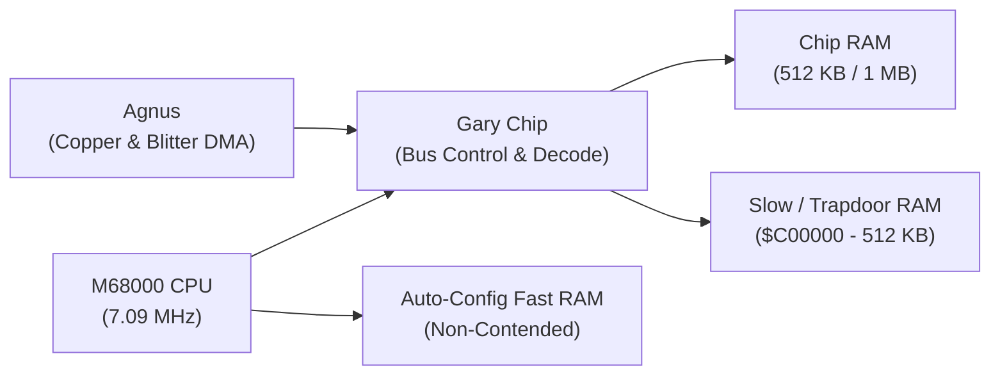

# Amiga 500 Core Architectural & Hardware Principles

This document formalizes the foundational execution model, clock synchronization, bus contention, and systems architecture of the cycle-exact Amiga 500 emulator.

---

## 1. System Clock & Color Clock Phases (CCK1 / CCK2)

The primary synchronization unit of the Amiga hardware is the **Color Clock (CCK)**:
- **PAL System Frequency:** $\approx 3.546895\ \text{MHz}$ ($1\ \text{CCK} \approx 281.9\ \text{ns}$).
- **NTSC System Frequency:** $\approx 3.579545\ \text{MHz}$ ($1\ \text{CCK} \approx 279.4\ \text{ns}$).
- **Motorola 68000 CPU Frequency:** Exactly $2 \times \text{CCK}$ ($\approx 7.09\ \text{MHz}$ PAL / $\approx 7.16\ \text{MHz}$ NTSC).

### Clock Ratio & Bus Cycle Timing
Physical 68000 bus cycles consist of 4 CPU clocks ($S_0..S_7$). In our cycle-exact model:
$$1\ \text{M68000 Bus Cycle} = 4\ \text{CPU Clocks} = 2\ \text{Color Clocks (CCK1} + \text{CCK2})$$

```
CPU Clocks:  | S0 | S1 | S2 | S3 | S4 | S5 | S6 | S7 |
CCK Phases:  |       CCK1        |       CCK2        |
Bus Commit:  |  Address / Strobe | Sample / Commited |
```

- **CCK1 (Address / Strobe Phase):** Address lines, function codes, and read/write control signals stabilize.
- **CCK2 (Sample / Commit Phase):** Data is sampled on reads or latched on writes. Memory bus wait states stall CPU progression in discrete CCK increments without advancing internal microcode state.

---

## 2. Shared Memory Bus & Agnus DMA Contention

The Amiga motherboard connects the 68000 CPU and custom chipset (Agnus, Denise, Paula) through a shared Chip RAM bus managed by the **Gary** custom chip and Agnus DMA sequencer:



### Bus Arbitration Rules
1. **Time-Sliced Chip RAM Access:**
   - Even CCK cycles are allocated to custom chip DMA channels (Audio, Disk, Sprites, Copper, Bitplanes).
   - Odd CCK cycles are available to the CPU.
2. **Blitter Contention ("Blitter Nasty"):**
   - When the Blitter operates in standard mode, it consumes spare cycles without starving the CPU.
   - When `BLTPRI` (bit 10 of `DMACON`) is set, the Blitter claims consecutive cycles, withholding `_DTACK` and forcing the CPU into wait states.
3. **Slow / Trapdoor RAM ($C00000-$C7FFFF):**
   - Decoded by Gary via `_RAMEN`. Because it physically resides on the shared custom chip bus, CPU accesses to Slow RAM experience identical bus contention wait states as Chip RAM. However, Agnus cannot address Slow RAM (OCS Agnus is limited to 512 KB Chip RAM via 19-bit DRAM address lines `DRA0..DRA8`).
4. **Fast RAM ($200000-$9FFFFF):**
   - Resides on a dedicated, non-contended expansion bus. Fast RAM reads and writes execute with zero wait states, completely immune to custom chip DMA activity.

---

## 3. Circuit Simulation & Register Propagation

To avoid emulation race conditions, all register modifications and bus signals emulate physical electronic propagation:
- Internal flip-flops and register writes commit at clock phase boundaries rather than propagating instantaneously.
- Interrupt lines (IPL 1–6) from Paula pass through priority arbitration before latching into the CPU status register.

---

## 4. Systems Invariants & Host Hardware Efficiency

1. **Strict Big-Endian Invariance:**
   - The Motorola 68000 is strictly Big-Endian; modern host CPUs are Little-Endian.
   - Pointer casting or `transmute` between host memory and guest RAM is strictly forbidden.
   - Multi-byte data is encoded/decoded using explicit endian conversion helpers (`u16::from_be_bytes`, `u32::from_be_bytes`).
2. **Zero Host Panics on Guest Code:**
   - Emulated guest code must never crash or panic the host process.
   - Unmapped memory reads simulate open bus floating high (returning `$FF` for bytes, `$FFFF` for words).
   - Unaligned word/long operations trigger internal M68000 Address Error exception frames (Vector 3).
3. **Zero Heap Allocations in Hot Paths:**
   - Emulation loops (`step()`, `step_cck()`, memory transactions, interrupt polling) execute with zero dynamic memory allocation (`Vec::new`, `Box::new`, `format!`).
4. **Decoupled Ownership & Save State Serde:**
   - The root machine struct (`A500`) maintains strict hierarchical ownership without circular references (`Rc<RefCell<...>>`).
   - Subsystem state snapshots derive `serde::Serialize` and `serde::Deserialize` for keyframe save states and temporal rewind.
