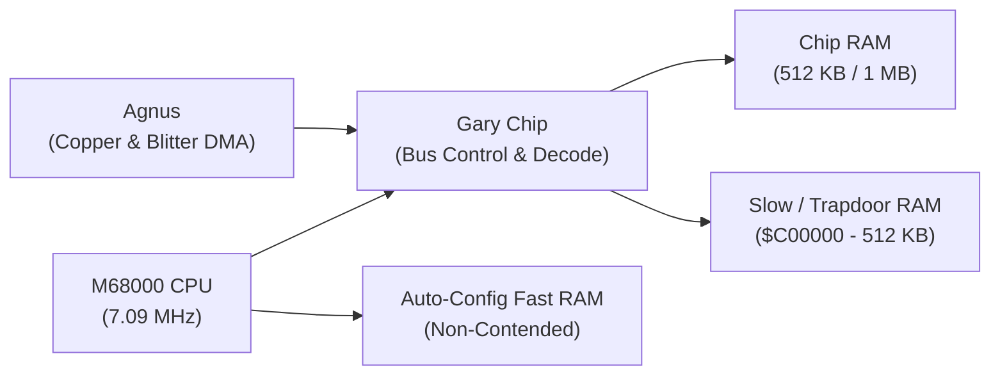

# Amiga 500 Core Architectural & Hardware Principles

This document formalizes the foundational execution model, clock synchronization, bus contention, and systems architecture of the cycle-exact Amiga 500 emulator. Comprehensive circuit specifications, register mappings, and DMA slot schedules reside in [`Obsidian/Amiga/Design/`](../Obsidian/Amiga/Design/).

---

## 1. Cycle-Exact Execution Model & Color Clock Phases (CCK1 / CCK2)

The emulator is engineered around a **cycle-exact, phase-accurate execution model**. Every major subsystem—the Motorola 68000 CPU, Agnus (Copper & Blitter), Denise, Paula, and the dual 8520 CIAs—is synchronized to the physical master clock and stepped in lockstep.

### Why Cycle-Exact?
Looser, frame-based, or instruction-slice emulators often rely on complex heuristics, out-of-order execution workarounds, time-catchup loops, and delicate race-condition hacks to keep the CPU and custom chipset in sync. In contrast, cycle-exact simulation:
- **Eliminates Synchronization Hacks:** By executing at the fundamental physical clock resolution, race conditions between the CPU, Blitter, Copper, and audio DMA resolve naturally according to physical silicon reality.
- **Prevents Out-of-Order Glitches:** Copper beam synchronization, raster-split color gradients, sprite multiplexing, and dynamic CIA timer interrupts behave identically to real Commodore hardware with zero timing compensation code.
- **Deep Design Documentation Links:** For component-specific hardware details, consult the authoritative design specifications in [`Obsidian/Amiga/Design/`](../Obsidian/Amiga/Design/) (including [General Architecture](../Obsidian/Amiga/Design/General%20Architecture.md), [Agnus](../Obsidian/Amiga/Design/Agnus.md), and [Main Loop](../Obsidian/Amiga/Design/Main%20loop%20A500.md)).

### Master Clocks & CCK Phases
The primary synchronization unit of the Amiga hardware is the **Color Clock (CCK)**:
- **PAL System Frequency:** $\approx 3.546895\ \text{MHz}$ ($1\ \text{CCK} \approx 281.9\ \text{ns}$).
- **NTSC System Frequency:** $\approx 3.579545\ \text{MHz}$ ($1\ \text{CCK} \approx 279.4\ \text{ns}$).
- **Motorola 68000 CPU Frequency:** Exactly $2 \times \text{CCK}$ ($\approx 7.09\ \text{MHz}$ PAL / $\approx 7.16\ \text{MHz}$ NTSC).

Physical 68000 bus cycles consist of 4 CPU clocks ($S_0..S_7$), which map directly to two 2-clock Color Clock phases:
$$1\ \text{M68000 Bus Cycle} = 4\ \text{CPU Clocks} = 2\ \text{Color Clocks (CCK1} + \text{CCK2})$$

```
CPU Clocks:  | S0 | S1 | S2 | S3 | S4 | S5 | S6 | S7 |
CCK Phases:  |       CCK1        |       CCK2        |
Bus Commit:  |  Address / Strobe | Sample / Committed |
```

- **CCK1 (Address / Strobe Phase):** Address lines, function codes, and read/write control signals stabilize.
- **CCK2 (Sample / Commit Phase):** Data is sampled on reads or latched on writes. Memory bus wait states stall CPU progression in discrete CCK increments without advancing internal microcode state.

---

## 2. Shared Memory Bus & DMA Contention

The Amiga motherboard connects the 68000 CPU and custom chipset (Agnus, Denise, Paula) through a shared Chip RAM bus managed by the **Gary** custom chip and the Agnus DMA sequencer:



### Bus Arbitration & Interleaved Memory Access
1. **Interleaved Chip RAM Access:**
   - Amiga Chip RAM operates at the full 7.09 MHz rate. Custom chipset DMA channels (Audio, Disk, Sprites, Copper, Bitplanes) access Chip RAM during **even CCK cycles**, while the CPU accesses Chip RAM during **odd CCK cycles**. Under standard display modes, both the CPU and chipset execute concurrently at full speed without mutual stalling.
2. **Contention & Wait States ("Blitter Nasty" & Display Overhead):**
   - When the Blitter operates with `BLTPRI` set (bit 10 of `DMACON`), or when high-resolution 6-bitplane displays consume all available bandwidth, the custom chipset claims odd cycles. Gary suppresses the CPU's `_DTACK` signal, forcing the CPU into wait states (`BusResult::WaitState`) until the bus becomes available.
3. **Slow / Trapdoor RAM ($C00000-$C7FFFF):**
   - Decoded by Gary via `_RAMEN`. Because it physically resides on the shared custom chip bus, CPU accesses to Slow RAM experience identical bus contention wait states as Chip RAM. However, Agnus cannot address Slow RAM (OCS Agnus is limited to 512 KB Chip RAM via 19-bit DRAM address lines `DRA0..DRA8`).
4. **Fast RAM ($200000-$9FFFFF):**
   - Resides on a dedicated, non-contended expansion bus. Fast RAM reads and writes execute with zero wait states, completely immune to custom chip DMA activity.

---

## 3. Physical Circuit Simulation & Signal Propagation

To avoid artificial software race conditions, all cross-chip signals, register strobes, and bus interrupts simulate physical electronic propagation:
- **Read is NOW, Write Propagates across Clock Phases:** Register reads return the currently latched state immediately. Register modifications (e.g. `DMACON`, `BPLCON0`, `INTENA`, `COPJMP1`), control strobes, and timer latches do not mutate downstream chips instantaneously; they are staged and propagate after discrete Color Clock phases or cycles before altering execution paths.
- **Hardware Interrupt Arbitration:** Interrupt request lines (Level 1–6 from Paula and CIAs) pass through priority arbitration and sync latches before being recognized by the CPU at instruction boundaries.
- **Detailed Subsystem Circuit Specifications:** For individual register timing models and DMA pipelines, refer to [`Obsidian/Amiga/Design/`](../Obsidian/Amiga/Design/) ([Agnus](../Obsidian/Amiga/Design/Agnus.md), [Denise](../Obsidian/Amiga/Design/Denise.md), [Paula](../Obsidian/Amiga/Design/Paula.md), and [CIA](../Obsidian/Amiga/Design/CIA.md)).

---

## 4. Systems Invariants & Host Hardware Efficiency

1. **Strict Big-Endian Invariance:**
   - The Motorola 68000 is strictly Big-Endian; modern host CPUs are Little-Endian.
   - Pointer casting or `transmute` between host memory and guest RAM is strictly forbidden.
   - Multi-byte data is encoded/decoded using explicit endian conversion helpers (`u16::from_be_bytes`, `u32::from_be_bytes`).
2. **Zero Host Panics on Guest Code:**
   - Emulated guest code must never crash or panic the host process.
   - Unmapped memory reads simulate open bus floating high (returning `$FF` for bytes, `$FFFF` for words).
   - Unaligned word/long operations trigger internal M68000 Address Error exception frames (Vector 3).
3. **Zero Heap Allocations in Hot Paths:**
   - Emulation loops (`step()`, `step_cck()`, memory transactions, interrupt polling) execute with zero dynamic memory allocation (`Vec::new`, `Box::new`, `format!`).
4. **Decoupled Ownership & Save State Serde:**
   - The root machine struct (`A500`) maintains strict hierarchical ownership without circular references (`Rc<RefCell<...>>`).
   - Subsystem state snapshots derive `serde::Serialize` and `serde::Deserialize` for keyframe save states and temporal rewind.
