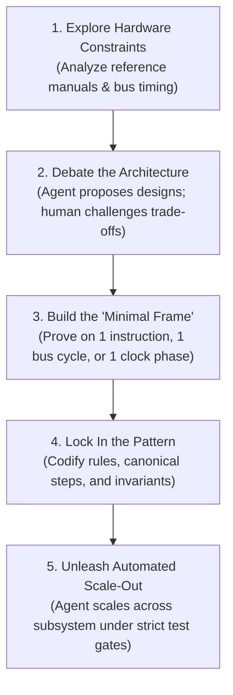
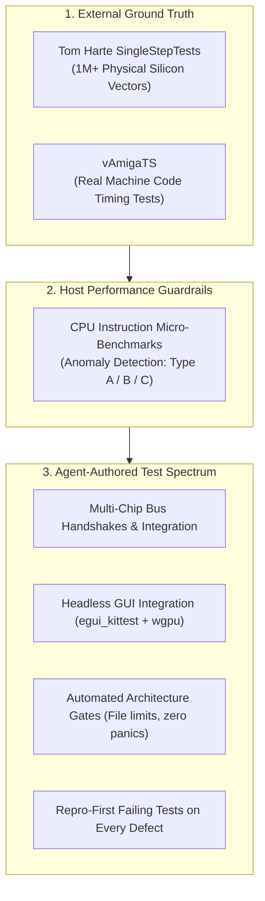

# How This Emulator Was Written: Pair-Programming with an AI Agent

Here is the honest breakdown of how this cycle-exact Amiga 500 emulator was built from scratch in Rust—and how an AI agent generated 100% of the implementation code, test suites, and documentation under human architectural direction.

---

## 1. Zero Hand-Written Code (and Zero Rust Experience)

Here is the defining fact about this project: **I did not write a single line of Rust code. Not one.**

I didn't write any of the implementation code. And just as importantly, **I never wrote, designed, or proposed a single test**—from unit tests and multi-chip integration suites to GUI harnesses and automated architecture gates. Every struct, every micro-step in the CPU state machine, every bus arbitration check, every co-processor pipeline, and every test suite was generated and verified by the AI agent.

And here is the even more candid reality: **I didn't know the hardware inside-out going in, and this project was my very first contact with Rust.**

I didn't have the retro hardware details memorized. Nor was I a seasoned Rust programmer—in all honesty, there are still aspects of Rust that I am learning today.

My role was serving as the **Architect, Constraint Setter, and Sparring Partner**. Rather than micromanaging syntax, I focused on high-level system boundaries, trade-off debates, and designing the verification harness.

---

## 2. The Methodology: The "Minimal Frame" Rule

When building complex systems with AI, asking a model to generate an entire subsystem from a large prompt almost always produces brittle, unmaintainable code.

Our approach was the opposite: **the agent was never unleashed on a subsystem until the architecture was proven on the smallest possible working slice—the "minimal frame."**

Before implementing hundreds of CPU instructions or complex co-processor pipelines, we first proved the minimal operational skeleton:
- How a bus cycle breaks down across discrete sub-clock phases.
- How the memory bus arbitrates wait states when co-processor DMA blocks the CPU.
- How decoupled chips communicate cleanly without circular reference handles (`Rc<RefCell<...>>`).
- How interrupt priority signals propagate into the CPU.

Once verified on a single instruction or clock phase, the pattern was locked into a recipe, and the agent scaled it out across the entire subsystem.

### When the AI Trips, Don't Touch the Code—Upgrade the Harness
Whenever the agent made a mistake or took a shortcut, the solution was never to step in and write code manually. Instead, we diagnosed the root cause: *What rule, skill, or architectural constraint was missing?*

Every mistake prompted an update to our operational rules (`.agents/rules/`), a refined skill recipe (`.agents/skills/`), or a new assertion in our automated architecture test suite. Over time, the harness became self-correcting.

---

## 3. The Zero-Trust Verification Engine

LLMs excel at generating code that looks plausible, compiles cleanly, and passes basic smoke tests—yet breaks completely under real-world execution. To eliminate hallucinated hardware behavior, we established a three-tier verification harness:

### A. Ground Truth Test Vectors (Tom Harte & vAmigaTS)
- **1 Million+ Silicon Captures:** We imported 124 test suites captured directly from physical Motorola 68000 silicon. Every test asserts exact bus cycles, register states, and ALU status flags. If an instruction diverged by even a single clock phase, the agent had to fix its micro-step state machine until it matched real silicon 100%.
- **Hardware Timing Baseline:** Real machine code test suites verified co-processor synchronization, video beam timing, memory bus priority, and hardware timers.

### B. Micro-Benchmarking Every Instruction
Cycle accuracy is useless if host execution is sluggish. To ensure the agent didn't write code riddled with pipeline stalls or unexpected branches, we built a dedicated CPU micro-benchmarking engine that measures host nanoseconds against emulated hardware clocks:
- **Type A (Hot Path Spikes):** Flags instructions significantly slower than sibling opcodes in the same family.
- **Type B (Addressing Inefficiencies):** Flags indirect addressing modes that spike relative to register baselines (catching missed inlining or unexpected branches).
- **Type C (Branch Predictor Thrashing):** Detects execution jitter (>5.0% CV across passes) caused by host CPU pipeline flushes.

### C. Autonomous Testing Spectrum
The agent authored and maintained every unit test, multi-chip integration test, headless GUI test (`egui_kittest`), and architecture rule check across all 26 workspace crates. Bug fixes followed a strict **Repro-First** mandate: write an isolated failing test before touching production code.

---

## 4. Systems Architecture in Rust: Flat Layout, Rigorous Ownership

### Flat Code Layout, Rich Compile-Time Ownership
One foundational design choice was keeping the codebase structure intentionally flat:
- **Flat Crate Layout:** All 26 crates live directly under `crates/*` (e.g. `crates/cpu`, `crates/memory_bus`, `crates/debugger`, `crates/gui`).
- **Flat Modules:** CPU instructions reside directly under `crates/cpu/src/instructions/<mnemonic>.rs` without nested directories.

While the file layout is flat, the ownership graph within is strict. Shared mutable pointers (`Rc<RefCell<...>>`) are strictly banned. The top-level machine struct owns subsystems directly, modeling bus contention and co-processor scheduling through unidirectional borrows and calibrated event queues.

### Aspect-per-File Modularity
Modules are organized by cohesive behavioral capabilities rather than fragmented across dozens of micro-files. In [`crates/debugger/src/`](../crates/debugger/src/), for example, each file encapsulates an entire functional aspect: `assembler.rs` (parser), `breakpoints.rs` (evaluators and hit testing), `temporal.rs` (time-travel ring buffers), and `stepping.rs` (execution control).

> [!NOTE]
> **A DSP Detour: Standalone Anti-Aliasing (BLEP)**
> To eliminate digital audio aliasing from variable-rate sound channels, we implemented Band-Limited Steps (BLEP). We built a standalone Rust tool in [`tools/blep_generator`](../tools/blep_generator/) with zero external dependencies—deriving sinc pulses, minimum-phase transforms, and analog filter curves directly from mathematical first principles.

---

## Key Takeaways for Building with AI

1. **You Don't Need to Type Syntax or Tests:** An AI agent can generate 100% of production code, test suites, and documentation when directed with clear architectural constraints.
2. **Upgrade the Harness, Don't Fix Code:** When the AI stumbles, treat it as a harness failure. Refine operational rules, skills, and architecture tests so the mistake cannot recur.
3. **Anchor to Objective Ground Truth:** Combine physical hardware test captures with micro-benchmarking to ensure code is both 100% accurate and fast on modern host processors.
4. **Build the Minimal Frame First:** Never unleash an agent on an entire subsystem at once. Prove the architecture on one instruction or one bus cycle before scaling out.
5. **Flat Organization, Strict Ownership:** Keep directory hierarchies flat and navigable, while using Rust's compile-time ownership to eliminate circular references and runtime locks.
