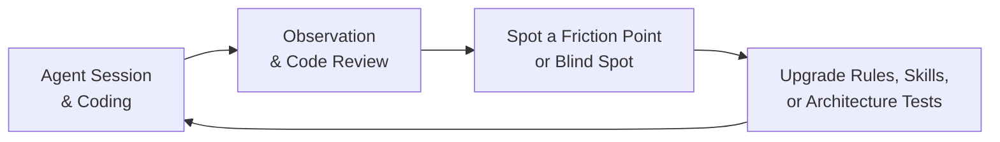
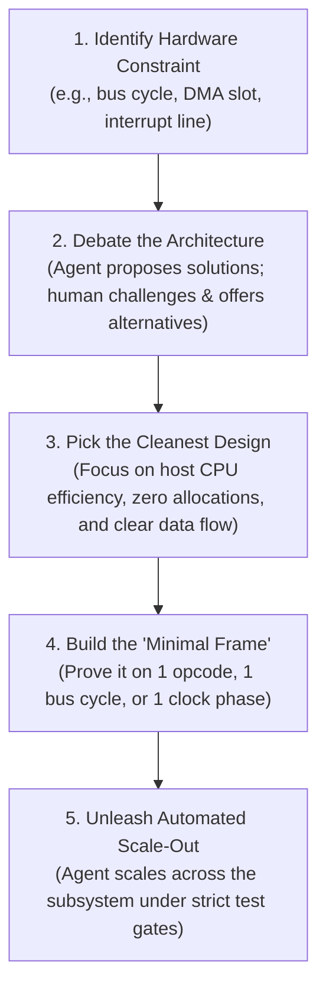

# How This Emulator Was Written: Pair-Programming with an AI Agent

Here is the honest breakdown of how this cycle-exact Amiga 500 emulator was built from scratch in Rust—and how an AI agent generated 100% of the code, tests, and documentation under human architectural direction.

---

## 1. The Headline: Zero Hand-Written Code (and Zero Rust Experience)

Here is the most defining fact about this project: **I did not write a single line of Rust code. Not one.**

I didn't write any of the implementation code. And just as importantly, **I never wrote, designed, or proposed a single test of any kind**—from individual unit tests and multi-chip integration suites to GUI test harnesses and automated architecture gates. Every struct, every micro-step in the Motorola 68000 CPU state machine, every bus arbitration check in Gary, every custom chip pipeline, and every test suite was generated and maintained by the AI agent.

And here is the even more candid reality: **I didn't fully understand how the Amiga works going in, and this project was my very first contact with Rust.**

I didn't have all the deep hardware details of the 68000 CPU, Agnus, Denise, or Paula memorized. Nor was I a seasoned Rust programmer—in all honesty, there are still plenty of things about Rust that I probably don't know today. 

My role wasn't writing syntax or pretending to be an all-knowing hardware guru. It was acting as the **System Architect, Strategic Director, and Engineering Sparring Partner**. I didn't treat the agent like a junior intern who needs syntax babysitting, and I definitely didn't treat it like a glorified autocomplete widget. We worked as high-bandwidth engineering peers, exploring both the hardware architecture and the systems design together.

---

## 2. The Sparring Partner Mindset: How We Actually Worked Together

The relationship worked because we treated each other as technical partners:

| The "Junior Intern" Trap | The Sparring Partner Mindset |
| :--- | :--- |
| Micromanaging syntax, variable names, and formatting | Setting high-level architectural direction and constraints |
| Getting frustrated when the model makes a mistake | Updating the rules and skills so that mistake can never happen again |
| Passively accepting whatever code the model outputs | Debating trade-offs, pushing back, and suggesting better alternatives |
| Stepping in to write code manually when the AI struggles | Polishing the harness and test feedback loops until the AI succeeds |

### When the AI Trips, Don't Touch the Code—Upgrade the Harness
Whenever the agent stumbled or took a suboptimal shortcut, I didn't reach for my keyboard to fix it. Instead, I asked: *Why did the agent make that choice? What rule or skill was missing or ambiguous?* 

Then I updated our operational rules under `.agents/rules/`, refined a skill in `.agents/skills/`, or added an automated test in our architecture test suite. Every mistake made the harness stronger. Over time, the agent required fewer corrections and operated with remarkable velocity.

### When the Collaboration Surprises You
The most rewarding part of this project was discovering solutions that exceeded what either of us would have come up with alone.

Through back-and-forth architectural sparring, we repeatedly landed on designs that were cleaner, more robust, and more elegant than my original ideas—solutions I had not foreseen at all going in, but which turned out to be exceptionally well-suited to the hardware. 

These breakthroughs weren't planned upfront on day one. They emerged naturally from continuous engineering dialogue, grounded in real hardware constraints and backed by a disciplined, evolving harness.

---

## 3. Real Silicon Test Vectors Don't Care About AI Guesses

LLMs are remarkably good at generating code that looks plausible, compiles cleanly, and passes basic hand-rolled smoke tests—yet completely breaks the moment you boot a real Amiga game or demoscene raster trick.

To eliminate hallucinated hardware behavior, we anchored the agent to two unforgiving, external test suites:

### A. Tom Harte's SingleStepTests (Real 68000 Silicon Captures)
- **Over 1 Million Test Vectors:** We imported 124 comprehensive test suites (`ref_src/SingleStepTests-680x0/`) captured directly from physical Motorola 68000 silicon.
- **Cycle-by-Cycle Verification:** Every single test case initializes registers, memory, and the CPU prefetch queue (`IR`/`IRC`), steps through execution, and asserts every bus cycle, address strobe, data transfer, and condition code flag ($X, N, Z, V, C$).
- **No Room to Bluff:** When the agent wrote an opcode, we ran it against these physical silicon captures (`SINGLESTEP_FULL=1`). If a test failed by even a single clock phase or flag bit, the agent couldn't argue or fudge the implementation—it had to step through its micro-steps and fix the state machine until it matched real Motorola silicon 100%.

### B. vAmigaTS (Amiga Chipset Timing Suite)
- **Real Machine Code Tests:** Christian Bauer's vAmiga test suite runs real Amiga machine code programs designed to push custom chip edge cases to their breaking point.
- **Custom Chip Stress-Testing:** It verified Agnus Copper beam synchronization, Blitter nasty bus priority, Denise bitplane latches, sprite multiplexing, and CIA timer rollovers.
- **Zero Regression Confidence:** Every time we refactored bus logic or chip synchronization, we had an objective, external verification baseline to prove we hadn't broken hardware timing.

---

## 4. Catching Performance Bottlenecks: Micro-Benchmarking Every CPU Instruction

Cycle accuracy is only half the equation in emulation. If an instruction handler is riddled with hidden host pipeline stalls, missing inlining annotations, or unpredictable branches, the emulator will chug and burn processor cycles.

To ensure the agent didn't write code that was cycle-accurate but agonizingly slow on modern hardware, we built a **dedicated CPU instruction micro-benchmarking and anomaly detection engine**:

- **Benchmarking Every Opcode & Addressing Mode:** The harness measures host execution time in nanoseconds against emulated Amiga Color Clocks for every single instruction and addressing mode variant, computing a normalized performance ratio:
  $$R_{\text{norm}} = \frac{\text{Host Execution Time (ns)}}{\text{Amiga Hardware Clocks (CCK)}}$$
- **Spotting Performance Defects at a Glance:** Rather than manually profiling with external tools, our engine automatically compares instructions across families and addressing modes, flagging performance anomalies right away:
  - **Type A (Hot Path Spikes):** Detects if a specific instruction is unexpectedly slower than its sibling opcodes in the same family (>2.5x baseline).
  - **Type B (Addressing Mode Inefficiencies):** Flags if an indirect or indexed addressing mode spikes relative to direct register operations (>3.0x register baseline), instantly catching a missing `#[inline(always)]` annotation or an accidental dynamic branch.
  - **Type C (Branch Predictor Thrashing):** Catches excessive execution jitter (>5.0% CV across passes) caused by host CPU pipeline flushes.

Whenever the agent refactored instruction decoding, effective address calculation, or ALU logic, this benchmark harness gave us immediate proof of whether the code was truly fast or hiding an accidental bottleneck.

---

## 5. The Entire Testing Spectrum Authored by the Agent

People often assume that if an AI writes production code, the human must at least write the tests to keep it honest. In our case, **I never wrote, designed, or proposed a single test of any kind**. The agent authored every unit test, integration test, architecture check, and regression harness across all 26 workspace crates from the very beginning:

- **Exhaustive Unit Tests:** Verifying opcode decoders, CCR arithmetic flags, memory alignment checks, and register mutation pipelines.
- **Multi-Chip Integration Tests:** Validating physical bus handshakes between chips—like the Copper triggering Blitter operations, Paula asserting CPU interrupt lines (IPL 1-6), Gary overlay switching on CIA-A `_OVL` pin transitions, and floppy head stepping.
- **Headless GUI Integration Tests:** Offscreen frame rendering (`egui_kittest` + `wgpu`) asserting that the debugger window, panel splitters, and user keystrokes work without ever panicking the host.
- **Automated Architecture & Hygiene Tests:** A dedicated test suite (`cargo test -p test_runner --test test_architecture_rules`) that verifies constitutional rules automatically on every build—enforcing file size limits ($\le 800$ lines), canonical micro-step constants, zero inline tests in `src/`, and zero runtime panics.
- **Repro-First Bug Verification:** Whenever an edge case or bug appeared, the agent had to first write an isolated failing reproduction test before touching a single line of production code.

Early on, I occasionally prompted: *"Write tests for this, coverage is missing."* But as we polished the harness, testing became an automatic, non-negotiable Definition of Done. The agent wrote, ran, and validated comprehensive test suites autonomously before declaring any task finished.

---

## 6. Documentation is an Iterative Compass, Never a Holy Grail

The repository contains dozens of deep architectural specs under [`Obsidian/Amiga/Design/`](../Obsidian/Amiga/Design/) and [`docs/`](../docs/). But here is an essential truth about how they were made: **documentation was never treated as a sacred holy grail or a long, upfront waterfall marathon.**

A common trap with AI-assisted coding is spending weeks drafting an exhaustive, "perfect" specification in the naive hope that it will magically generate a flawless codebase in one shot. That never works.

Instead, our approach was pragmatic:
- **Good Enough to Start Coding:** We developed documentation collaboratively with the agent only up to the point where the architecture felt solid and clear. As soon as I felt, *"Okay, this makes sense, the interfaces are sane"*, we stopped writing docs and immediately moved to code and tests.
- **Human-Driven Debates:** The docs were never generated in a vacuum. Every spec started from human initiative: *"Write a design document on Paula audio DMA"*, *"What if the CPU accesses registers out-of-order?"*, *"Add this section, but remove that assumption."*
- **Refined in Lockstep with Code:** From the moment coding began, the documentation lived and breathed with the implementation. Whenever writing code revealed gaps, missing edge cases, or hardware quirks, we updated and expanded the documentation alongside the code.

Documentation was a fast, iterative working compass—never an upfront bureaucratic monument.

---

## 7. The Methodology: The "Minimal Frame" Rule

When people try to build complex systems with AI, they usually hand the agent a big specification and say: *"Build the CPU."* That never works. It produces thousands of lines of brittle, unmaintainable code that falls apart the moment you run a real test.

Our approach was the exact opposite: **the agent was never unleashed on a subsystem until we proved the architecture on the smallest possible working slice—what we called the "minimal frame."**

Before implementing hundreds of M68000 instructions or complex chip registers, we sat down and built the minimal operational skeleton together:
- How does a single bus cycle break down across Color Clock phases (`CCK1` address/strobe vs `CCK2` sample/commit)?
- How does the memory bus signal wait states (`BusResult::WaitState`) when custom chip DMA blocks the CPU?
- How do decoupled chips talk to each other without messy circular pointer soup (`Rc<RefCell<...>>`)?
- How does an interrupt request line (`IPL 1-6`) travel from Paula and the CIAs into the CPU?

Once we proved that minimal frame on one instruction or one cycle, the architecture was locked in. Only then was the agent unleashed to scale out the full implementation across the subsystem.

---

## 8. The Architectural Blueprint: Flat Code, Rich Ownership

Now for the under-the-hood technical choices. How did we actually structure the Rust codebase?

### A. Flat Code Organization, Complex Ownership Graph
One of the most conscious decisions I made was keeping the code structure **as flat as possible**:
- **Flat Crate Layout:** All 26 crates live directly under `crates/*` (e.g. `crates/m68000`, `crates/memory_bus`, `crates/agnus`, `crates/debugger`, `crates/gui`). There is no deep, dizzying nesting of crates inside crates.
- **Flat Module Files:** Instructions live directly under `crates/m68000/src/instructions/<mnemonic>.rs` with zero subdirectories. Subsystems are split into direct, single-level sibling files.

**But here is the contrast:** while the directory and file structure is aggressively flat, **the ownership model within that structure is rich and intricate**:
- In Rust, beginners often get overwhelmed by ownership and reach for shared mutable pointers (`Rc<RefCell<...>>`) or massive monolithic "God structs". We strictly banned circular pointers.
- The top-level machine struct (`A500`) owns all major subsystems directly. 
- Inter-chip communication, DMA bus locks, interrupt lines (`IPL 1-6`), and Gary wait-state arbitration are modeled through unidirectional borrowing lifecycles and calibrated event queues.
- Subsystem state snapshots are completely decoupled from runtime execution handles, allowing both WebAssembly export and zero-allocation time-travel rewind.

The result is the best of both worlds: a clean, easily navigable flat file layout backed by a rigorous, compile-time verified ownership graph.

### B. "Aspect-per-File", Not "Class-per-File"
Another architectural choice I enforced across the codebase was rejecting the classic object-oriented trap: splitting every single struct into its own tiny file. In languages like Java or C#, you often end up with twenty micro-files for one feature (`Breakpoint.rs`, `BreakpointManager.rs`, `BreakpointCondition.rs`), which fragments your attention and forces artificial boilerplate.

Instead, we organized code strictly by **behavioral aspect per file**. A single file encapsulates an entire capability from top to bottom.

Look at [`crates/debugger/src/`](../crates/debugger/src/) as the poster child of this approach:
- `assembler.rs`: Everything needed to parse text into 68000 machine code.
- `breakpoints.rs`: Structs, condition evaluators, and hit-testing logic for all breakpoints and watchpoints.
- `loader.rs`: Binary executable injection into RAM and CPU entrypoint setup.
- `session.rs`: High-level session coordination and state lifecycle.
- `stepping.rs`: Execution control (step into, step over, step out, frame step).
- `temporal.rs`: Time-travel rewind ring buffers and snapshot seeking.
- `trace.rs`: Execution trace recording and bottom log display.

When you open a file, you get the entire functional aspect in one coherent place. No jumping between ten different files to understand a single feature.

### C. DSP from First Principles: Paula & The BLEP Generator
Paula features four independent DMA audio channels running at variable sample rates. In software emulation, jumping DAC values across arbitrary clock cycles causes harsh digital aliasing. A standard, effective solution is **Band-Limited Steps (BLEP)**—injecting pre-calculated step responses whenever a transition occurs.

We started with an existing Python script to generate these tables, but it relied on heavy external numerical libraries. Porting it into our project turned into a genuinely fun detour into DSP. I had a great time getting my hands dirty with the fundamentals—experimenting with low-pass and high-pass filters, sample rate conversion, and reconstructing continuous signals from discrete steps.

Together with the agent, we turned that prototype into a standalone Rust tool in [`tools/blep_generator`](../tools/blep_generator/) with zero external dependencies. It derives the windowed sinc pulses, minimum-phase transforms, and analog RC filter curves directly from first principles. It was one of the most rewarding side quests in the project: taking a mathematical script and turning it into clean, self-contained systems code.

### D. Exploring Hardware Before Writing Code
Before drafting our first module, the agent served as an interactive research engine to deconstruct how the Amiga 500 actually works:
- **Deep Q&A Over Original Manuals:** Tearing through the Commodore Hardware Reference Manual, Motorola 68000 PRMs, and schematics.
- **Untangling Custom Chip Interactions:** Mapping how Agnus, Gary, Paula, Denise, and the dual 8520 CIAs cooperate.
- **Physical Quirks First:** Nailing down open-bus floating values (`$FF`/`$FFFF`), color clock boundaries (`CCK1`/`CCK2`), and DMA slot interleaving before writing software structures.

---

## Key Takeaways for Building with AI

1. **You Don't Need to Type Code or Tests:** An AI agent can generate 100% of the production code, test suites (unit, integration, GUI, and architecture checks), and technical documentation if you provide sharp architectural leadership.
2. **Be a Sparring Partner, Not an Intern Babysitter:** Debate trade-offs, challenge decisions, and continuously upgrade the harness (rules and skills) whenever the AI trips.
3. **Anchor to Silicon Accuracy & Performance Benchmarks:** Pair exhaustive hardware test vectors (SingleStepTests, vAmigaTS) with instruction micro-benchmarks and anomaly detection to guarantee code is both 100% cycle-exact and blistering fast.
4. **Docs as an Iterative Compass, Not a Holy Grail:** Draft documentation just until the architecture is "good enough to code," then refine and expand it in lockstep as real-world code reveals edge cases.
5. **Build the Minimal Frame:** Never ask an agent to build a whole subsystem at once. Prove the architecture on one instruction or one bus cycle first.
6. **Flat Structure, Rich Ownership:** Keep your file tree flat and navigable, but use Rust's strict compile-time ownership to eliminate circular pointer soup.
