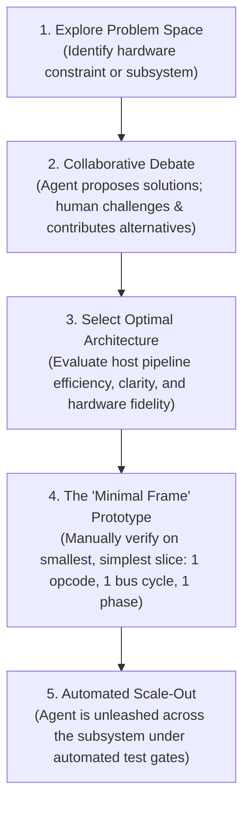

# How This Emulator Was Written: Pair-Programming with an AI Agent

> _Original Polish Working Title: "Jak ten emulator został napisany. Jak współpracowałem z agentem."_
> 
> This document details the engineering methodology, collaboration dynamics, and harness design behind the development of this cycle-exact Amiga 500 emulator.

---

## Executive Summary: Zero Hand-Written Code

The most defining characteristic of this project is a simple fact: **the human developer did not write a single gram of code**.

Not a single line of Rust implementation code was typed manually by the human. Furthermore, **not a single unit or integration test was manually authored or designed by the human**. Every data structure, opcode micro-step, memory bus arbitration routine, custom chip state machine, test harness, and technical design document was generated and maintained by the AI agent under human architectural steering.

Instead of writing syntax, the human acted as **System Architect, Director, and Intellectual Sparring Partner**. The agent was not treated as a passive autocompletion widget or a subordinate junior programmer needing low-level hand-holding, but as a high-bandwidth engineering peer.

This document synthesizes the five core pillars of how this collaboration operated.

---

## 1. Domain Knowledge Exploration & Machine Comprehension

Before writing production code, the agent served as an interactive engine for **exploring and deconstructing the Amiga hardware architecture**:

- **Systemic Questioning & Deep Analysis:** Rather than treating emulation as a guessing game, the developer engaged the agent in exhaustive Q&A sessions analyzing the Commodore Amiga hardware manual, Motorola 68000 programmer reference manuals, and physical hardware schematics.
- **Inter-Chip Interplay:** Initial sessions focused on clarifying the subtle interactions between chips: how Agnus (Copper/Blitter) arbitrates the shared Chip RAM bus with the CPU, how Gary manages address decoding and DTACK wait states, how Paula synchronizes audio and floppy DMA slots, and how the dual 8520 CIAs generate timer interrupts.
- **Grounded Hardware Mental Model:** By probing edge cases through dialogue—such as open-bus floating behavior (`$FF`/`$FFFF`), color clock phase boundaries (`CCK1`/`CCK2`), and bus contention penalties—the developer and agent established a shared, rigorous mental model of the physical silicon before committing to any software structures.

---

## 2. Architectural Solution Exploration & The "Minimal Frame" Methodology

Emulating a complex, cycle-exact system requires navigating countless architectural trade-offs. The development followed a strict collaborative workflow:

### The "Minimal Frame" Invariant
A critical principle prevented chaos and unanchored code generation: **the agent was never unleashed on large subsystems without a proven, verified minimal frame**.

Before scaling out to hundreds of CPU instructions or extensive chip features, the human and agent first established and verified the minimal operational skeleton:
- How does a single CPU bus cycle split across Color Clock phases (`CCK1` address/strobe vs `CCK2` sample/commit)?
- How does the memory bus return `BusResult::WaitState` when Chip RAM is contended by DMA?
- How do decoupled subsystems exchange signals without circular pointer references (`Rc<RefCell<...>>`)?
- How does the interrupt priority level (`IPL 1-6`) propagate between Paula/CIAs and the CPU?

Only after this minimal frame was proven and tested on the simplest possible slice was the agent given clearance to scale out the full implementation autonomously.

---

## 3. The Complete Agent Harness & Test Automation

An autonomous agent is only as dependable as the environment constraining it. The emulator was built inside an extensive, multi-layered **agent harness**:

### A. Modular Guardrails & Constitutional Invariants
Operational rules under `.agents/rules/` enforce non-negotiable architectural invariants:
- **Language Policy (`language-policy.md`):** Strict English for all code, comments, documentation, and commits.
- **Hardware Efficiency & Readability (`performance-and-readability.md`):** Strict prohibition of custom macros (`macro_rules!`) and const-generic opcode functions; contiguous arrays; zero heap allocations in emulation hot paths; zero `.unwrap()` or panic paths.
- **Cycle Fidelity:** Canonical Color Clock phases (`CCK1`/`CCK2`) and dual staging registers (`addr1`/`addr2`).
- **Attractor Discipline (`attractor-discipline.md`):** Prevention of synthetic academic jargon and leaked buzzwords.

### B. Self-Maintaining Documentation
The agent maintains its own technical architecture documentation:
- Every major code change is reflected immediately in [`Obsidian/Amiga/Design/`](../Obsidian/Amiga/Design/) and [`docs/`](../docs/).
- Link graphs and YAML frontmatter are audited continuously (`obsidian-vault-linking`).
- Hardware reference manuals and architectural notes are indexed in a local vector database (Qdrant) via `amiga-rag`.

### C. Evolution of Test Automation
Initially, the human periodically instructed the agent: *"Write tests for this, because coverage is missing."* 

Quickly, this expectation was encoded into the harness itself:
- The **Unit Testing Policy (`unit-testing-policy.md`)** mandated exhaustive external test coverage for all functional and utility modules (`crates/*/tests/`).
- The **Repro-First Policy (`repro-first.md`)** mandated that every bug fix begin with a failing reproduction test before editing production code.
- Automated architecture tests (`cargo test -p test_runner --test test_architecture_rules`) began gating every commit against file size ceilings ($\le 800$ lines), canonical micro-steps, and zero runtime panics.
- Once automated into the harness, test creation required zero manual prompting—the agent wrote and verified tests as part of its baseline Definition of Done.

---

## 4. The Sparring Partner Dynamic & Continuous Harness Refinement

The human-agent dynamic was explicitly structured as a **partnership between peers**:

| Anti-Pattern: Treating Agent as Junior | Reality: The Sparring Partner Dynamic |
| :--- | :--- |
| Micromanaging syntax and spelling | Setting strategic architectural vision and goals |
| Blaming the model for repeated mistakes | Updating rules and skills so mistakes cannot reoccur |
| Accepting the first code draft passively | Challenging decisions, debating trade-offs, and counter-proposing |
| Writing code manually when agent struggles | Improving the test harness and constraints until the agent succeeds |

### The Meta-Loop of Harness Refinement
Whenever the agent encountered a blind spot, made an incorrect assumption, or produced suboptimal code:
1. The human analyzed the root cause of the misstep.
2. Rather than merely asking for a one-off fix, the human **updated the agent skills (`.agents/skills/`) and operating rules (`.agents/rules/`)**.
3. The harness was hardened so the mistake could never be repeated in future sessions.

The development of the emulator was simultaneously the **continuous engineering of the harness**.

---

## 5. Mutual Synergy & Unexpectedly Elegant Solutions

One of the greatest sources of satisfaction in this project was the **emergence of solutions that exceeded initial human expectations**.

Through iterative debate and reciprocal critique, the human and agent frequently converged on architectural patterns that neither would have produced in isolation:
- **Fused Color Clock ALU Micro-Steps:** Merging arithmetic calculations, CCR evaluation, and Effective Address operations directly into the 2-clock bus phases (`BUS_READ_IDLE`, `BUS_WRITE_IDLE`) eliminated artificial zero-clock states while mirroring real physical silicon timing.
- **Dual Staging Registers (`addr1` / `addr2`):** Elegant handling of dual-memory M68000 instructions (`CMPM`, `ABCD`, `ADDX`, `SUBX`) without pointer juggling, maintaining strict Address Error exception invariance.
- **Decoupled Snapshot Architecture:** Zero-copy, queryable subsystem states enabling both WebAssembly export and zero-allocation time-travel debugger rewind without circular references.

These solutions were not anticipated at project inception—they emerged naturally from rigorous sparring against physical hardware constraints and strict architectural guardrails.

---

## Summary of Key Takeaways

1. **Zero Human Code:** 100% of Rust code, tests, and technical specs were generated by the AI agent under human guidance.
2. **Knowledge First:** Emulation began with deep architectural Q&A and reverse-engineering of hardware manuals.
3. **The Minimal Frame:** Always build and prove the smallest functional skeleton before scaling out automated implementation.
4. **Harness Over Syntax:** Invest effort into rules, skills, automated architecture tests, and guardrails rather than manually fixing code.
5. **Sparring Partner Relationship:** Treat the agent as an intellectual peer to discover solutions superior to individual design instincts.
