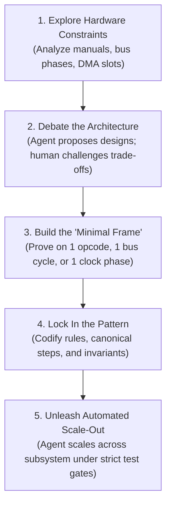
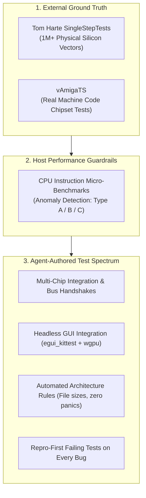

# How This Emulator Was Written: Pair-Programming with an AI Agent

Here is the honest breakdown of how this cycle-exact Amiga 500 emulator was built from scratch in Rust—and how an AI agent generated 100% of the implementation code, test suites, and documentation under human architectural direction.

---

## 1. The Headline: Zero Hand-Written Code (and Zero Rust Experience)

Here is the most defining fact about this project: **I did not write a single line of Rust code. Not one.**

I didn't write any of the implementation code. And just as importantly, **I never wrote, designed, or proposed a single test**—from individual unit tests and multi-chip integration suites to GUI test harnesses and automated architecture gates. Every struct, every micro-step in the Motorola 68000 state machine, every bus arbitration check in Gary, every custom chip pipeline, and every test suite was generated and verified by the AI agent.

And here is the even more candid reality: **I didn't know the Amiga hardware inside-out going in, and this project was my very first contact with Rust.**

I didn't have the microarchitectural details of Agnus, Denise, or Paula memorized. Nor was I a seasoned Rust programmer—in all honesty, there are still aspects of Rust that I am learning today.

The human role in this project was not typing syntax or pretending to be an all-knowing hardware guru. It was acting as the **Architect, Constraint Setter, and Engineering Sparring Partner**. We didn't treat the agent like a junior intern who needs syntax babysitting, nor as a glorified autocomplete widget. We worked as high-bandwidth engineering peers, exploring both the hardware architecture and the systems design together.

---

## 2. The Methodology: Sparring Partner Mindset & The "Minimal Frame"

The collaboration succeeded because it was structured around clear engineering dynamics:

| The "Junior Intern" Trap | The Sparring Partner Mindset |
| :--- | :--- |
| Micromanaging syntax, variable names, and formatting | Setting high-level architectural direction and constraints |
| Getting frustrated when the model makes a mistake | Updating the rules and skills so that mistake can never happen again |
| Passively accepting whatever code the model outputs | Debating trade-offs, pushing back, and exploring alternatives |
| Stepping in to write code manually when the AI struggles | Polishing the harness and test feedback loops until the AI succeeds |

### When the AI Trips, Don't Touch the Code—Upgrade the Harness
Whenever the agent stumbled or took a shortcut, the solution was never to step in and fix the code manually. Instead, the focus was diagnosing the systemic cause: *Why did the agent make that choice? What rule or skill was missing or ambiguous?*

Every mistake prompted an upgrade to our operational rules under `.agents/rules/`, a refined skill under `.agents/skills/`, or a new assertion in our automated architecture test suite. Over time, the harness grew increasingly self-correcting.

### The "Minimal Frame" Rule
When people try to build complex systems with AI, they often hand the model a large specification and ask it to generate an entire subsystem at once. That almost always yields brittle, unmaintainable code.

Our approach was the exact opposite: **the agent was never unleashed on a subsystem until the architecture was proven on the smallest possible working slice—the "minimal frame."**

Before implementing hundreds of M68000 instructions or complex chip registers, we first established the minimal operational skeleton:
- Breaking a bus cycle cleanly into Color Clock phases (`CCK1` address/strobe vs `CCK2` sample/commit).
- Signaling wait states (`BusResult::WaitState`) when custom chip DMA blocks the CPU.
- Decoupling chip coordination without circular pointer soup (`Rc<RefCell<...>>`).
- Routing interrupt priority lines (`IPL 1-6`) into the CPU.

Once verified on a single instruction or clock phase, the pattern was locked into a recipe, and the agent scaled it out across the entire subsystem.

---

## 3. The Zero-Trust Verification Engine

LLMs excel at generating code that looks plausible, compiles cleanly, and passes basic smoke tests—yet completely breaks under real-world execution. To eliminate hallucinated hardware behavior, we established a zero-trust verification pyramid combining external silicon vectors, micro-benchmarks, and comprehensive automated test suites:

### A. Real Silicon Test Vectors (Tom Harte & vAmigaTS)
- **Over 1 Million Silicon Vectors:** We imported 124 test suites (`ref_src/SingleStepTests-680x0/`) captured directly from physical Motorola 68000 silicon. Every test asserts exact bus cycles, prefetch queue progression (`IR`/`IRC`), and condition codes ($X, N, Z, V, C$). If a test failed by even a single clock phase, the agent had to fix the micro-step state machine until it matched real hardware 100%.
- **Chipset Timing Baseline:** Christian Bauer's vAmiga test suite verified custom chip stress points: Agnus Copper beam synchronization, Blitter nasty priority, Denise bitplane latches, and CIA timer rollovers.

### B. Micro-Benchmarking Every Instruction
Cycle accuracy is useless if host execution is sluggish. To catch missing inlining annotations, unexpected dynamic branches, or pipeline stalls, we built a dedicated CPU micro-benchmarking engine that measures host nanoseconds against emulated Color Clocks ($R_{\text{norm}}$):
- **Type A (Hot Path Spikes):** Flags instructions significantly slower than sibling opcodes in the same family.
- **Type B (Addressing Mode Inefficiencies):** Flags indirect or indexed modes that spike relative to register baselines (catching missed `#[inline(always)]` or unexpected branches).
- **Type C (Branch Predictor Thrashing):** Detects execution jitter (>5.0% CV across passes) caused by host CPU pipeline flushes.

### C. The Entire Testing Spectrum Authored by the Agent
Every unit test, multi-chip integration test, headless GUI test (`egui_kittest`), and architecture rule check across all 26 workspace crates was generated and maintained by the agent. Crucially, testing followed a strict **Repro-First** discipline: whenever an edge case or defect appeared, the agent was required to write an isolated, failing reproduction test before modifying any production code.

---

## 4. Documentation as an Iterative Compass, Never a Holy Grail

The repository maintains extensive architectural specifications under [`Obsidian/Amiga/Design/`](../Obsidian/Amiga/Design/) and [`docs/`](../docs/). However, documentation was never treated as an upfront waterfall exercise.

A common pitfall in AI development is spending weeks drafting an exhaustive specification in hopes that the model will produce a perfect codebase in one pass. Instead:
- **Good Enough to Start Coding:** We drafted documentation collaboratively only until the interfaces and high-level architecture were clear. The moment it felt sound, we stopped writing docs and began implementing the minimal frame.
- **Refined in Lockstep:** As active coding revealed subtle hardware quirks or silicon edge cases, documentation was continuously updated alongside the code. Specs remained living, pragmatic compasses rather than rigid bureaucratic monuments.

---

## 5. Systems Architecture in Rust: Flat Layout, Rigorous Ownership

### Flat Code Layout, Rich Compile-Time Ownership
One foundational design decision was keeping the codebase structure intentionally flat:
- **Flat Crate Layout:** All 26 crates live directly under `crates/*` (e.g. `crates/m68000`, `crates/memory_bus`, `crates/agnus`, `crates/debugger`, `crates/gui`).
- **Flat Modules:** CPU instructions reside directly under `crates/m68000/src/instructions/<mnemonic>.rs` without nested subdirectories.

While the file layout is flat, the ownership graph within is strict and decoupled. Shared mutable pointers (`Rc<RefCell<...>>`) are strictly banned. The top-level machine struct (`A500`) owns subsystems directly, modeling bus contention, interrupt priority arbitration, and DMA through unidirectional borrows and calibrated event queues.

### "Aspect-per-File", Not "Class-per-File"
Rather than fragmenting functionality across dozens of micro-files for every struct, modules are organized by cohesive behavioral aspects. For example, [`crates/debugger/src/`](../crates/debugger/src/) encapsulates whole functional capabilities in single files: `assembler.rs` (full parser), `breakpoints.rs` (evaluators and hit testing), `temporal.rs` (time-travel ring buffers), and `stepping.rs` (execution control).

> [!NOTE]
> **A DSP Detour: Paula & The BLEP Generator**
> To eliminate digital audio aliasing in Paula's variable-rate DMA channels, we needed Band-Limited Steps (BLEP). Rather than relying on heavy external math libraries, we worked together to implement a standalone Rust tool in [`tools/blep_generator`](../tools/blep_generator/) with zero external dependencies—deriving windowed sinc pulses, minimum-phase transforms, and analog RC filter curves directly from first principles.

---

## Key Takeaways for Building with AI

1. **You Don't Need to Type Syntax or Tests:** An AI agent can generate 100% of production code, test suites, and documentation when directed with clear architectural constraints.
2. **Upgrade the Harness, Don't Fix the Code:** When the AI stumbles, treat it as a harness failure. Refine operational rules, skills, and automated architecture tests so the mistake cannot recur.
3. **Anchor to Objective Silicon Ground Truth:** Combine external physical test captures (SingleStepTests, vAmigaTS) with instruction micro-benchmarking to ensure code is both 100% cycle-exact and blistering fast.
4. **Build the Minimal Frame First:** Never unleash an agent on an entire subsystem at once. Prove the architecture on one instruction, one bus cycle, or one clock phase before scaling out.
5. **Docs as an Iterative Compass:** Write just enough design documentation to start coding, then expand and refine it in lockstep with the implementation.
6. **Flat Organization, Strict Ownership:** Keep directory hierarchies flat and navigable, while using Rust's compile-time ownership to eliminate circular references and runtime locks.
