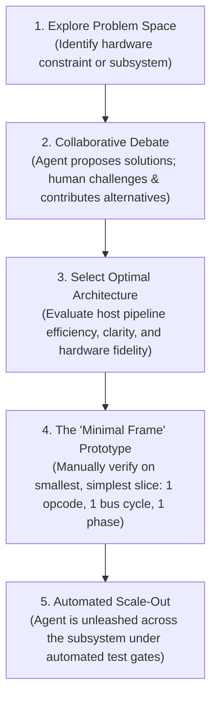
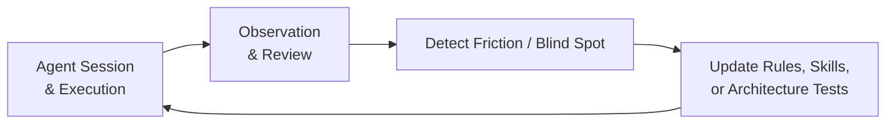

# How This Emulator Was Written: Pair-Programming with an AI Agent

This document details the engineering methodology, collaboration dynamics, and harness design behind the development of this cycle-exact Amiga 500 emulator.

---

## Executive Summary: Zero Hand-Written Code

The most defining characteristic of this project is a simple fact: **the human developer did not write a single gram of code**.

Not a single line of Rust implementation code was typed manually by the human. Furthermore, **not a single unit or integration test was manually authored or proposed by the human**. Every data structure, opcode micro-step, memory bus arbitration routine, custom chip state machine, test harness, and technical design document was generated and maintained by the AI agent under human architectural steering.

Instead of writing syntax, the human acted as **System Architect, Strategic Director, and Intellectual Sparring Partner**. The agent was not treated as a passive autocompletion widget or a subordinate junior programmer needing low-level hand-holding, but as a high-bandwidth engineering peer.

This document synthesizes the core pillars of how this collaboration operated.

---

## 1. Domain Knowledge Exploration & Machine Comprehension

Before writing production code, the agent served as an interactive engine for **exploring and deconstructing the Amiga hardware architecture**:

- **Systemic Questioning & Deep Analysis:** Rather than treating emulation as guesswork, the developer engaged the agent in exhaustive Q&A sessions analyzing the Commodore Amiga hardware reference manuals, Motorola 68000 programmer reference manuals, and physical hardware schematics.
- **Inter-Chip Interplay:** Initial sessions focused on clarifying the subtle interactions between chips: how Agnus (Copper/Blitter) arbitrates the shared Chip RAM bus with the CPU, how Gary manages address decoding and DTACK wait states, how Paula synchronizes audio and floppy DMA slots, and how the dual 8520 CIAs generate timer interrupts.
- **Grounded Hardware Mental Model:** By probing edge cases through dialogue—such as open-bus floating behavior (`$FF`/`$FFFF`), color clock phase boundaries (`CCK1`/`CCK2`), and bus contention penalties—the developer and agent established a shared, rigorous mental model of the physical silicon before committing to any software structures.

---

## 2. Architectural Exploration & The "Minimal Frame" Methodology

Emulating a complex, cycle-exact system requires navigating countless architectural trade-offs. The development followed a strict collaborative workflow:

### The "Minimal Frame" Principle
A critical rule prevented unanchored code generation: **the agent was never unleashed on large subsystems without a proven, verified minimal frame**.

Before scaling out to hundreds of CPU instructions or extensive chip features, the human and agent first established and verified the minimal operational skeleton:
- How does a single CPU bus cycle split across Color Clock phases (`CCK1` address/strobe vs `CCK2` sample/commit)?
- How does the memory bus return `BusResult::WaitState` when Chip RAM is contended by DMA?
- How do decoupled subsystems exchange signals without circular pointer references (`Rc<RefCell<...>>`)?
- How does the interrupt priority level (`IPL 1-6`) propagate between Paula/CIAs and the CPU?

Only after this minimal frame was proven and tested on the simplest possible slice was the agent given clearance to scale out the full implementation autonomously.

---

## 3. External Ground Truth: SingleStepTests & vAmigaTS

An AI agent working solely from documentation or text prompts can easily hallucinate plausible-looking logic that fails on actual hardware corner cases. To eliminate this risk, the project relied heavily on two exhaustive, external ground truth verification suites:

### A. Tom Harte SingleStepTests (Motorola 68000 Silicon Vectors)
- **Scale:** Over 1 million cycle-by-cycle physical hardware captures across 124 distinct test suites (`ref_src/SingleStepTests-680x0/`).
- **Granularity:** Each test case specifies the exact initial CPU registers, memory state, and prefetch queue (`IR`/`IRC`), stepping the CPU through execution and asserting every intermediate bus cycle, data strobe, address bus state, and condition code flag ($X, N, Z, V, C$).
- **Cycle-Exact Calibration:** Every M68000 instruction implemented by the agent was validated directly against these physical silicon vectors (`SINGLESTEP_FULL=1`). If an instruction diverged by even a single bus phase or CCR bit, the agent could not guess or negotiate—it had to trace the micro-step state machine and correct the micro-operations until the silicon captures matched 100%.

### B. vAmigaTS (Amiga Chipset & Timing Test Suite)
- **Scale & Scope:** Christian Bauer's comprehensive automated test suite, executing real Amiga machine code programs designed to stress test custom chip edge cases.
- **Subsystem Coverage:** Rigorous validation of Agnus Copper beam racing, Blitter nasty bus contention, Denise bitplane fetching, sprite multiplexing, Paula audio period intervals, and MOS 8520 CIA timer rollover and TOD atomic latches.
- **Eliminating Regressions:** By verifying subsystems against vAmigaTS captures and reference behaviors, the agent had an objective, unforgiving baseline that prevented regressions during refactorings.

---

## 4. The Agent Harness: Continuous Evolution & Relentless Polishing

An autonomous AI agent is only as reliable as the harness that constrains, guides, and verifies it. A central lesson of this project is that **the entire agent harness was in a state of continuous evolution and relentless polishing**.

The harness was not a static configuration set up at the beginning; it was constantly shaped, hardened, and refined alongside the emulator code itself.

### A. Unit Tests Written by the Agent From Day One
- From the very first line of code, **the agent authored all unit and integration tests**. The human never wrote a single test case manually or designed test scaffolding.
- Over time, test authoring evolved from an implicit practice into an ironclad, automated requirement:
  - **Unit Testing Policy (`unit-testing-policy.md`):** Mandated dedicated `crates/*/tests/` suites for all functional modules, strictly prohibiting inline tests in `src/`.
  - **Repro-First Defect Resolution (`repro-first.md`):** Mandated that before any bug was fixed, the agent had to first author an isolated, failing reproduction test.
  - **Automated Architecture Tests:** CI gates (`cargo test -p test_runner --test test_architecture_rules`) began enforcing test presence, non-panicking code, and strict architectural standards automatically, eliminating the need for the human to remind the agent to add tests.

### B. Modular Constitutional Guardrails
Operational rules under `.agents/rules/` grew organically to eliminate recurring classes of errors:
- **Language Policy (`language-policy.md`):** Strict English for all code, comments, documentation, and commits.
- **Hardware Efficiency & Readability (`performance-and-readability.md`):** Strict prohibition of custom macros (`macro_rules!`) and const-generic opcode functions; contiguous arrays; zero heap allocations in emulation hot paths; zero `.unwrap()` or panic paths.
- **Attractor Discipline (`attractor-discipline.md`):** Active prevention of synthetic academic jargon, inflated invariant slogans, and leaked buzzwords.
- **Immediate Atomic Commits (`git-commits.md`):** Mandatory verified commit after every discrete task, preventing uncommitted working trees across conversational turns.

### C. Self-Maintaining Architecture Documentation
The agent maintains its own technical architecture documentation:
- Every major code change is reflected immediately in [`Obsidian/Amiga/Design/`](../Obsidian/Amiga/Design/) and [`docs/`](../docs/).
- Link graphs and YAML frontmatter are audited continuously (`obsidian-vault-linking`).
- Hardware reference manuals and architectural notes are indexed in a local vector database (Qdrant) via `amiga-rag`.

---

## 5. The Sparring Partner Dynamic & Continuous Calibration

The human-agent dynamic was explicitly structured as a **partnership between peers**:

| Anti-Pattern: Treating Agent as Junior | Reality: The Sparring Partner Dynamic |
| :--- | :--- |
| Micromanaging syntax and spelling | Setting strategic architectural vision and goals |
| Blaming the model for repeated mistakes | Updating rules and skills so mistakes cannot reoccur |
| Accepting the first code draft passively | Challenging decisions, debating trade-offs, and counter-proposing |
| Writing code manually when agent struggles | Improving the test harness and constraints until the agent succeeds |

The human observed execution in real time, challenged architectural decisions, and intervened when an assumption looked questionable. But rather than fixing mistakes manually in the code editor, the developer channeled that energy into **upgrading the rules, skills, and test harnesses**. The system became progressively smarter, more autonomous, and more robust with each completed milestone.

---

## 6. Mutual Synergy & Unexpectedly Elegant Solutions

One of the greatest sources of satisfaction in this project was the **emergence of solutions that exceeded initial human expectations**.

Through iterative debate and reciprocal critique, the human and agent frequently converged on architectural patterns that neither would have produced in isolation:
- **Fused Color Clock ALU Micro-Steps:** Merging arithmetic calculations, CCR evaluation, and Effective Address operations directly into the 2-clock bus phases (`BUS_READ_IDLE`, `BUS_WRITE_IDLE`) eliminated artificial zero-clock states while mirroring real physical silicon timing.
- **Dual Staging Registers (`addr1` / `addr2`):** Elegant handling of dual-memory M68000 instructions (`CMPM`, `ABCD`, `ADDX`, `SUBX`) without pointer juggling, maintaining strict Address Error exception invariance.
- **Decoupled Snapshot Architecture:** Zero-copy, queryable subsystem states enabling both WebAssembly export and zero-allocation time-travel debugger rewind without circular references.

These solutions were not anticipated at project inception—they emerged naturally from rigorous sparring against physical hardware constraints and strict architectural guardrails.

---

## Summary of Key Takeaways

1. **Zero Human Code:** 100% of Rust code, tests, and technical specs were generated by the AI agent under human guidance.
2. **Tests From Day One:** The agent authored all unit and integration tests from the beginning, later formalized into automated Definition of Done gates.
3. **External Ground Truth:** Exhaustive physical silicon vectors (SingleStepTests) and chipset test suites (vAmigaTS) grounded the implementation in undeniable hardware reality.
4. **The Minimal Frame:** Always build and prove the smallest functional skeleton before scaling out automated implementation.
5. **Continuous Harness Polishing:** Treat the harness (rules, skills, automated architecture tests) as an evolving product that is continuously refined.
6. **Sparring Partner Relationship:** Treat the agent as an intellectual peer to discover solutions superior to individual design instincts.
