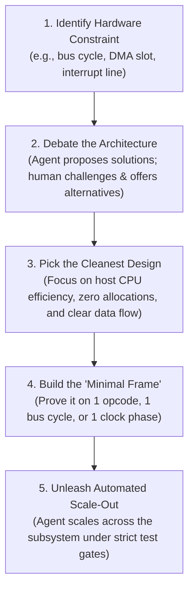
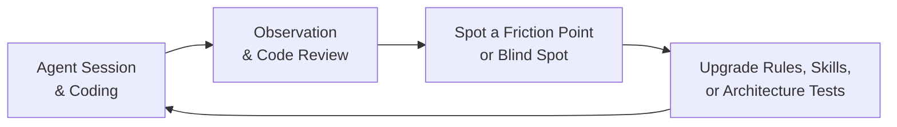

# How This Emulator Was Written: Pair-Programming with an AI Agent

Here is the honest breakdown of how this cycle-exact Amiga 500 emulator was built from scratch in Rust—and how an AI agent generated 100% of the code, tests, and documentation under human architectural direction.

---

## The Headline: Zero Hand-Written Code

Here is the most defining fact about this project: **I did not write a single line of Rust code. Not one.**

I didn't write any of the implementation code. And just as importantly, **I never wrote, designed, or proposed a single test of any kind**—from individual unit tests and multi-chip integration suites to GUI test harnesses and automated architecture gates. Every struct, every micro-step in the Motorola 68000 CPU state machine, every bus arbitration check in Gary, every custom chip pipeline, and every test suite was generated and maintained by the AI agent.

Even the dozens of deep technical design specs in this repository were drafted and maintained by the agent. But make no mistake: **every document was driven by human initiative and intense back-and-forth debate**. It was always: *"Let's create a spec for this subsystem"*, *"What if the CPU accesses Slow RAM during a Blitter cycle?"*, *"Add this corner case"*, or *"No, that's not how it works—revise it."* The agent put the thoughts into markdown, but the agenda, the critical questions, and the relentless corrections came from me.

And here is the even more candid reality: **I didn't fully understand how the Amiga works going in, and this project was my very first contact with Rust.**

I didn't have all the deep hardware details of the 68000 CPU, Agnus, Denise, or Paula memorized. Nor was I a seasoned Rust programmer—in all honesty, there are still plenty of things about Rust that I probably don't know today. 

My role wasn't writing syntax or pretending to be an all-knowing hardware guru. It was acting as the **System Architect, Strategic Director, and Engineering Sparring Partner**. I didn't treat the agent like a junior intern who needs syntax babysitting, and I definitely didn't treat it like a glorified autocomplete widget. We worked as high-bandwidth engineering peers, exploring both the hardware architecture and the systems design together.

Here is exactly how that collaboration worked in practice.

---

## 1. Exploring the Amiga Architecture Before Writing a Line of Code

The biggest mistake you can make with an AI agent is jumping straight into code generation before you both understand the machine. 

Before drafting our first Rust module, the agent served as an interactive research engine to deconstruct how the Amiga 500 actually works:

- **Deep Q&A Over Original Manuals:** We spent hours in focused Q&A sessions tearing through the Commodore Hardware Reference Manual, the Motorola 68000 Programmer's Reference Manual, and physical circuit schematics.
- **Untangling Custom Chip Interactions:** We mapped out how the chipset pieces fit together: how Agnus (Copper and Blitter) shares the Chip RAM bus with the CPU, how Gary handles address decoding and DTACK wait states, how Paula interleaves audio and floppy DMA cycles, and how the dual MOS 8520 CIAs drive timer interrupts.
- **Building a Solid Mental Model:** We dug into physical hardware quirks before touching the keyboard—open-bus floating values (`$FF`/`$FFFF`), color clock phase boundaries (`CCK1`/`CCK2`), and bus contention penalties.

By the time we started writing code, we weren't guessing. We had a crisp, shared mental model of the physical hardware.

---

## 2. The "Minimal Frame" Rule: Nail the Skeleton First, Then Scale

When people try to build complex systems with AI, they usually hand the agent a big specification and say: *"Build the CPU."* That never works. It produces thousands of lines of brittle, unmaintainable code that falls apart the moment you run a real test.

Our approach was the exact opposite: **the agent was never unleashed on a subsystem until we proved the architecture on the smallest possible working slice—what we called the "minimal frame."**

Before implementing hundreds of M68000 instructions or complex chip registers, we sat down and built the minimal operational skeleton together:
- How does a single bus cycle break down across Color Clock phases (`CCK1` address/strobe vs `CCK2` sample/commit)?
- How does the memory bus signal wait states (`BusResult::WaitState`) when custom chip DMA blocks the CPU?
- How do decoupled chips talk to each other without messy circular pointer soup (`Rc<RefCell<...>>`)?
- How does an interrupt request line (`IPL 1-6`) travel from Paula and the CIAs into the CPU?

Once we proved that minimal frame on one instruction or one cycle, the architecture was locked in. Only then was the agent unleashed to scale out the full implementation across the subsystem.

---

## 3. Real Silicon Test Vectors Don't Care About AI Guesses

LLMs are remarkably good at generating code that looks plausible, compiles cleanly, and passes basic hand-rolled smoke tests—yet completely breaks the moment you boot a real Amiga game or demoscene raster trick.

To eliminate hallucinated hardware behavior, we anchored the agent to two unforgiving, external test suites:

### A. Tom Harte's SingleStepTests (Real 68000 Silicon Captures)
- **Over 1 Million Test Vectors:** We imported 124 comprehensive test suites (`ref_src/SingleStepTests-680x0/`) captured directly from physical Motorola 68000 silicon.
- **Cycle-by-Cycle Verification:** Every single test case initializes registers, memory, and the CPU prefetch queue (`IR`/`IRC`), steps through execution, and asserts every bus cycle, address strobe, data transfer, and condition code flag ($X, N, Z, V, C$).
- **No Room to Bluff:** When the agent wrote an opcode, we ran it against these physical silicon captures (`SINGLESTEP_FULL=1`). If a test failed by even a single clock phase or flag bit, the agent couldn't argue or fudge the implementation—it had to step through its micro-steps and fix the state machine until it matched real Motorola silicon 100%.

### B. vAmigaTS (Amiga Chipset Timing Suite)
- **Real Machine Code Tests:** Christian Bauer's vAmiga test suite runs real Amiga machine code programs designed to push custom chip edge cases to their breaking point.
- **Custom Chip Stress-Testing:** It verified Agnus Copper beam synchronization, Blitter nasty bus priority, Denise bitplane latches, sprite multiplexing, and CIA timer rollovers.
- **Zero Regression Confidence:** Every time we refactored bus logic or chip synchronization, we had an objective, external verification baseline to prove we hadn't broken hardware timing.

---

## 4. The Real Job: Continuously Polishing the Agent Harness

If you want an AI agent to reliably write high-performance systems code, you don't micromanage its typing. You build a strict, supportive harness around it.

And here is the vital insight: **the harness was not something we set up on day one and forgot about. It was in a state of continuous evolution and relentless polishing throughout the entire project.**

### A. The Entire Testing Spectrum Authored by the Agent
- **Zero Human Test Code:** People often assume that if an AI writes production code, the human must at least write the tests to keep it honest. In our case, **I never wrote, designed, or proposed a single test of any kind**. The agent authored every unit test, integration test, architecture check, and regression harness across all 26 workspace crates from the very beginning.
- **Covering the Full Testing Spectrum:**
  - **Exhaustive Unit Tests:** Verifying opcode decoders, CCR arithmetic flags, memory alignment checks, and register mutation pipelines.
  - **Multi-Chip Integration Tests:** Validating physical bus handshakes between chips—like the Copper triggering Blitter operations, Paula asserting CPU interrupt lines (IPL 1-6), Gary overlay switching on CIA-A `_OVL` pin transitions, and floppy head stepping.
  - **Headless GUI Integration Tests:** Offscreen frame rendering (`egui_kittest` + `wgpu`) asserting that the debugger window, panel splitters, and user keystrokes work without ever panicking the host.
  - **Automated Architecture & Hygiene Tests:** A dedicated test suite (`cargo test -p test_runner --test test_architecture_rules`) that verifies constitutional rules automatically on every build—enforcing file size limits ($\le 800$ lines), canonical micro-step constants, zero inline tests in `src/`, and zero runtime panics.
  - **Repro-First Bug Verification:** Whenever an edge case or bug appeared, the agent had to first write an isolated failing reproduction test before touching a single line of production code.
- **From Gentle Reminders to Total Automation:** Early on, I occasionally prompted: *"Write tests for this, coverage is missing."* But as we polished the harness, testing became an automatic, non-negotiable Definition of Done. The agent wrote, ran, and validated comprehensive test suites autonomously before declaring any task finished.

### B. Practical Rules, Not Theoretical Fluff
We maintained modular operational rules under `.agents/rules/` that attacked concrete failure modes:
- **Clean Performance & Readability (`performance-and-readability.md`):** Banned complex custom macros (`macro_rules!`) and const-generic opcode functions that obfuscate code. Mandated contiguous memory layouts, zero heap allocations inside the emulation loop, and zero runtime `.unwrap()` panics.
- **Attractor Discipline (`attractor-discipline.md`):** Filtered out academic jargon and fake complexity to keep discussions grounded in clear software engineering.
- **Immediate Atomic Commits (`git-commits.md`):** Required a clean, verified Git commit after every completed task, ensuring the working tree was never left dirty across turns.

### C. Human-Directed, Agent-Maintained Documentation
The repository contains dozens of deep architectural specs under [`Obsidian/Amiga/Design/`](../Obsidian/Amiga/Design/) and [`docs/`](../docs/). But the agent didn't draft these in isolation:
- **Human-Driven Debates:** Every document started with human initiative: *"Write a design document on Paula audio DMA"*, *"What if the CPU accesses registers out-of-order?"*, *"Add this section, but remove that assumption."*
- **Iterative Scrutiny:** I reviewed every draft, pushed back on flawed logic, and said *"No, that's not right, change it like this"* until the document was watertight.
- **Automated Upkeep:** Once established, the agent was responsible for maintaining the documentation in lockstep with the code—updating specs and verifying link integrity whenever a subsystem changed.

### D. "Aspect-per-File", Not "Class-per-File"
A major architectural choice I enforced across the codebase was rejecting the classic object-oriented trap: splitting every single struct into its own tiny file. In languages like Java or C#, you often end up with twenty micro-files for one feature (`Breakpoint.rs`, `BreakpointManager.rs`, `BreakpointCondition.rs`), which fragments your attention and forces artificial boilerplate.

Instead, we organized code strictly by **behavioral aspect per file**. A single file encapsulates an entire capability from top to bottom.

Look at [`crates/debugger/src/`](../crates/debugger/src/) as the poster child of this approach:
- `assembler.rs`: Everything needed to parse text into 68000 machine code.
- `breakpoints.rs`: Structs, condition evaluators, and hit-testing logic for all breakpoints and watchpoints.
- `loader.rs`: Binary executable injection into RAM and CPU entrypoint setup.
- `session.rs`: High-level session coordination and state lifecycle.
- `stepping.rs`: Execution control (step into, step over, step out, frame step).
- `temporal.rs`: Time-travel rewind ring buffers and snapshot seeking.
- `trace.rs`: Execution trace recording and bottom log display.

When you open a file, you get the entire functional aspect in one coherent place. No jumping between ten different files to understand a single feature.

---

## 5. The Sparring Partner Mindset

The relationship worked because we treated each other as technical partners:

| The "Junior Intern" Trap | The Sparring Partner Mindset |
| :--- | :--- |
| Micromanaging syntax, variable names, and formatting | Setting high-level architectural direction and constraints |
| Getting frustrated when the model makes a mistake | Updating the rules and skills so that mistake can never happen again |
| Passively accepting whatever code the model outputs | Debating trade-offs, pushing back, and suggesting better alternatives |
| Stepping in to write code manually when the AI struggles | Polishing the harness and test feedback loops until the AI succeeds |

Whenever the agent stumbled or took a suboptimal shortcut, I didn't reach for my keyboard to fix it. Instead, I asked: *Why did the agent make that choice? What rule or skill was missing or ambiguous?* 

Then I updated the rule, refined the skill, or added an architecture test. Every mistake made the harness stronger. Over time, the agent required fewer corrections and operated with remarkable velocity.

---

## 6. When the Collaboration Surprises You

The most rewarding part of this project was discovering solutions that exceeded what either of us would have come up with alone.

Through back-and-forth architectural sparring, we repeatedly landed on designs that were cleaner, more robust, and more elegant than my original ideas—solutions I had not foreseen at all going in, but which turned out to be exceptionally well-suited to the hardware.

These breakthroughs weren't planned upfront on day one. They emerged naturally from continuous engineering dialogue, grounded in real hardware constraints and backed by a disciplined, evolving harness.

---

## Key Takeaways for Building with AI

1. **You Don't Need to Type Code or Tests:** An AI agent can generate 100% of the production code, test suites (unit, integration, GUI, and architecture checks), and technical documentation if you provide sharp architectural leadership.
2. **Explore the Domain First:** Spend time deconstructing hardware specs and reference manuals before writing your first module.
3. **Build the Minimal Frame:** Never ask an agent to build a whole subsystem at once. Prove the architecture on one instruction or one bus cycle first.
4. **Anchor to Real-World Test Vectors:** Use external, exhaustive test suites (like SingleStepTests and vAmigaTS) so the agent has an undeniable source of truth.
5. **Treat the Harness as a Product:** Constantly polish your rules, skills, and automated architecture tests whenever friction appears.
6. **Be a Sparring Partner:** Debate ideas, push back on trade-offs, and let the collaborative process produce designs better than your initial instincts.
